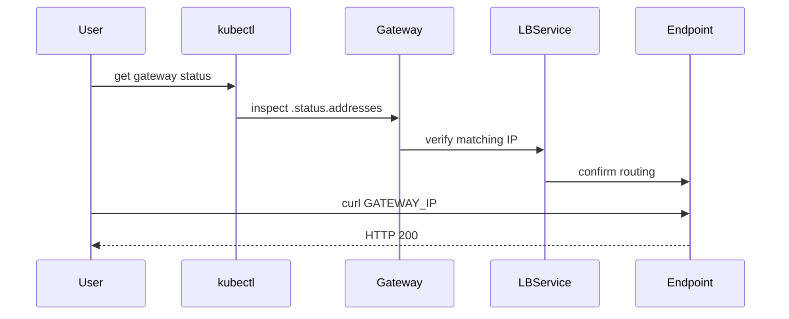

# How to Validate Cilium Gateway API Addresses Support

Author: [nawazdhandala](https://github.com/nawazdhandala)

Tags: Cilium, Kubernetes, Gateway API, Networking, Validation

Description: Step-by-step validation procedures to confirm that Cilium Gateway API addresses are correctly allocated, assigned, and reachable.

---

## Introduction

After configuring address support for Cilium's Gateway API implementation, it is essential to run validation checks to confirm that IPs are correctly assigned and that traffic routes through them as expected. Validation catches misconfiguration before traffic load increases.

Cilium exposes address assignment status through the Gateway resource's `status.addresses` field. This field is populated once the underlying Service receives an external IP from the load balancer provider. Validation must check both the API objects and real network reachability.

This guide provides a sequence of checks ranging from Kubernetes object inspection to live HTTP probing.

## Prerequisites

- Cilium with Gateway API enabled
- A deployed Gateway and at least one HTTPRoute
- `curl` available in-cluster or externally
- Gateway API CRDs installed

## Check Gateway Programmed Condition

The `Programmed` condition confirms the address is in use:

```bash
kubectl get gateway <gateway-name> -n <namespace> \
  -o jsonpath='{.status.conditions[?(@.type=="Programmed")].status}'
```

Expected output: `True`

## Verify Status Addresses Field

```bash
kubectl get gateway <gateway-name> -n <namespace> \
  -o jsonpath='{.status.addresses[*].value}'
```

This should return one or more IP addresses or hostnames.

## Confirm Load Balancer Service IP

```bash
kubectl get svc -n <namespace> -l cilium.io/gateway-name=<gateway-name> \
  -o jsonpath='{.items[*].status.loadBalancer.ingress[*].ip}'
```

The IP should match what is shown in `Gateway.status.addresses`.

## Test HTTP Connectivity

```bash
GATEWAY_IP=$(kubectl get gateway <gateway-name> -n <namespace> \
  -o jsonpath='{.status.addresses[0].value}')
curl -v http://${GATEWAY_IP}/
```

## Architecture



## Validate Route Bindings

Ensure HTTPRoutes are attached to the gateway:

```bash
kubectl get httproute -n <namespace> -o wide
kubectl describe httproute <route-name> -n <namespace> | grep -A5 "Parents"
```

A `Accepted: True` condition on the route's parent reference confirms binding.

## Check Cilium Endpoint Status

```bash
cilium status --verbose | grep Gateway
kubectl get ciliumendpoints -n <namespace>
```

## Conclusion

Validating Cilium Gateway API address support requires confirming the Gateway's programmed condition, matching the load balancer service IP, and verifying live connectivity. These checks ensure your ingress path is working end-to-end before serving production traffic.
