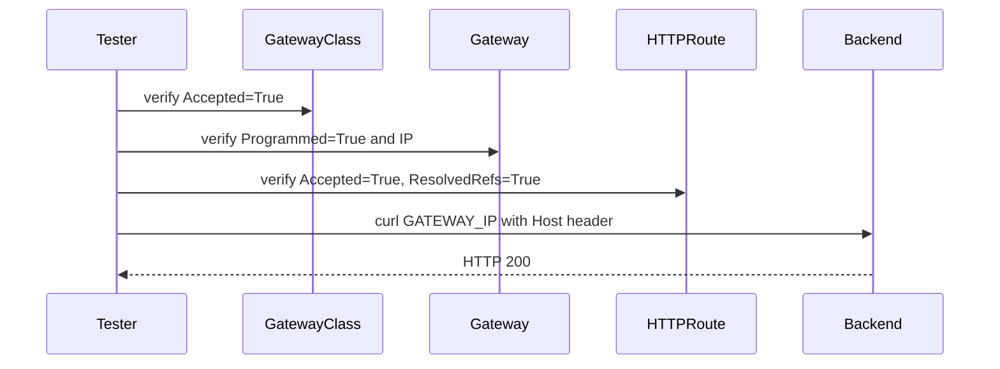

# How to Validate Cilium Gateway API Support

Author: [nawazdhandala](https://github.com/nawazdhandala)

Tags: Cilium, Kubernetes, Gateway API, Validation, Networking

Description: Validate Cilium Gateway API support by verifying Gateway provisioning, HTTPRoute binding, and end-to-end traffic routing.

---

## Introduction

Validating Cilium Gateway API support confirms that the complete traffic path from external IP to backend pods is working correctly. This involves verifying Kubernetes API objects, load balancer service health, and actual network connectivity.

Gateway API validation is typically run after initial deployment, after upgrades, and as part of CI/CD pipelines. A complete validation checklist catches regressions before users are affected.

## Prerequisites

- Cilium with Gateway API enabled
- At least one Gateway and one HTTPRoute deployed
- External IP assigned to the Gateway
- `curl` available externally or from a pod

## Validate GatewayClass

```bash
kubectl get gatewayclass cilium \
  -o jsonpath='{.status.conditions[?(@.type=="Accepted")].status}'
# Expected: True
```

## Validate Gateway Provisioning

```bash
kubectl get gateway -A -o custom-columns=\
NAME:.metadata.name,\
NS:.metadata.namespace,\
PROGRAMMED:.status.conditions[0].status,\
IP:.status.addresses[0].value
```

All Gateways should show `True` for PROGRAMMED and an IP address.

## Validate HTTPRoute Binding

```bash
kubectl get httproute -A -o json | jq '
  .items[] | {
    name: .metadata.name,
    ns: .metadata.namespace,
    accepted: (.status.parents[0].conditions[] |
      select(.type=="Accepted") | .status),
    resolvedRefs: (.status.parents[0].conditions[] |
      select(.type=="ResolvedRefs") | .status)
  }'
```

## Architecture



## Test End-to-End Traffic

```bash
GATEWAY_IP=$(kubectl get gateway <name> -n <namespace> \
  -o jsonpath='{.status.addresses[0].value}')

# Test HTTP
curl -v -H "Host: myapp.example.com" http://${GATEWAY_IP}/

# Test HTTPS
curl -v --cacert ca.crt https://myapp.example.com/
```

## Validate Backend Connectivity

Confirm the target Services have ready endpoints:

```bash
kubectl get endpoints -n <namespace> <backend-service>
```

## Run Cilium Connectivity Test

```bash
cilium connectivity test --test gateway-api
```

## Conclusion

Validating Cilium Gateway API support requires checking the GatewayClass, Gateway, and HTTPRoute conditions, verifying load balancer IP assignment, and testing live traffic. This checklist provides confidence that the full ingress path is operational.
