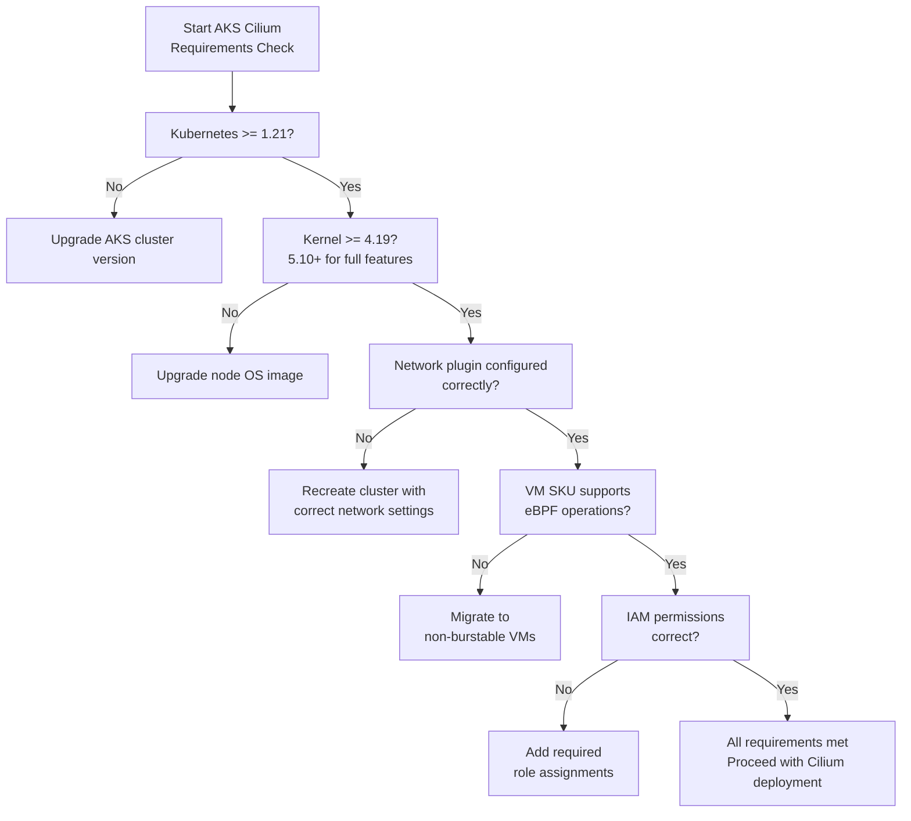

# Validate Cilium Requirements on AKS

Author: [nawazdhandala](https://github.com/nawazdhandala)

Tags: Cilium, Kubernetes, AKS, Azure, eBPF

Description: A checklist-driven guide to validating that your AKS cluster meets all requirements for running Cilium, covering node OS, kernel version, networking configuration, and AKS-specific prerequisites.

---

## Introduction

Running Cilium on Azure Kubernetes Service requires meeting specific prerequisites at both the AKS configuration level and the underlying node infrastructure. AKS abstracts much of the node configuration, but some settings-like the network plugin mode, Kubernetes version, and node OS-directly impact Cilium's capabilities and must be validated before deployment.

Failing to meet these requirements often results in Cilium agents that start but cannot load eBPF programs, missing features like kube-proxy replacement, or policy enforcement that silently does not work. Proactive requirements validation prevents these issues.

This guide provides a comprehensive requirements checklist for running Cilium on AKS, covering each prerequisite and how to validate it.

## Prerequisites

- AKS cluster (or planned AKS cluster configuration)
- `az` CLI authenticated to your Azure subscription
- `kubectl` configured to access the cluster

## Step 1: Validate Kubernetes Version

Cilium requires a minimum Kubernetes version that supports the features it uses.

```bash
# Check the Kubernetes server version
kubectl version --short

# Cilium 1.14+ requires Kubernetes 1.21+
# Cilium 1.15+ recommends Kubernetes 1.25+ for full feature support

# Check AKS supported versions in your region
az aks get-versions --location eastus --query \
  "orchestrators[*].orchestratorVersion" -o table
```

## Step 2: Validate Node OS and Kernel Version

Cilium's eBPF features require a minimum kernel version.

```bash
# Check kernel versions on AKS nodes
kubectl get nodes -o jsonpath=\
'{range .items[*]}{.metadata.name}: {.status.nodeInfo.kernelVersion}, OS={.status.nodeInfo.osImage}{"\n"}{end}'

# Requirements:
# - Azure Linux (CBL-Mariner) 2.0: kernel 5.15+ (full eBPF support)
# - Ubuntu 22.04: kernel 5.15+ (recommended)
# - Minimum for basic Cilium: kernel 4.19
# - Minimum for kube-proxy replacement: kernel 5.10
```

## Step 3: Validate AKS Network Plugin Configuration

The AKS network plugin setting determines which Cilium modes are supported.

```bash
# Check the network plugin configured on the cluster
az aks show --resource-group <rg> --name <cluster> \
  --query "networkProfile.networkPlugin" -o tsv

# For Cilium as the dataplane with Azure CNI Overlay:
# networkPlugin: azure
# networkPluginMode: overlay
# networkDataplane: cilium

az aks show --resource-group <rg> --name <cluster> \
  --query "networkProfile.{plugin:networkPlugin,mode:networkPluginMode,dataplane:networkDataplane}" \
  -o table
```

## Step 4: Check Node Pool VM SKU Compatibility

Certain VM SKUs have limitations that affect eBPF functionality.

```bash
# List node pool VM sizes
az aks nodepool list --resource-group <rg> --cluster-name <cluster> \
  --query "[*].{name:name, vmSize:vmSize}" -o table

# Avoid B-series burstable VMs for production Cilium deployments
# (CPU throttling under burst can cause eBPF map operation timeouts)
# Recommended: D-series, F-series, or N-series VMs
```

## Step 5: Validate Required Azure Permissions

Cilium's cloud integrations require specific Azure IAM permissions.

```bash
# Check if the cluster's managed identity has required permissions
AKS_PRINCIPAL=$(az aks show --resource-group <rg> --name <cluster> \
  --query "identityProfile.kubeletidentity.objectId" -o tsv)

# Required roles for Azure CNI with Cilium:
# - Network Contributor (for subnet IP management)
# - Virtual Machine Contributor (for ENI operations if using ENI mode)
az role assignment list --assignee $AKS_PRINCIPAL \
  --query "[*].{role:roleDefinitionName, scope:scope}" -o table
```

## Requirements Validation Checklist



## Best Practices

- Use AKS's `--network-dataplane cilium` flag when creating new clusters for native Cilium support
- Pin the AKS node OS image version to ensure kernel compatibility after auto-upgrades
- Document your specific Kubernetes and kernel version requirements in your cluster provisioning runbook
- Test requirements in a dev cluster before enforcing them in production
- Subscribe to AKS release notes to catch changes that may affect Cilium compatibility

## Conclusion

Validating Cilium requirements on AKS before deployment prevents the difficult-to-diagnose failures that occur when prerequisites are not met. By systematically checking Kubernetes version, kernel version, network plugin configuration, VM SKUs, and IAM permissions, you ensure your AKS cluster is ready to run Cilium with full functionality.
