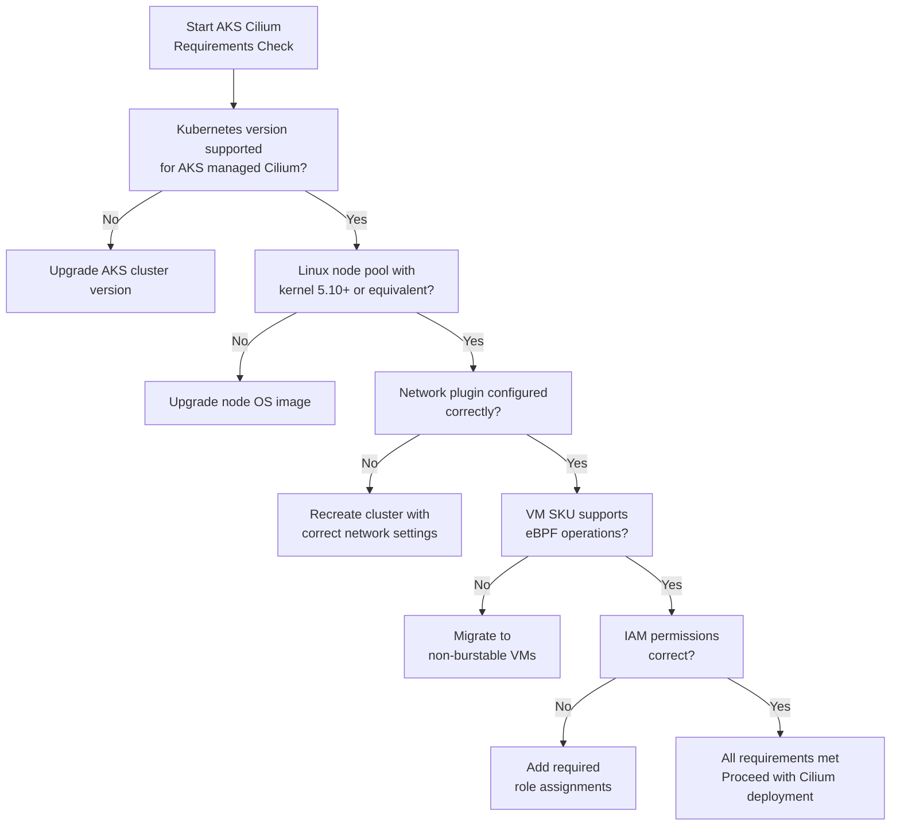

# Validate Cilium Requirements on AKS

Author: [nawazdhandala](https://github.com/nawazdhandala)

Tags: Cilium, Kubernetes, AKS, Azure, eBPF

Description: A checklist-driven guide to validating that your AKS cluster meets all requirements for running Cilium, covering node OS, kernel version, networking configuration, and AKS-specific prerequisites.

---

## Introduction

Running Cilium on Azure Kubernetes Service requires meeting specific prerequisites at both the AKS configuration level and the underlying node infrastructure. AKS abstracts much of the node configuration, but some settings-like the network plugin mode, Kubernetes version, and node OS-directly impact Cilium's capabilities and must be validated before deployment.

Failing to meet these requirements often results in Cilium agents that start but cannot load eBPF programs, missing features like kube-proxy replacement, or policy enforcement that silently does not work. Proactive requirements validation prevents these issues.

This guide provides a comprehensive requirements checklist for running Cilium on AKS, covering each prerequisite and how to validate it.

## Prerequisites

- AKS cluster (or planned AKS cluster configuration)
- `az` CLI authenticated to your Azure subscription
- `kubectl` configured to access the cluster

## Step 1: Validate Kubernetes Version

Cilium requires a minimum Kubernetes version that supports the features it uses.

```bash
# Check the Kubernetes server version

kubectl version

# Check the Azure CNI Powered by Cilium version table for the
# Kubernetes versions supported by AKS with managed Cilium.

# Check AKS supported versions in your region
az aks get-versions --location eastus -o table
```

## Step 2: Validate Node OS and Kernel Version

Cilium's eBPF features require a minimum kernel version.

```bash
# Check kernel versions on AKS nodes
kubectl get nodes -o jsonpath=\
'{range .items[*]}{.metadata.name}: {.status.nodeInfo.kernelVersion}, OS={.status.nodeInfo.osImage}{"\n"}{end}'

# Requirements:
# - Azure CNI Powered by Cilium supports Linux node pools, not Windows
# - Cilium recommends kernel 5.10+ or an equivalent vendor kernel
# - AKS defaults vary by Kubernetes version:
#   Ubuntu 22.04 for Kubernetes 1.25-1.34, Ubuntu 24.04 for 1.35+
#   Azure Linux 2.0 for Kubernetes 1.26-1.31, Azure Linux 3.0 for 1.32+
```

## Step 3: Validate AKS Network Plugin Configuration

The AKS network plugin setting determines which Cilium modes are supported.

```bash
# Check the network plugin configured on the cluster
az aks show --resource-group <rg> --name <cluster> \
  --query "networkProfile.networkPlugin" -o tsv

# For Cilium as the dataplane with Azure CNI:
# networkPlugin: azure
# networkDataplane: cilium
# networkPluginMode: overlay when using Azure CNI Overlay

az aks show --resource-group <rg> --name <cluster> \
  --query "networkProfile.{plugin:networkPlugin,mode:networkPluginMode,dataplane:networkDataplane}" \
  -o table
```

## Step 4: Check Node Pool VM SKU Compatibility

Certain VM SKUs have limitations that affect eBPF functionality.

```bash
# List node pool VM sizes
az aks nodepool list --resource-group <rg> --cluster-name <cluster> \
  --query "[*].{name:name, vmSize:vmSize}" -o table

# Avoid undersized or burstable VMs for production networking components
# if they cannot provide sustained CPU and memory for your workload.
# Use production-suitable VM sizes and monitor Cilium and node resource usage.
```

## Step 5: Validate Required Azure Permissions

AKS-managed Cilium uses the cluster's Azure networking configuration. If you use a custom virtual network or standalone Cilium Azure IPAM, validate that the relevant managed identity or service principal has the required Azure network permissions.

```bash
# Check the cluster managed identity
AKS_PRINCIPAL=$(az aks show --resource-group <rg> --name <cluster> \
  --query "identity.principalId" -o tsv)

# If your cluster uses a user-assigned kubelet identity, you can inspect it too
KUBELET_PRINCIPAL=$(az aks show --resource-group <rg> --name <cluster> \
  --query "identityProfile.kubeletidentity.objectId" -o tsv)

# Common required role:
# - Network Contributor on the virtual network or subnet for custom VNet scenarios
#
# Standalone Cilium Azure IPAM also needs Azure API permissions in the
# AKS node resource group for network interfaces, virtual networks,
# and virtual machine scale sets.
az role assignment list --assignee $AKS_PRINCIPAL \
  --query "[*].{role:roleDefinitionName, scope:scope}" -o table
```

## Requirements Validation Checklist


```mermaid
flowchart TD
    A[Start AKS Cilium\nRequirements Check] --> B[Kubernetes version supported\nfor AKS managed Cilium?]
    B -- No --> C[Upgrade AKS cluster version]
    B -- Yes --> D[Linux node pool with\nkernel 5.10+ or equivalent?]
    D -- No --> E[Upgrade node OS image]
    D -- Yes --> F[Network plugin configured\ncorrectly?]
    F -- No --> G[Recreate cluster with\ncorrect network settings]
    F -- Yes --> H[VM SKU supports\neBPF operations?]
    H -- No --> I[Migrate to\nnon-burstable VMs]
    H -- Yes --> J[IAM permissions\ncorrect?]
    J -- No --> K[Add required\nrole assignments]
    J -- Yes --> L[All requirements met\nProceed with Cilium deployment]
```

## Best Practices

- Use AKS's `--network-dataplane cilium` flag when creating new clusters for native Cilium support
- Pin the AKS node OS image version to ensure kernel compatibility after auto-upgrades
- Document your specific Kubernetes and kernel version requirements in your cluster provisioning runbook
- Test requirements in a dev cluster before enforcing them in production
- Subscribe to AKS release notes to catch changes that may affect Cilium compatibility

## Conclusion

Validating Cilium requirements on AKS before deployment prevents the difficult-to-diagnose failures that occur when prerequisites are not met. By systematically checking Kubernetes version, kernel version, network plugin configuration, VM SKUs, and IAM permissions, you ensure your AKS cluster is ready to run Cilium with full functionality.
