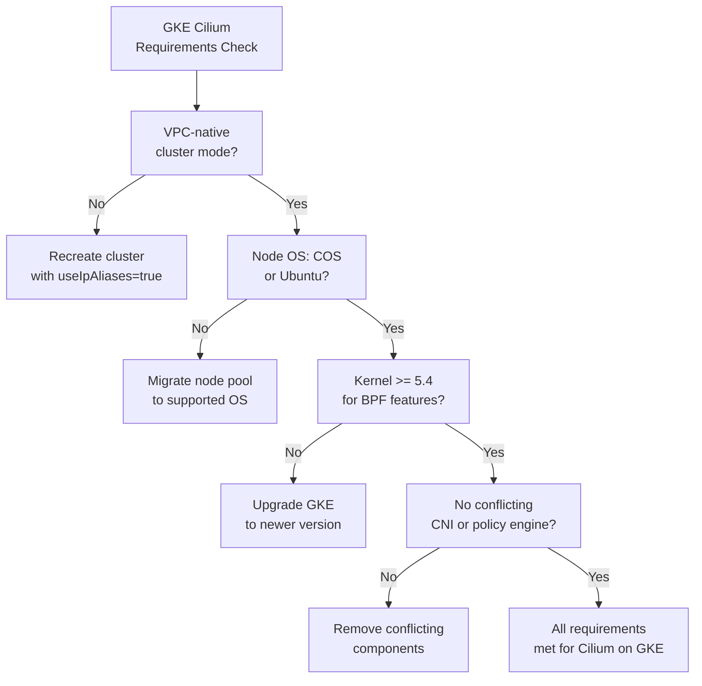

# Validate Cilium Requirements on GKE

Author: [nawazdhandala](https://github.com/nawazdhandala)

Tags: Cilium, Kubernetes, GKE, Google Cloud, eBPF

Description: A guide to validating that your Google Kubernetes Engine cluster meets all requirements for running Cilium, covering GKE-specific cluster settings, node OS requirements, and networking configuration.

---

## Introduction

Google Kubernetes Engine provides Dataplane V2 (which is based on Cilium) as a built-in option, but you can also deploy Cilium independently or use Cilium Managed on GKE for additional control. Running Cilium on GKE requires specific cluster configuration settings that differ from running Cilium on other platforms.

Key GKE-specific considerations include the Dataplane configuration, node pool OS image type, and GKE's VPC-native networking mode. Understanding and validating these requirements before deployment ensures Cilium operates correctly within GKE's network constraints.

## Prerequisites

- GKE cluster or planned cluster configuration
- `gcloud` CLI authenticated to your GCP project
- `kubectl` configured to access the cluster
- GCP project with GKE API enabled

## Step 1: Validate GKE Cluster Networking Mode

Cilium on GKE requires VPC-native (alias IP) clusters.

```bash
# Check if the cluster uses VPC-native mode
gcloud container clusters describe <cluster-name> \
  --zone <zone> \
  --format="get(ipAllocationPolicy.useIpAliases)"

# Expected: true (VPC-native mode required for Cilium)

# Also check the pod and service CIDR ranges
gcloud container clusters describe <cluster-name> \
  --zone <zone> \
  --format="table(ipAllocationPolicy.clusterIpv4Cidr,ipAllocationPolicy.servicesIpv4Cidr)"
```

## Step 2: Check Node OS Image Type

```bash
# List node pools and their image types
gcloud container node-pools list \
  --cluster <cluster-name> \
  --zone <zone> \
  --format="table(name,config.imageType,config.machineType)"

# For Cilium on GKE:
# Recommended: Container-Optimized OS (COS) or Ubuntu
# COS: cos-containerd image type
# Ubuntu: ubuntu_containerd image type

# Check kernel version on nodes
kubectl get nodes -o jsonpath=\
'{range .items[*]}{.metadata.name}: {.status.nodeInfo.kernelVersion}{"\n"}{end}'
```

## Step 3: Check for Dataplane V2 Configuration

If using GKE Dataplane V2 (Cilium-based), validate the configuration.

```bash
# Check if Dataplane V2 is enabled on the cluster
gcloud container clusters describe <cluster-name> \
  --zone <zone> \
  --format="get(networkConfig.datapathProvider)"

# Expected for Dataplane V2: "ADVANCED_DATAPATH"
# Standard: "LEGACY_DATAPATH"

# If Dataplane V2 is enabled, check GKE Cilium pods
kubectl -n kube-system get pods | grep cilium
```

## Step 4: Validate Network Policy Requirements

GKE has specific considerations for network policy when using Cilium.

```bash
# Check if NetworkPolicy is enabled on the cluster
gcloud container clusters describe <cluster-name> \
  --zone <zone> \
  --format="get(networkPolicy.enabled)"

# If deploying Cilium independently (not Dataplane V2),
# ensure Calico network policy is NOT enabled simultaneously
kubectl -n kube-system get pods | grep calico
```

## Step 5: Validate IAM and Service Account Requirements

```bash
# Check the GKE service account permissions
gcloud container clusters describe <cluster-name> \
  --zone <zone> \
  --format="get(nodeConfig.serviceAccount)"

# The service account needs compute permissions for ENI/networking operations
# Minimum required: roles/container.defaultNodeServiceAccount
gcloud projects get-iam-policy <project-id> \
  --flatten="bindings[].members" \
  --filter="bindings.members:serviceAccount:<sa-email>" \
  --format="table(bindings.role)"
```

## GKE Cilium Requirements Summary



## Best Practices

- Use GKE's built-in Dataplane V2 (Cilium) for seamless integration and Google support
- If deploying Cilium independently, create a new node pool with the correct OS image type
- Never enable both Calico network policy and Cilium simultaneously on GKE
- Use Workload Identity for Cilium's GCP API access instead of service account keys
- Test Cilium features in GKE Autopilot separately - some eBPF features may be restricted

## Conclusion

Validating GKE-specific Cilium requirements ensures that the GKE cluster configuration supports Cilium's networking model. By confirming VPC-native mode, node OS compatibility, Dataplane configuration, and IAM permissions, you set the foundation for a successful Cilium deployment on GKE.
