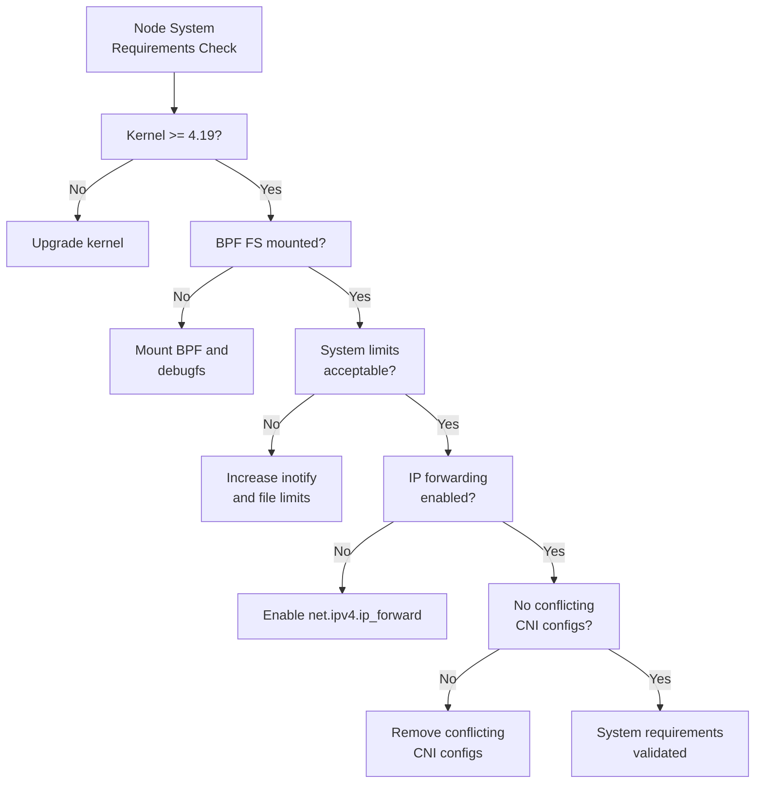

# Validate Cilium System Requirements

Author: [nawazdhandala](https://github.com/nawazdhandala)

Tags: cilium, requirements, system, kernel, ebpf, kubernetes, prerequisites

Description: A comprehensive checklist for validating that all system-level requirements are met before deploying Cilium, covering kernel features, system limits, and hardware capabilities.

---

## Introduction

Cilium's power comes from eBPF, a Linux kernel technology that enables high-performance in-kernel networking programs. This dependency means Cilium has specific system-level requirements that go beyond standard Kubernetes prerequisites. Before deploying Cilium, validating that every node meets these requirements prevents deployment failures and ensures all Cilium features you intend to use are available.

System requirements span multiple layers: the Linux kernel version and compiled features, filesystem mounts, system call limits, network configuration, and hardware capabilities. Missing any of these requirements can cause Cilium agents to fail to start, eBPF programs to refuse to load, or features to silently degrade to compatibility modes.

This guide provides a systematic approach to validating all system requirements before a Cilium deployment.

## Prerequisites

- Linux nodes (Ubuntu 20.04+, Debian 11+, RHEL 8+, or compatible)
- Root or sudo access to the nodes
- Basic familiarity with Linux system administration

## Step 1: Validate Kernel Version and Features

```bash
# Check the kernel version
uname -r

# Minimum requirements by feature:
# Core Cilium:             4.19.57
# BPF NodePort:            5.4
# kube-proxy replacement:  5.10 (full), 4.19 (partial)
# WireGuard encryption:    5.6
# Bandwidth Manager:       5.1
# L7 LB/TPROXY:           5.7

# Check kernel configuration for required features
zcat /proc/config.gz 2>/dev/null | grep -E "CONFIG_BPF=|CONFIG_BPF_SYSCALL="
# Or:
grep -E "CONFIG_BPF|CONFIG_BPF_SYSCALL|CONFIG_BPF_JIT" /boot/config-$(uname -r) 2>/dev/null
```

## Step 2: Verify eBPF Filesystem

```bash
# Check if eBPF filesystem is mounted
mount | grep -E "bpf|debugfs"

# If not mounted, mount it
mount -t bpf bpf /sys/fs/bpf
mount -t debugfs debugfs /sys/kernel/debug

# Make mounts persistent — add to /etc/fstab
grep -q "bpf" /etc/fstab || echo "WARNING: BPF FS not in /etc/fstab"
```

## Step 3: Check System Limits

```bash
# Verify inotify limits — Cilium uses file watchers extensively
sysctl fs.inotify.max_user_instances
sysctl fs.inotify.max_user_watches

# Recommended values:
# max_user_instances: 512+
# max_user_watches: 262144+
# If too low, set them:
# sysctl -w fs.inotify.max_user_instances=512
# sysctl -w fs.inotify.max_user_watches=262144

# Check ulimits for open files
ulimit -n
# Should be at least 65536
```

## Step 4: Validate Network Configuration

```bash
# Confirm IP forwarding is enabled
sysctl net.ipv4.ip_forward
# Expected: net.ipv4.ip_forward = 1

# Check that IPv6 forwarding is enabled if using dual-stack
sysctl net.ipv6.conf.all.forwarding
# Expected: net.ipv6.conf.all.forwarding = 1

# Verify conntrack max is sufficient
sysctl net.netfilter.nf_conntrack_max
# Recommended: at least 1048576 for production clusters
```

## Step 5: Check for Conflicting Software

```bash
# Check for competing network management tools
systemctl status NetworkManager 2>/dev/null | grep Active
systemctl status firewalld 2>/dev/null | grep Active

# Check for existing CNI configuration files that may conflict
ls -la /etc/cni/net.d/
# Should be empty or only contain Cilium's config after deployment

# Verify no other eBPF-based tools are loaded that may conflict
bpftool prog list 2>/dev/null | grep -v cilium | head -10
```

## System Requirements Summary



## Best Practices

- Create a node initialization script that validates and sets all requirements before Kubernetes joins the node
- Use cloud-init or Ignition to apply sysctl settings consistently across all nodes
- Document the specific kernel features required for your Cilium feature set
- Include system requirement validation in your node image build pipeline
- Monitor kernel upgrades on nodes — security patches sometimes change relevant settings

## Conclusion

Validating Cilium's system requirements before deployment is a small investment that prevents hours of debugging post-deployment failures. By checking kernel version, eBPF filesystem mounts, system limits, network configuration, and conflicting software, you ensure every node is ready to run Cilium with full functionality from the first deployment.
