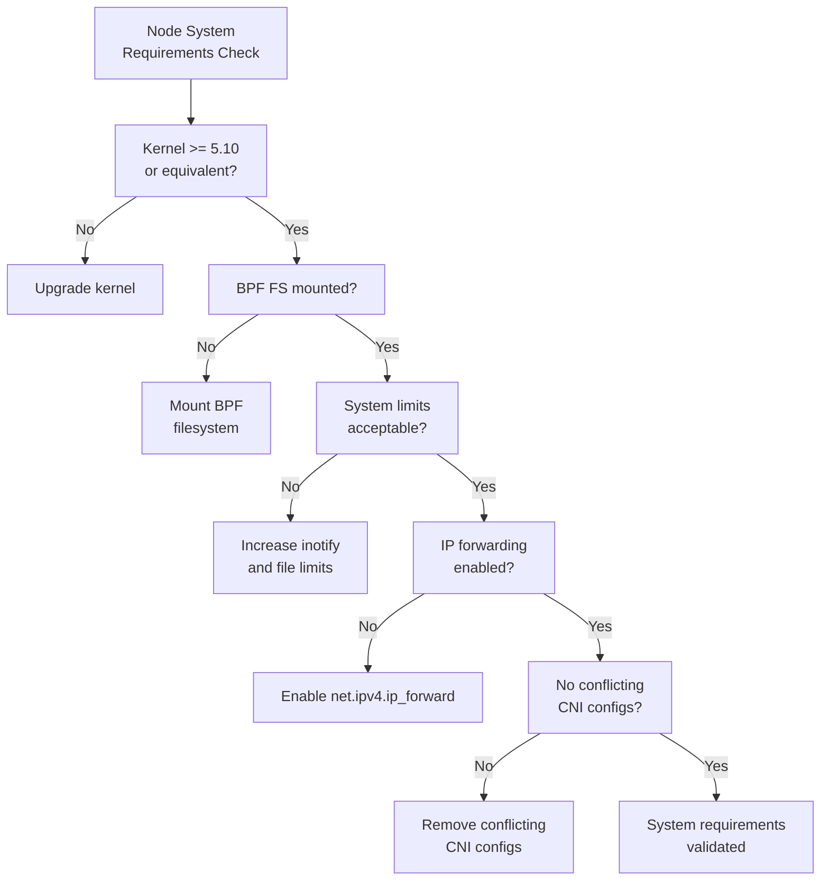

# Validate Cilium System Requirements

Author: [nawazdhandala](https://github.com/nawazdhandala)

Tags: Cilium, Kubernetes, Networking, eBPF

Description: A comprehensive checklist for validating that all system-level requirements are met before deploying Cilium, covering kernel features, system limits, and hardware capabilities.

---

## Introduction

Cilium's power comes from eBPF, a Linux kernel technology that enables high-performance in-kernel networking programs. This dependency means Cilium has specific system-level requirements that go beyond standard Kubernetes prerequisites. Before deploying Cilium, validating that every node meets these requirements prevents deployment failures and ensures all Cilium features you intend to use are available.

System requirements span multiple layers: the Linux kernel version and compiled features, filesystem mounts, system limits, network configuration, and supported architectures. Missing any of these requirements can cause Cilium agents to fail to start, eBPF programs to refuse to load, or features to silently degrade to compatibility modes.

This guide provides a systematic approach to validating all system requirements before a Cilium deployment.

## Prerequisites

- Linux nodes (Ubuntu 20.04+, Debian 10+, RHEL 8.6+, or compatible)
- Root or sudo access to the nodes
- Basic familiarity with Linux system administration

## Step 1: Validate Kernel Version and Features

```bash
# Check the kernel version

uname -r

# Minimum requirements:
# Core Cilium:             5.10 or equivalent (for example, 4.18 on RHEL 8.10)
# Supported architectures: AMD64 or AArch64
# Native host process:     clang+LLVM 18.1+
# Without Kubernetes:      etcd 3.1.0+
#
# Advanced feature examples:
# IPv6 BIG TCP:            5.19
# IPv4 BIG TCP:            6.3
# Multicast beta:          5.10 on AMD64, 6.0 on AArch64
# WireGuard encryption:    in-kernel WireGuard support, or an out-of-tree module
# Bandwidth Manager BBR:   5.18+ recommended for reliable Pod BBR

# Check kernel configuration for required features
zcat /proc/config.gz 2>/dev/null | grep -E "CONFIG_BPF=|CONFIG_BPF_EVENTS=|CONFIG_BPF_SYSCALL=|CONFIG_NET_CLS_BPF=|CONFIG_BPF_JIT=|CONFIG_NET_CLS_ACT=|CONFIG_NET_SCH_INGRESS=|CONFIG_CRYPTO_SHA1=|CONFIG_CRYPTO_USER_API_HASH=|CONFIG_CGROUPS=|CONFIG_CGROUP_BPF=|CONFIG_PERF_EVENTS=|CONFIG_SCHEDSTATS="
# Or:
grep -E "CONFIG_BPF=|CONFIG_BPF_EVENTS=|CONFIG_BPF_SYSCALL=|CONFIG_NET_CLS_BPF=|CONFIG_BPF_JIT=|CONFIG_NET_CLS_ACT=|CONFIG_NET_SCH_INGRESS=|CONFIG_CRYPTO_SHA1=|CONFIG_CRYPTO_USER_API_HASH=|CONFIG_CGROUPS=|CONFIG_CGROUP_BPF=|CONFIG_PERF_EVENTS=|CONFIG_SCHEDSTATS=" /boot/config-$(uname -r) 2>/dev/null
```

## Step 2: Verify eBPF Filesystem

```bash
# Check if eBPF filesystem is mounted
findmnt -t bpf /sys/fs/bpf

# If not mounted, Cilium can automatically mount it. To pre-mount it:
mount bpffs /sys/fs/bpf -t bpf

# Make mounts persistent - add to /etc/fstab
grep -qE "^[[:space:]]*[^#[:space:]]+[[:space:]]+/sys/fs/bpf[[:space:]]+bpf[[:space:]]" /etc/fstab || echo "WARNING: BPF FS not in /etc/fstab"
```

## Step 3: Check System Limits

```bash
# Verify inotify limits if your node baseline sets unusually low defaults
sysctl fs.inotify.max_user_instances
sysctl fs.inotify.max_user_watches

# Common baseline values:
# max_user_instances: 512+
# max_user_watches: 262144+
# If too low, set them:
# sysctl -w fs.inotify.max_user_instances=512
# sysctl -w fs.inotify.max_user_watches=262144

# Check ulimits for open files
ulimit -n
# Should be at least 65536
```

## Step 4: Validate Network Configuration

```bash
# Confirm IP forwarding is enabled if your routing mode depends on Linux forwarding
sysctl net.ipv4.ip_forward
# Expected for forwarding: net.ipv4.ip_forward = 1

# Check that IPv6 forwarding is enabled if using dual-stack
sysctl net.ipv6.conf.all.forwarding
# Expected for IPv6 forwarding: net.ipv6.conf.all.forwarding = 1

# Verify conntrack max if your deployment still depends on netfilter conntrack
sysctl net.netfilter.nf_conntrack_max
```

## Step 5: Check for Conflicting Software

```bash
# Check for tools that may manage interfaces or firewall policy
systemctl status NetworkManager 2>/dev/null | grep Active
systemctl status firewalld 2>/dev/null | grep Active

# Check for existing CNI configuration files that may conflict
ls -la /etc/cni/net.d/
# Cilium writes 05-cilium.conflist and removes other CNI config files by default

# Inventory other eBPF-based tools that are loaded
bpftool prog list 2>/dev/null | grep -v cilium | head -10
```

## System Requirements Summary


```mermaid
flowchart TD
    A[Node System\nRequirements Check] --> B[Kernel >= 5.10\nor equivalent?]
    B -- No --> C[Upgrade kernel]
    B -- Yes --> D[BPF FS mounted?]
    D -- No --> E[Mount BPF\nfilesystem]
    D -- Yes --> F[System limits\nacceptable?]
    F -- No --> G[Increase inotify\nand file limits]
    F -- Yes --> H[IP forwarding\nenabled?]
    H -- No --> I[Enable net.ipv4.ip_forward]
    H -- Yes --> J[No conflicting\nCNI configs?]
    J -- No --> K[Remove conflicting\nCNI configs]
    J -- Yes --> L[System requirements\nvalidated]
```

## Best Practices

- Create a node initialization script that validates and sets all requirements before Kubernetes joins the node
- Use cloud-init or Ignition to apply sysctl settings consistently across all nodes
- Document the specific kernel features required for your Cilium feature set
- Include system requirement validation in your node image build pipeline
- Monitor kernel upgrades on nodes - security patches sometimes change relevant settings

## Conclusion

Validating Cilium's system requirements before deployment is a small investment that prevents hours of debugging post-deployment failures. By checking kernel version, eBPF filesystem mounts, system limits, network configuration, and conflicting software, you ensure every node is ready to run Cilium with full functionality from the first deployment.
