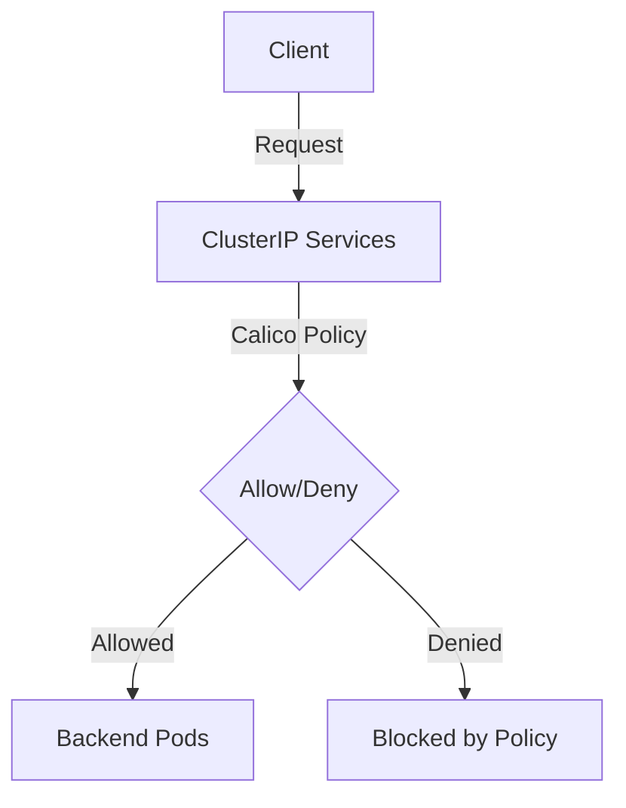

# How to Validate Calico ClusterIP Service Policies Before Production

Author: [nawazdhandala](https://github.com/nawazdhandala)

Tags: Calico, Kubernetes, Network Policy, ClusterIP, Security

Description: Validate Calico ClusterIP service policies to secure internal Kubernetes service-to-service communication.

---

## Introduction

Calico NetworkPolicies give you control over how traffic flows to and from the pods backing Kubernetes Services. The `projectcalico.org/v3` API provides the tools needed to secure ClusterIP Service traffic effectively while maintaining service availability.

Proper policy configuration is essential for clusters that expose services to external traffic, including ClusterIP services advertised outside the cluster. Without it, unauthorized sources can reach exposed services, creating significant attack surface.

This guide covers validating ClusterIP Service access with Calico policies and practical, production-tested configurations.

## Prerequisites

- Kubernetes cluster with Calico v3.26+
- `calicoctl` and `kubectl` installed
- Understanding of Kubernetes service networking

## Core Configuration

```yaml
apiVersion: projectcalico.org/v3
kind: NetworkPolicy
metadata:
  name: protect-clusterip-service
  namespace: production
spec:
  order: 100
  selector: app == 'backend-service'
  ingress:
    - action: Allow
      source:
        selector: tier == 'frontend'
      destination:
        ports: [8080]
    - action: Allow
      source:
        selector: tier == 'monitoring'
      destination:
        ports: [9090]
    - action: Deny
  egress:
    - action: Allow
      destination:
        selector: app == 'database'
        ports: [5432]
    - action: Allow
      destination:
        services:
          name: kube-dns
          namespace: kube-system
    - action: Deny
  types:
    - Ingress
    - Egress
```


## Verification

```bash
# Apply the policy

calicoctl apply -f validate-clusterip-services.yaml

# Verify traffic behavior
kubectl exec -n test test-pod -- curl -s --max-time 5 http://service-name:8080
echo "Result: $?"
```

## Architecture



## Conclusion

Calico NetworkPolicies provide essential security controls for Kubernetes service traffic. Configure them carefully, test bidirectional traffic flows, and use staged policies to preview impact before enforcement. Regular monitoring of denial rates helps you detect misconfigurations and unauthorized access attempts before they impact service availability.
