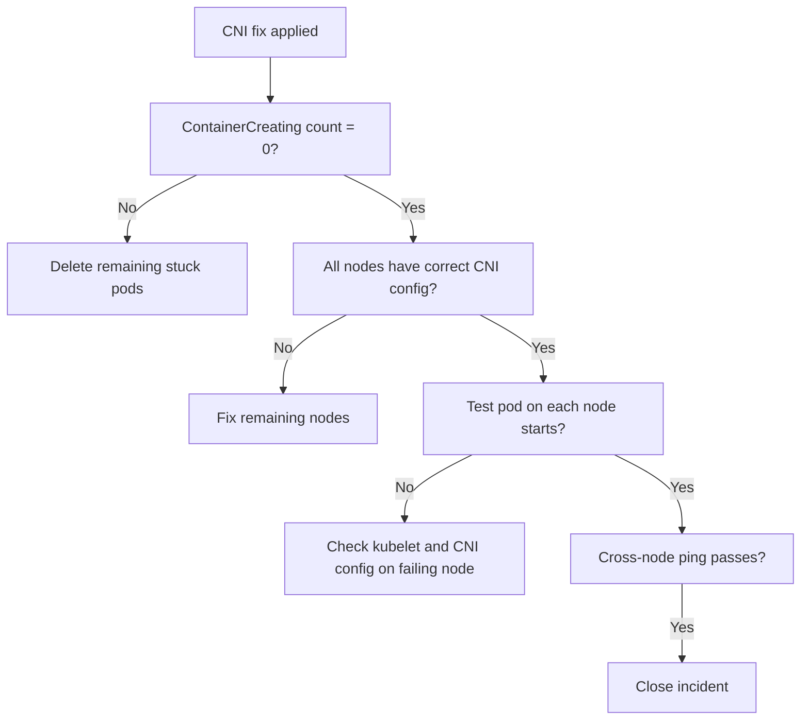

# How to Validate Resolution of ContainerCreating After Uninstalling Calico

Author: [nawazdhandala](https://github.com/nawazdhandala)

Tags: Calico, Kubernetes, Networking, Troubleshooting

Description: Validation checklist to confirm pods are no longer stuck in ContainerCreating after Calico CNI removal by verifying CNI state and pod scheduling success.

---

## Introduction

Validating resolution of ContainerCreating after Calico removal requires confirming that the CNI layer is restored on all nodes, that new pods can be scheduled and receive IP addresses, and that no ContainerCreating pods remain. Because the problem often affects multiple nodes simultaneously, validation must cover all nodes, not just the first one that was fixed.

## Symptoms

- ContainerCreating count drops to zero but some nodes still affected
- New pods start but cannot communicate cross-node
- CNI fixed but old ContainerCreating pods not deleted

## Root Causes

- Fix applied to subset of nodes only
- Stuck pods not deleted after CNI fix

## Diagnosis Steps

```bash
kubectl get pods --all-namespaces | grep ContainerCreating | wc -l
```

## Solution

**Validation Step 1: No ContainerCreating pods remain**

```bash
COUNT=$(kubectl get pods --all-namespaces | grep ContainerCreating | wc -l)
[ "$COUNT" -eq 0 ] && echo "PASS: No ContainerCreating pods" || echo "FAIL: $COUNT still ContainerCreating"
```

**Validation Step 2: All nodes have correct CNI config**

```bash
for NODE in $(kubectl get nodes -o jsonpath='{.items[*].metadata.name}'); do
  CNI=$(ssh $NODE "ls /etc/cni/net.d/ | grep -v calico | head -1" 2>/dev/null)
  CALICO=$(ssh $NODE "ls /etc/cni/net.d/ | grep calico | wc -l" 2>/dev/null)
  echo "$NODE: CNI=$CNI, Calico_configs=$CALICO"
done
```

**Validation Step 3: Schedule test pod on each node**

```bash
for NODE in $(kubectl get nodes -o jsonpath='{.items[*].metadata.name}'); do
  kubectl run test-$NODE --image=busybox --restart=Never \
    --overrides="{\"spec\":{\"nodeName\":\"$NODE\"}}" -- sleep 10
done

kubectl wait pods -l run --for=condition=Ready --timeout=120s
kubectl get pods -l run -o wide
kubectl delete pods -l run
```

**Validation Step 4: Cross-node connectivity**

```bash
kubectl run src --image=busybox --restart=Never -- sleep 120
kubectl run dst --image=busybox --restart=Never -- sleep 120
kubectl wait pod/src pod/dst --for=condition=Ready --timeout=60s
DST_IP=$(kubectl get pod dst -o jsonpath='{.status.podIP}')
kubectl exec src -- ping -c 3 $DST_IP && echo "PASS: Cross-node ping" || echo "FAIL"
kubectl delete pod src dst
```



## Prevention

- Run node-by-node test pod validation as part of CNI migration procedure
- Include cross-node ping in final validation before declaring migration complete
- Keep a record of CNI state on all nodes pre- and post-migration

## Conclusion

Validating ContainerCreating resolution requires zero ContainerCreating pods, correct CNI config on all nodes, successful test pod scheduling on each node, and cross-node connectivity confirmation. Node-by-node validation is essential since issues may affect only a subset of nodes.
