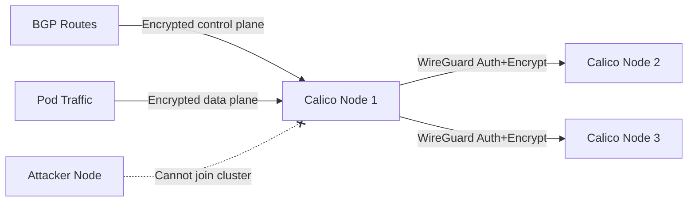

# How to Validate Crypto Authentication for Calico Node Traffic Before Production

Author: [nawazdhandala](https://github.com/nawazdhandala)

Tags: Calico, Kubernetes, Network Policy, Encryption, WireGuard, Node Security

Description: Validate WireGuard-based crypto authentication for Calico node traffic to secure inter-node communication.

---

## Introduction

Crypto authentication for Calico node traffic uses WireGuard to authenticate and encrypt communication between Calico nodes. This protects the BGP control plane and pod traffic from interception and spoofing, even on untrusted networks.

Calico's `projectcalico.org/v3` FelixConfiguration resource controls WireGuard settings, enabling you to turn on node-level encryption with a single configuration change. Node-to-node authentication ensures that only legitimate Calico nodes can exchange routing information and forward pod traffic.

This guide covers validate crypto authentication for Calico node traffic, including both data plane and control plane encryption.

## Prerequisites

- Kubernetes cluster with Calico v3.26+
- Linux kernel 5.6+ on all nodes (for WireGuard)
- `calicoctl` and `kubectl` installed

## Enable Crypto Authentication

```yaml
apiVersion: projectcalico.org/v3
kind: FelixConfiguration
metadata:
  name: default
spec:
  wireguardEnabled: true
  wireguardInterfaceMTU: 1440
  wireguardListeningPort: 51820
```

```bash
# Apply configuration
calicoctl apply -f wireguard-config.yaml

# Verify on each node
kubectl get node -o custom-columns='NAME:.metadata.name,WIREGUARD:.metadata.annotations.projectcalico\.org/WireguardPublicKey'
```

## Verify Node Authentication

```bash
# Check WireGuard peers (all Calico nodes should be listed)
kubectl exec -n kube-system calico-node-xxx -- wg show

# Verify peer connections
kubectl exec -n kube-system calico-node-node1 -- wg show calico.wireguard peers

# Check that traffic between nodes is encrypted
kubectl debug node/node1 -it --image=nicolaka/netshoot -- tcpdump -i eth0 -n port 51820 -c 10
```

## Architecture



## Conclusion

Crypto authentication for Calico node traffic provides mutual authentication and encryption for all inter-node communication. Enable WireGuard in FelixConfiguration to protect both the control plane (BGP routing) and data plane (pod traffic) from interception and injection. Monitor WireGuard peer connections and transfer statistics to ensure encryption is active across all nodes and detect any nodes that have lost their crypto authentication.
