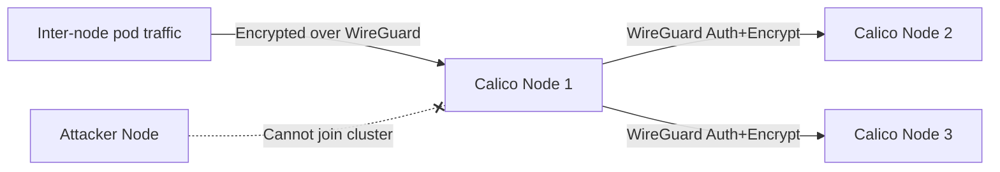

# How to Validate Crypto Authentication for Calico Node Traffic Before Production

Author: [nawazdhandala](https://github.com/nawazdhandala)

Tags: Calico, Kubernetes, Network Policy, Encryption, WireGuard, Node Security

Description: Validate WireGuard-based crypto authentication for Calico node traffic to secure inter-node communication.

---

## Introduction

Crypto authentication for Calico node traffic uses WireGuard to authenticate and encrypt communication between Calico nodes. This protects inter-node pod traffic from interception and spoofing, even on untrusted networks.

Calico's `projectcalico.org/v3` FelixConfiguration resource controls WireGuard settings, enabling you to turn on node-level pod traffic encryption with a single configuration change. Node-to-node authentication ensures that only legitimate Calico nodes can establish WireGuard tunnels and forward encrypted pod traffic.

This guide covers validate crypto authentication for Calico node traffic, focusing on inter-node pod traffic encryption.

## Prerequisites

- Kubernetes cluster with Calico v3.26+
- Linux kernel 5.6+ on all nodes (for WireGuard)
- `calicoctl` and `kubectl` installed

## Enable Crypto Authentication

```yaml
apiVersion: projectcalico.org/v3
kind: FelixConfiguration
metadata:
  name: default
spec:
  wireguardEnabled: true
  wireguardMTU: 1440
  wireguardListeningPort: 51820
```

```bash
# Apply configuration

calicoctl apply -f wireguard-config.yaml

# Verify each Calico node has a WireGuard public key in status
calicoctl get node <NODE-NAME> -o yaml
```

## Verify Node Authentication

```bash
# Check WireGuard peers (all Calico nodes should be listed)
kubectl exec -n kube-system calico-node-xxx -- wg show

# Verify peer connections
kubectl exec -n kube-system calico-node-node1 -- wg show wireguard.cali peers

# Check that traffic between nodes is encrypted
kubectl debug node/node1 -it --image=nicolaka/netshoot -- tcpdump -i eth0 -n port 51820 -c 10
```

## Architecture


```mermaid
flowchart LR
    N1[Calico Node 1] -->|WireGuard Auth+Encrypt| N2[Calico Node 2]
    N1 -->|WireGuard Auth+Encrypt| N3[Calico Node 3]
    B[Inter-node pod traffic] -->|Encrypted over WireGuard| N1
    C[Attacker Node] -.-x|Cannot join cluster| N1
```

## Conclusion

Crypto authentication for Calico node traffic provides mutual authentication and encryption for inter-node pod traffic. Enable WireGuard in FelixConfiguration to protect pod traffic from interception and injection. Monitor WireGuard peer connections and transfer statistics to ensure encryption is active across all nodes and detect any nodes that have lost their crypto authentication.
