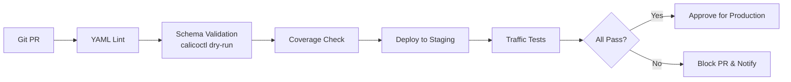

# How to Validate Calico Default Deny Policies Before Production

Author: [nawazdhandala](https://github.com/nawazdhandala)

Tags: Calico, Kubernetes, Network Policy, Validation, Security, Testing

Description: A comprehensive validation framework for Calico default deny network policies to ensure correctness before deploying to production clusters.

---

## Introduction

Validation is the final gate before a network policy reaches production. Unlike testing with real traffic (which verifies behavior), validation ensures correctness at the policy definition level: right API version, correct selectors, proper ordering, complete traffic coverage, and no conflicting rules. A valid policy that has been tested is far more reliable than one that has only been eyeballed.

Calico provides schema validation through `calicoctl` and dry-run capabilities that catch syntax errors before any traffic is affected. Beyond schema validation, you need semantic validation: does the policy actually express the intent you designed? Does the allow list cover all required paths? Are there any gaps that would cause unexpected denials?

This guide builds a validation pipeline for Calico default deny policies that you can integrate into your CI/CD workflow to prevent invalid or incomplete policies from ever reaching production.

## Prerequisites

- Kubernetes cluster with Calico v3.26+ (or just `calicoctl` for dry-run validation)
- `calicoctl` installed and configured
- A CI/CD system (GitHub Actions, GitLab CI, or similar)
- `yamllint` and `kubeval` or `kubeconform` installed

## Step 1: Schema Validation with calicoctl

```bash
# Validate without applying
calicoctl apply -f default-deny.yaml --dry-run

# Validate all policies in a directory
for f in policies/*.yaml; do
  echo "Validating: $f"
  calicoctl apply -f "$f" --dry-run && echo "PASS" || echo "FAIL: $f"
done
```

## Step 2: YAML Lint for Policy Files

```yaml
# .yamllint.yaml
extends: default
rules:
  line-length:
    max: 120
  truthy:
    allowed-values: ['true', 'false']
```

```bash
yamllint -c .yamllint.yaml policies/
```

## Step 3: Verify Required Fields Are Present

```bash
# Check all policies have required metadata
python3 << 'EOF'
import yaml, os, sys

required_fields = ['apiVersion', 'kind', 'metadata', 'spec']
calico_api = 'projectcalico.org/v3'
errors = []

for fname in os.listdir('policies'):
    if not fname.endswith('.yaml'):
        continue
    with open(f'policies/{fname}') as f:
        doc = yaml.safe_load(f)
    for field in required_fields:
        if field not in doc:
            errors.append(f"{fname}: missing {field}")
    if doc.get('apiVersion') != calico_api:
        errors.append(f"{fname}: wrong apiVersion {doc.get('apiVersion')}")

if errors:
    print('\n'.join(errors))
    sys.exit(1)
print("All policies valid")
EOF
```

## Step 4: Validate Traffic Coverage

Create a traffic coverage matrix test:

```bash
#!/bin/bash
# validate-coverage.sh
REQUIRED_PATHS=(
  "frontend->backend:8080"
  "backend->database:5432"
  "monitoring->all:9090"
  "all->dns:53"
)

echo "Checking policy coverage for required traffic paths..."
for path in "${REQUIRED_PATHS[@]}"; do
  SRC=$(echo $path | cut -d'-' -f1)
  DST=$(echo $path | cut -d'>' -f2 | cut -d':' -f1)
  PORT=$(echo $path | cut -d':' -f2)
  echo "Checking: $SRC -> $DST:$PORT"
  # Verify corresponding allow rule exists
  calicoctl get networkpolicies --all-namespaces -o json | \
    jq -e ".items[] | select(.spec.ingress[]?.destination.ports[] == $PORT)" > /dev/null \
    && echo "COVERED" || echo "MISSING: $SRC -> $DST:$PORT"
done
```

## Step 5: CI/CD Integration

```yaml
# .github/workflows/validate-policies.yaml
name: Validate Calico Policies
on: [pull_request]
jobs:
  validate:
    runs-on: ubuntu-latest
    steps:
      - uses: actions/checkout@v3
      - name: Install calicoctl
        run: |
          curl -Lo calicoctl https://github.com/projectcalico/calico/releases/download/v3.26.0/calicoctl-linux-amd64
          chmod +x calicoctl && sudo mv calicoctl /usr/local/bin/
      - name: Validate Policies
        run: |
          yamllint policies/
          for f in policies/*.yaml; do
            calicoctl apply -f "$f" --dry-run
          done
```

## Validation Pipeline



## Conclusion

A robust validation pipeline for Calico default deny policies combines schema validation, YAML linting, traffic coverage analysis, and automated CI/CD checks. By catching errors at the policy definition stage, you prevent production incidents before they happen. Integrate these validation steps into every pull request that touches network policy files, and you will dramatically reduce the risk of misconfigurations reaching your cluster.
