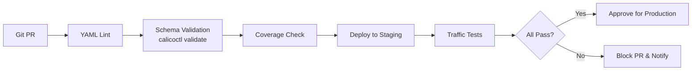

# How to Validate Calico Default Deny Policies Before Production

Author: [nawazdhandala](https://github.com/nawazdhandala)

Tags: Calico, Kubernetes, Network Policy, Validation, Security, Testing

Description: A comprehensive validation framework for Calico default deny network policies to ensure correctness before deploying to production clusters.

---

## Introduction

Validation is the final gate before a network policy reaches production. Unlike testing with real traffic (which verifies behavior), validation ensures correctness at the policy definition level: right API version, correct selectors, proper ordering, complete traffic coverage, and no conflicting rules. A valid policy that has been tested is far more reliable than one that has only been eyeballed.

Calico provides schema validation through `calicoctl validate`, which catches syntax and Calico-specific validation errors before any traffic is affected. Beyond schema validation, you need semantic validation: does the policy actually express the intent you designed? Does the allow list cover all required paths? Are there any gaps that would cause unexpected denials?

This guide builds a validation pipeline for Calico default deny policies that you can integrate into your CI/CD workflow to prevent invalid or incomplete policies from ever reaching production.

## Prerequisites

- Kubernetes cluster with Calico v3.26+ (or just `calicoctl` for offline validation)
- `calicoctl` installed and configured
- A CI/CD system (GitHub Actions, GitLab CI, or similar)
- `yamllint` and `jq` installed

## Step 1: Schema Validation with calicoctl

```bash
# Validate without applying

calicoctl validate -f default-deny.yaml

# Validate all policies in a directory
for f in policies/*.yaml policies/*.yml; do
  [ -e "$f" ] || continue
  echo "Validating: $f"
  calicoctl validate -f "$f" && echo "PASS" || echo "FAIL: $f"
done
```

## Step 2: YAML Lint for Policy Files

```yaml
# .yamllint.yaml
extends: default
rules:
  line-length:
    max: 120
  truthy:
    allowed-values: ['true', 'false']
```

```bash
yamllint -c .yamllint.yaml policies/
```

## Step 3: Verify Required Fields Are Present

```bash
# Check all policies have required metadata
python3 << 'EOF'
import os
import sys
import yaml

required_fields = ['apiVersion', 'kind', 'metadata', 'spec']
calico_api = 'projectcalico.org/v3'
errors = []

for fname in os.listdir('policies'):
    if not fname.endswith(('.yaml', '.yml')):
        continue
    with open(f'policies/{fname}', encoding='utf-8') as f:
        for index, doc in enumerate(yaml.safe_load_all(f), start=1):
            if doc is None:
                continue
            label = f"{fname} document {index}"
            for field in required_fields:
                if field not in doc:
                    errors.append(f"{label}: missing {field}")
            if doc.get('apiVersion') != calico_api:
                errors.append(f"{label}: wrong apiVersion {doc.get('apiVersion')}")
            if not doc.get('metadata', {}).get('name'):
                errors.append(f"{label}: missing metadata.name")

if errors:
    print('\n'.join(errors))
    sys.exit(1)
print("All policies valid")
EOF
```

## Step 4: Validate Traffic Coverage

Create a traffic coverage matrix test:

```bash
#!/bin/bash
# validate-coverage.sh
REQUIRED_PATHS=(
  "role == 'frontend'|role == 'backend'|8080"
  "role == 'backend'|role == 'database'|5432"
  "role == 'monitoring'|all()|9090"
  "all()|k8s-app == 'kube-dns'|53"
)

echo "Checking policy coverage for required traffic paths..."
for path in "${REQUIRED_PATHS[@]}"; do
  IFS='|' read -r SRC_SELECTOR DST_SELECTOR PORT <<< "$path"
  echo "Checking: $SRC_SELECTOR -> $DST_SELECTOR:$PORT"
  # Verify a matching ingress allow rule exists for the destination selector and port
  calicoctl get networkpolicies --all-namespaces -o json | \
    jq -e --arg src "$SRC_SELECTOR" --arg dst "$DST_SELECTOR" --argjson port "$PORT" '
      .items[]
      | select(.spec.selector == $dst)
      | .spec.ingress[]?
      | select((.action // "Allow") == "Allow")
      | select((.source.selector? // "") == $src)
      | select(.destination.ports[]? == $port)
    ' > /dev/null \
    && echo "COVERED" || echo "MISSING: $SRC_SELECTOR -> $DST_SELECTOR:$PORT"
done
```

## Step 5: CI/CD Integration

```yaml
# .github/workflows/validate-policies.yaml
name: Validate Calico Policies
on: [pull_request]
jobs:
  validate:
    runs-on: ubuntu-latest
    steps:
      - uses: actions/checkout@v4
      - name: Install calicoctl
        run: |
          curl -Lo calicoctl https://github.com/projectcalico/calico/releases/download/v3.32.0/calicoctl-linux-amd64
          chmod +x calicoctl && sudo mv calicoctl /usr/local/bin/
      - name: Validate Policies
        run: |
          yamllint policies/
          calicoctl validate -f policies/ --recursive
```

## Validation Pipeline


```mermaid
flowchart LR
    A[Git PR] --> B[YAML Lint]
    B --> C[Schema Validation\ncalicoctl validate]
    C --> D[Coverage Check]
    D --> E[Deploy to Staging]
    E --> F[Traffic Tests]
    F --> G{All Pass?}
    G -->|Yes| H[Approve for Production]
    G -->|No| I[Block PR & Notify]
```

## Conclusion

A robust validation pipeline for Calico default deny policies combines schema validation, YAML linting, traffic coverage analysis, and automated CI/CD checks. By catching errors at the policy definition stage, you prevent production incidents before they happen. Integrate these validation steps into every pull request that touches network policy files, and you will dramatically reduce the risk of misconfigurations reaching your cluster.
