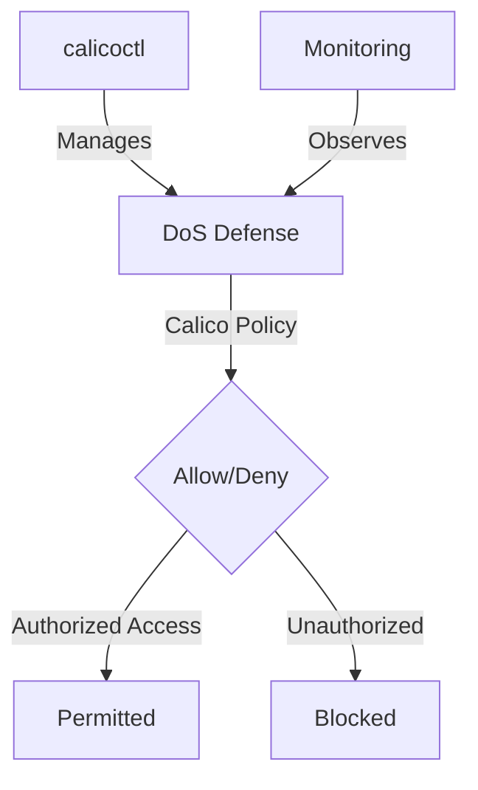

# How to Validate Calico DoS Defense Policies Before Production

Author: [nawazdhandala](https://github.com/nawazdhandala)

Tags: Calico, Kubernetes, Network Policy, DoS Defense, Security

Description: Validate Calico network policies for DoS defense to protect cluster workloads from denial of service attacks.

---

## Introduction

DoS Defense with Calico Policies is an important security consideration for production Calico deployments. The `projectcalico.org/v3` API provides the tools needed to validate DoS Defense effectively, combining Calico's network policy with proper access controls and monitoring.

This guide covers validate DoS Defense in Calico with practical configurations and operational best practices.

## Prerequisites

- Kubernetes cluster with Calico v3.26+
- `calicoctl` and `kubectl` installed
- Understanding of Calico's monitoring and security architecture

## Core Configuration

```yaml
apiVersion: projectcalico.org/v3
kind: GlobalNetworkPolicy
metadata:
  name: dos-defense-rate-limit
spec:
  order: 50
  selector: app == 'web-frontend'
  ingress:
    - action: Allow
      source:
        nets:
          - 0.0.0.0/0
      destination:
        ports: [80, 443]
      # Note: Rate limiting requires Calico Enterprise or eBPF mode
    - action: Allow
  types:
    - Ingress
---
# Block known bad actors
apiVersion: projectcalico.org/v3
kind: GlobalNetworkPolicy
metadata:
  name: dos-block-bad-actors
spec:
  order: 10
  selector: app == 'web-frontend'
  ingress:
    - action: Deny
      source:
        nets:
          - 198.51.100.0/24  # Known attack source
          - 203.0.113.0/24
  types:
    - Ingress
```

## Implementation

```bash
# Apply DoS defense policies
calicoctl apply -f dos-defense.yaml

# Monitor connection rates using Felix metrics
curl -s http://node-ip:9091/metrics | grep felix_denied

# Check denial rates in real-time
watch -n1 'curl -s http://localhost:9091/metrics | grep felix_denied_packets_total'
```

## eBPF Rate Limiting (Calico with eBPF dataplane)

```bash
# Enable eBPF dataplane for rate limiting support
kubectl patch installation default --type=merge -p '{"spec":{"calicoNetwork":{"linuxDataplane":"BPF"}}}'
```

## Architecture



## Conclusion

Validate DoS Defense in Calico requires a combination of proper policy configuration, regular monitoring, and proactive testing. Use the patterns in this guide as a foundation and adapt them to your specific security requirements. Always validate changes in staging before production and maintain comprehensive logging for security visibility.
