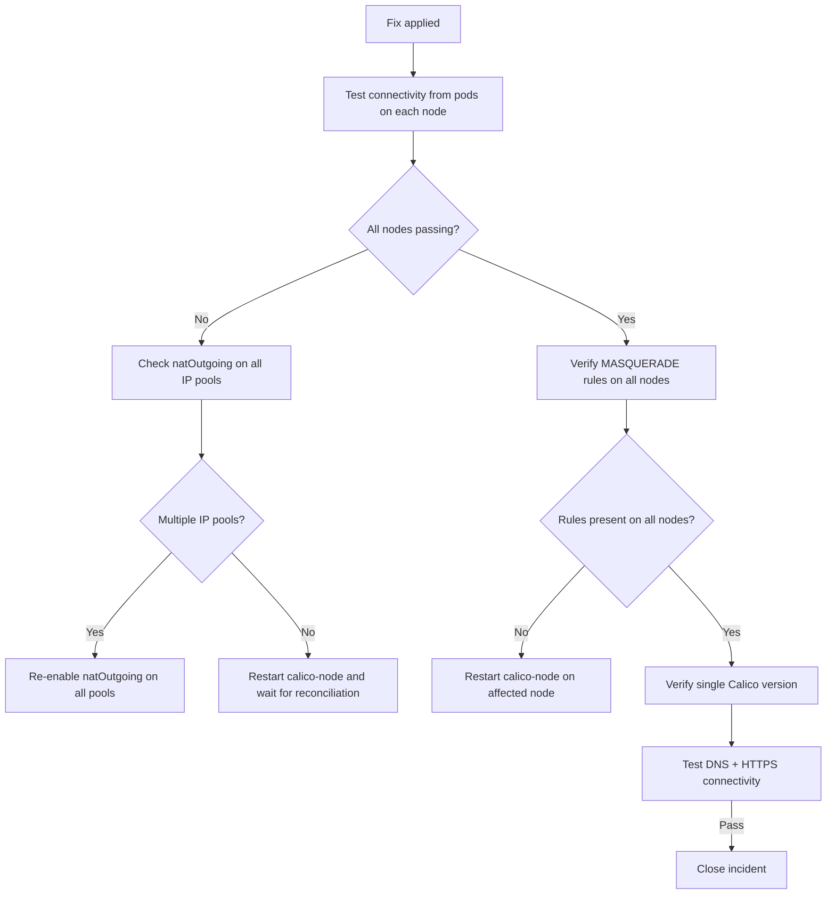

# How to Validate Resolution of External Connectivity After Calico Upgrade

Author: [nawazdhandala](https://github.com/nawazdhandala)

Tags: Calico, Kubernetes, Networking, Troubleshooting

Description: Validate that external connectivity is restored after a Calico upgrade fix by testing pod-to-external connectivity from all nodes, verifying iptables MASQUERADE rules, and confirming natOutgoing is enabled.

---

## Introduction

Validating external connectivity resolution after a Calico upgrade fix requires testing connectivity from pods on each node, verifying iptables MASQUERADE rules are present, and confirming the IP pool natOutgoing configuration is correct. A fix to natOutgoing takes effect immediately without requiring pod restarts, but iptables rule verification confirms calico-node applied the changes on each node.

Complete validation also includes verifying that all calico-node pods are running the same version, which eliminates the possibility of mixed-version routing inconsistencies causing intermittent failures after the incident appears resolved.

## Symptoms

- Connectivity restored for some pods but not others
- Fix applied but connectivity still intermittent

## Root Causes

- calico-node not yet reconciled iptables on all nodes
- Multiple IP pools — only one was fixed

## Solution

**Validation Step 1: Test external connectivity from pods on every node**

```bash
for NODE in $(kubectl get nodes -o jsonpath='{.items[*].metadata.name}'); do
  kubectl run ext-test-$NODE --image=busybox --restart=Never \
    --overrides="{\"spec\":{\"nodeName\":\"$NODE\"}}" \
    -- wget -qO- --timeout=10 http://1.1.1.1
done

sleep 15
kubectl get pods | grep ext-test
# All should complete (not Error)

kubectl delete pods -l run=ext-test 2>/dev/null || \
  kubectl get pods | grep ext-test | awk '{print $1}' | xargs kubectl delete pod
```

**Validation Step 2: Verify natOutgoing on all IP pools**

```bash
calicoctl get ippool -o yaml | grep -E "name:|natOutgoing"
# All IP pools used by pods should have natOutgoing: true
```

**Validation Step 3: Verify MASQUERADE rules on all nodes**

```bash
for NODE in $(kubectl get nodes -o jsonpath='{.items[*].metadata.name}'); do
  echo -n "Node $NODE MASQUERADE: "
  ssh $NODE "sudo iptables -t nat -L POSTROUTING -n | grep -c MASQUERADE" 2>/dev/null || echo "SSH failed"
done
# Each node should show at least 1 MASQUERADE rule
```

**Validation Step 4: Verify all calico-node pods on same version**

```bash
VERSIONS=$(kubectl get pods -n kube-system -l k8s-app=calico-node \
  -o jsonpath='{range .items[*]}{.spec.containers[0].image}{"\n"}{end}' | sort -u)
VERSION_COUNT=$(echo "$VERSIONS" | wc -l)

[ "$VERSION_COUNT" -eq 1 ] && echo "PASS: All nodes on same Calico version: $VERSIONS" \
  || echo "WARN: Multiple versions detected: $VERSIONS"
```

**Validation Step 5: Test DNS and HTTPS external connectivity**

```bash
kubectl run full-test --image=busybox --restart=Never -- sh -c \
  "nslookup google.com && wget -qO- --timeout=10 https://ifconfig.me && echo PASS"

kubectl wait pod full-test --for=condition=Ready --timeout=30s
kubectl logs full-test
kubectl delete pod full-test
```



## Prevention

- Add all validation steps to upgrade runbook as post-upgrade verification checklist
- Run connectivity probes from each node as part of upgrade validation
- Document expected natOutgoing values in team's Calico configuration standards

## Conclusion

Validating external connectivity resolution requires per-node pod connectivity tests, iptables MASQUERADE rule verification, and IP pool configuration confirmation. Testing from pods on every node ensures the fix applied correctly across all calico-node instances before closing the incident.
