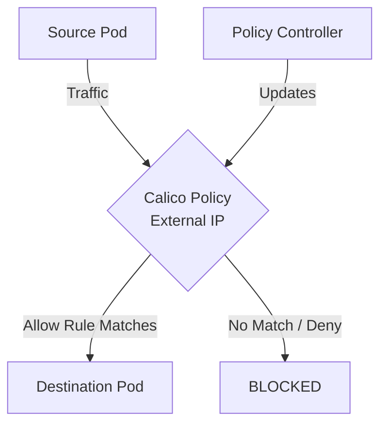

# How to Validate External IP Policies Before Production in Calico

Author: [nawazdhandala](https://github.com/nawazdhandala)

Tags: Calico, Kubernetes, Network Policy, External IP, Security

Description: Build a validation framework for External IP Policies in Calico before production deployment.

---

## Introduction

External IP Policies in Calico provides fine-grained network security controls using the `projectcalico.org/v3` API. This guide covers how to validate External IP effectively.

Calico's extensible policy model supports External IP through its `GlobalNetworkPolicy` and `NetworkPolicy` resources, giving you cluster-wide and namespace-scoped control over traffic that matches your External IP criteria.

This guide provides practical techniques for validate External IP in your Kubernetes cluster, following security best practices and production-tested patterns.

## Prerequisites

- Kubernetes cluster with Calico v3.26+
- `calicoctl` and `kubectl` installed
- Basic understanding of Calico network policy concepts

## Step 1: Schema Validation

```bash
for f in policies/*.yaml; do
  calicoctl apply -f "$f" --dry-run && echo "PASS: $f" || echo "FAIL: $f"
done
```

## Step 2: Selector Validation

```bash
python3 << 'EOF'
import subprocess, yaml, sys

# Load policies
with open('policies/production-policies.yaml') as f:
    policies = list(yaml.safe_load_all(f))

errors = []
for p in policies:
    if p is None: continue
    sel = p.get('spec', {}).get('selector', '')
    if sel and sel != 'all()':
        label_key = sel.split('==')[0].strip().strip("'")
        result = subprocess.run(
            ['kubectl', 'get', 'pods', '--all-namespaces', '-l', label_key],
            capture_output=True, text=True
        )
        if not result.stdout.strip():
            errors.append(f"No pods match selector: {sel}")
if errors:
    for e in errors: print(f"WARN: {e}")
else:
    print("All selectors validated")
EOF
```

## Step 3: Traffic Tests in Staging

```bash
./test-external-ip-policies.sh
echo "Exit code: $?"
```

## Step 4: CI/CD Integration

```yaml
# .github/workflows/validate-calico.yaml
name: Validate Calico Policies
on: [pull_request]
jobs:
  validate:
    runs-on: ubuntu-latest
    steps:
      - uses: actions/checkout@v3
      - name: Validate
        run: |
          for f in policies/*.yaml; do
            yamllint "$f"
          done
```

## Architecture



## Conclusion

Validate External IP policies in Calico requires attention to policy ordering, selector accuracy, and bidirectional rule coverage. Follow the patterns in this guide to ensure your External IP policies are correctly configured, tested, and monitored. Always validate in staging before applying to production, and maintain comprehensive logging for visibility into policy decisions.
