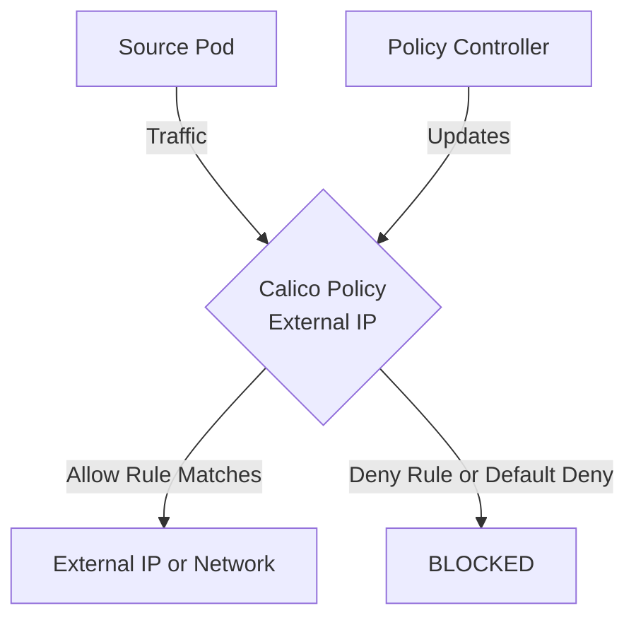

# How to Validate External IP Policies Before Production in Calico

Author: [nawazdhandala](https://github.com/nawazdhandala)

Tags: Calico, Kubernetes, Network Policy, External IP, Security

Description: Build a validation framework for External IP Policies in Calico before production deployment.

---

## Introduction

External IP and network rules in Calico provide fine-grained network security controls using the `projectcalico.org/v3` API. This guide covers how to validate External IP and network policy rules effectively.

Calico's extensible policy model supports external IP addresses and CIDRs through `GlobalNetworkPolicy` and `NetworkPolicy` rule fields, and through `GlobalNetworkSet` and `NetworkSet` resources for reusable IP lists. This gives you cluster-wide and namespace-scoped control over traffic that matches your external IP criteria.

This guide provides practical techniques for validating external IP policy rules in your Kubernetes cluster, following security best practices and production-tested patterns.

## Prerequisites

- Kubernetes cluster with Calico v3.26+
- `calicoctl` matched to your Calico version and `kubectl` installed
- Python 3 with PyYAML installed for the selector validation script
- Basic understanding of Calico network policy concepts

## Step 1: Schema Validation

```bash
for f in policies/*.yaml; do
  calicoctl validate -f "$f" && echo "PASS: $f" || echo "FAIL: $f"
done
```

## Step 2: Selector Validation

```bash
python3 << 'EOF'
import re
import subprocess
import yaml

# Load policies

with open('policies/production-policies.yaml') as f:
    policies = list(yaml.safe_load_all(f))

errors = []
warnings = []
for p in policies:
    if p is None:
        continue
    kind = p.get('kind')
    sel = p.get('spec', {}).get('selector', '')
    if not sel or sel == 'all()':
        continue

    exact_match = re.fullmatch(r"\s*([A-Za-z0-9_.\-/]+)\s*==\s*['\"]([^'\"]+)['\"]\s*", sel)
    has_match = re.fullmatch(r"\s*has\(([A-Za-z0-9_.\-/]+)\)\s*", sel)
    if exact_match:
        kubectl_selector = f"{exact_match.group(1)}={exact_match.group(2)}"
    elif has_match:
        kubectl_selector = has_match.group(1)
    else:
        warnings.append(f"Skipping complex Calico selector; calicoctl validate checked syntax only: {sel}")
        continue

    cmd = ['kubectl', 'get', 'pods', '-l', kubectl_selector, '--no-headers']
    if kind == 'NetworkPolicy':
        namespace = p.get('metadata', {}).get('namespace', 'default')
        cmd.extend(['-n', namespace])
    else:
        cmd.append('--all-namespaces')

    result = subprocess.run(cmd, capture_output=True, text=True)
    if result.returncode != 0:
        errors.append(f"kubectl failed for selector {sel}: {result.stderr.strip()}")
    elif not result.stdout.strip():
        errors.append(f"No pods match selector: {sel}")
for w in warnings:
    print(f"WARN: {w}")
if errors:
    for e in errors: print(f"WARN: {e}")
else:
    print("All selectors validated")
EOF
```

## Step 3: Traffic Tests in Staging

```bash
./test-external-ip-policies.sh
echo "Exit code: $?"
```

## Step 4: CI/CD Integration

```yaml
# .github/workflows/validate-calico.yaml
name: Validate Calico Policies
on: [pull_request]
jobs:
  validate:
    runs-on: ubuntu-latest
    steps:
      - uses: actions/checkout@v3
      - name: Validate
        run: |
          for f in policies/*.yaml; do
            yamllint "$f"
          done
```

## Architecture


```mermaid
flowchart TD
    A[Source Pod] -->|Traffic| B{Calico Policy\nExternal IP}
    B -->|Allow Rule Matches| C[External IP or Network]
    B -->|Deny Rule or Default Deny| D[BLOCKED]
    E[Policy Controller] -->|Updates| B
```

## Conclusion

Validating external IP policy rules in Calico requires attention to policy ordering, selector accuracy, and bidirectional rule coverage. Follow the patterns in this guide to ensure your external IP policy rules are correctly configured, tested, and monitored. Always validate in staging before applying to production, and maintain comprehensive logging for visibility into policy decisions.
