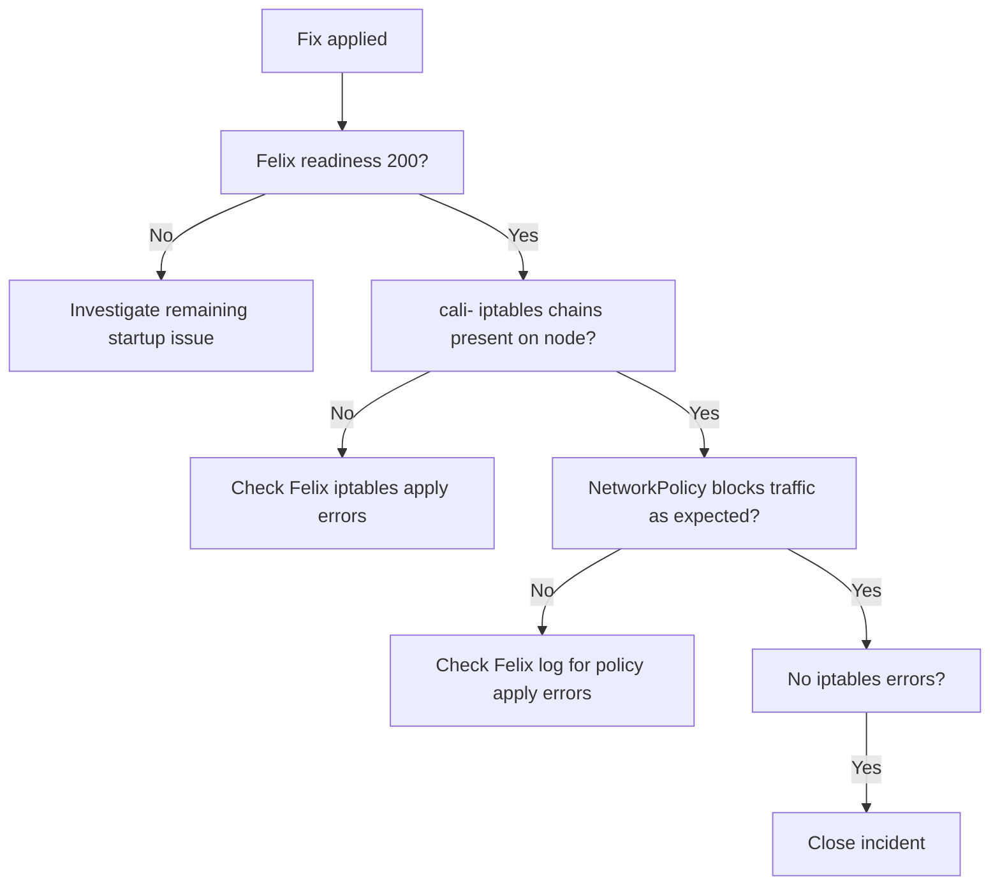

# How to Validate Resolution of Felix Not Starting in Calico

Author: [nawazdhandala](https://github.com/nawazdhandala)

Tags: Calico, Kubernetes, Networking, Troubleshooting

Description: Validate that Felix is running correctly after a startup failure fix by checking readiness probes, iptables rule application, and NetworkPolicy enforcement.

---

## Introduction

Validating Felix recovery requires checking not just that the readiness probe passes, but also that Felix is actually enforcing NetworkPolicy. A Felix that starts but fails to apply iptables rules is still functionally broken. The validation must confirm active iptables rule application and NetworkPolicy enforcement.

## Symptoms

- Felix readiness probe passes but iptables rules not applied
- NetworkPolicy changes applied before the incident still not enforced

## Root Causes

- Felix recovered but iptables rules from before the incident were flushed and not re-applied
- Fix resolved startup but not runtime iptables errors

## Diagnosis Steps

```bash
kubectl get pod $NODE_POD -n kube-system
kubectl exec $NODE_POD -n kube-system -- wget -qO- http://localhost:9099/readiness 2>/dev/null
```

## Solution

**Validation Step 1: Felix readiness probe returns 200**

```bash
kubectl exec $NODE_POD -n kube-system -- \
  wget -qO- http://localhost:9099/readiness 2>/dev/null
# Expected: returns 200 OK
```

**Validation Step 2: Calico iptables rules applied on node**

```bash
ssh $NODE "sudo iptables -L | grep -c cali-"
# Expected: non-zero count of Calico chains
ssh $NODE "sudo iptables -L cali-INPUT -n | head -10"
```

**Validation Step 3: NetworkPolicy is being enforced**

```bash
# Apply a test NetworkPolicy and verify it blocks traffic
kubectl apply -f - <<EOF
apiVersion: networking.k8s.io/v1
kind: NetworkPolicy
metadata:
  name: test-felix-enforcement
  namespace: default
spec:
  podSelector:
    matchLabels:
      app: felix-test-blocked
  policyTypes:
  - Ingress
  ingress: []
EOF

# Deploy a pod with that label
kubectl run felix-test --image=busybox --labels="app=felix-test-blocked" \
  --restart=Never -- sleep 60

kubectl wait pod/felix-test --for=condition=Ready --timeout=30s

# Ping should FAIL (blocked by policy)
POD_IP=$(kubectl get pod felix-test -o jsonpath='{.status.podIP}')
kubectl run tester --image=busybox --restart=Never -- \
  ping -c 1 -W 2 $POD_IP
# Expected: ping fails (policy is being enforced)

# Cleanup
kubectl delete pod felix-test tester --ignore-not-found
kubectl delete networkpolicy test-felix-enforcement --ignore-not-found
```

**Validation Step 4: No Felix iptables errors**

```bash
kubectl exec $NODE_POD -n kube-system -- \
  wget -qO- http://localhost:9091/metrics 2>/dev/null \
  | grep "felix_iptables_restore_errors_total"
# Expected: counter is 0 or not increasing
```



## Prevention

- Include NetworkPolicy enforcement test in Felix recovery validation
- Monitor Felix iptables error counter continuously
- Check iptables chain presence on nodes after Felix restarts

## Conclusion

Validating Felix recovery requires the readiness probe passing, Calico iptables chains present on the node, NetworkPolicy actually blocking traffic as expected, and zero iptables error counters. The NetworkPolicy enforcement test is the most definitive indicator that Felix is functioning correctly.
