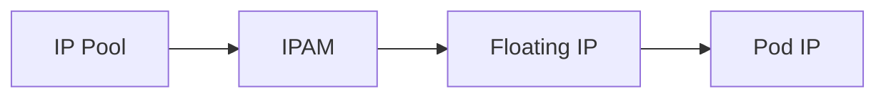

# How to Validate Floating IPs with Calico

Author: [nawazdhandala](https://github.com/nawazdhandala)

Tags: Calico, Kubernetes, IPAM, Floating IP, Networking

Description: Validate that floating IPs in Calico are correctly routed and can failover between pods as expected.

---

## Introduction

Floating IPs in Calico are additional IP addresses assigned to workload endpoints. The host uses NAT on incoming traffic to translate the floating IP to the pod's real IP before delivering packets to the pod.

## Prerequisites

- Calico CNI plugin installed from manifests
- kubectl and calicoctl access
- Floating IPs enabled in the Calico CNI configuration
- IP pools configured for the floating IP range

## Configuration

```bash
calicoctl get ippools -o yaml
calicoctl ipam show --show-blocks
kubectl -n kube-system get configmap calico-config -o yaml | grep -A3 feature_control
```

## Example

```yaml
apiVersion: projectcalico.org/v3
kind: IPPool
metadata:
  name: floating-ip-pool
spec:
  cidr: 10.48.0.0/16
  blockSize: 26
  natOutgoing: true
---
apiVersion: v1
kind: Pod
metadata:
  name: floating-ip-test
  annotations:
    cni.projectcalico.org/floatingIPs: "[\"10.48.0.10\"]"
spec:
  containers:
    - name: nginx
      image: nginx:stable-alpine
```

## Verification

```bash
calicoctl ipam check -o ipam-report.json
kubectl get pod floating-ip-test -o wide
kubectl get pod floating-ip-test -o jsonpath='{.metadata.annotations.cni\.projectcalico\.org/floatingIPs}{"\n"}'
```

## Architecture



## Conclusion

How to Validate Floating IPs with Calico helps ensure your Calico deployment handles floating IP assignment correctly for your specific workload requirements.
