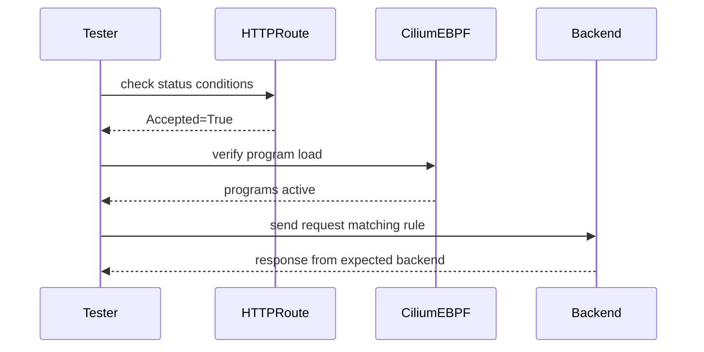

# How to Validate GAMMA in the Cilium Gateway API

Author: [nawazdhandala](https://github.com/nawazdhandala)

Tags: Cilium, Kubernetes, GAMMA, Gateway API, Validation

Description: Validate that GAMMA routes in the Cilium Gateway API are correctly configured, attached, and actively routing east-west mesh traffic.

---

## Introduction

Validating GAMMA in the Cilium Gateway API confirms that east-west routing rules are fully enforced. This is particularly important after upgrades, configuration changes, or when rolling out new routing rules to production.

GAMMA validation differs from standard ingress validation: instead of testing external connectivity, you test traffic flows between services inside the cluster. The validation checks ensure that HTTPRoutes with Service parentRefs are accepted, backends are reachable, and route rules like header matching and weighted splits behave as expected.

## Prerequisites

- Cilium GAMMA and Gateway API enabled
- HTTPRoutes deployed with Service parentRefs
- `kubectl`, `hubble` CLIs

## Validate Route Conditions

```bash
kubectl get httproute -A -o json | \
  jq '.items[] | {name: .metadata.name, ns: .metadata.namespace,
      accepted: .status.parents[0].conditions[] | select(.type=="Accepted") | .status}'
```

All routes should show `"True"` for `Accepted`.

## Validate Backend Endpoints

For each backend referenced in HTTPRoutes:

```bash
kubectl get endpoints <backend-service> -n <namespace>
```

Verify that pods are ready and addresses are populated.

## Architecture



## Test Header-Based Routing

```bash
kubectl run test --image=curlimages/curl --rm -it --restart=Never -n <namespace> -- \
  curl -H "x-version: v2" http://<service>:<port>/
```

Confirm the response comes from the v2 backend by checking logs or response body.

## Test Weighted Traffic Split

Run 10 requests and count which backend responds:

```bash
for i in $(seq 10); do
  kubectl run test-$i --image=curlimages/curl --rm --restart=Never -n <namespace> \
    --command -- curl -s http://<service>:<port>/backend-id
done
```

Results should approximate the configured weights.

## Validate with Hubble

```bash
hubble observe --namespace <namespace> --protocol http \
  --from-service <client> --to-service <target> --follow
```

Verify flows show `FORWARDED` verdicts and correct destination pods.

## Conclusion

Validating GAMMA in the Cilium Gateway API involves confirming route acceptance, testing header and weight-based routing rules, and using Hubble to verify actual traffic flows. These checks ensure your service mesh routing configuration is production-ready.
