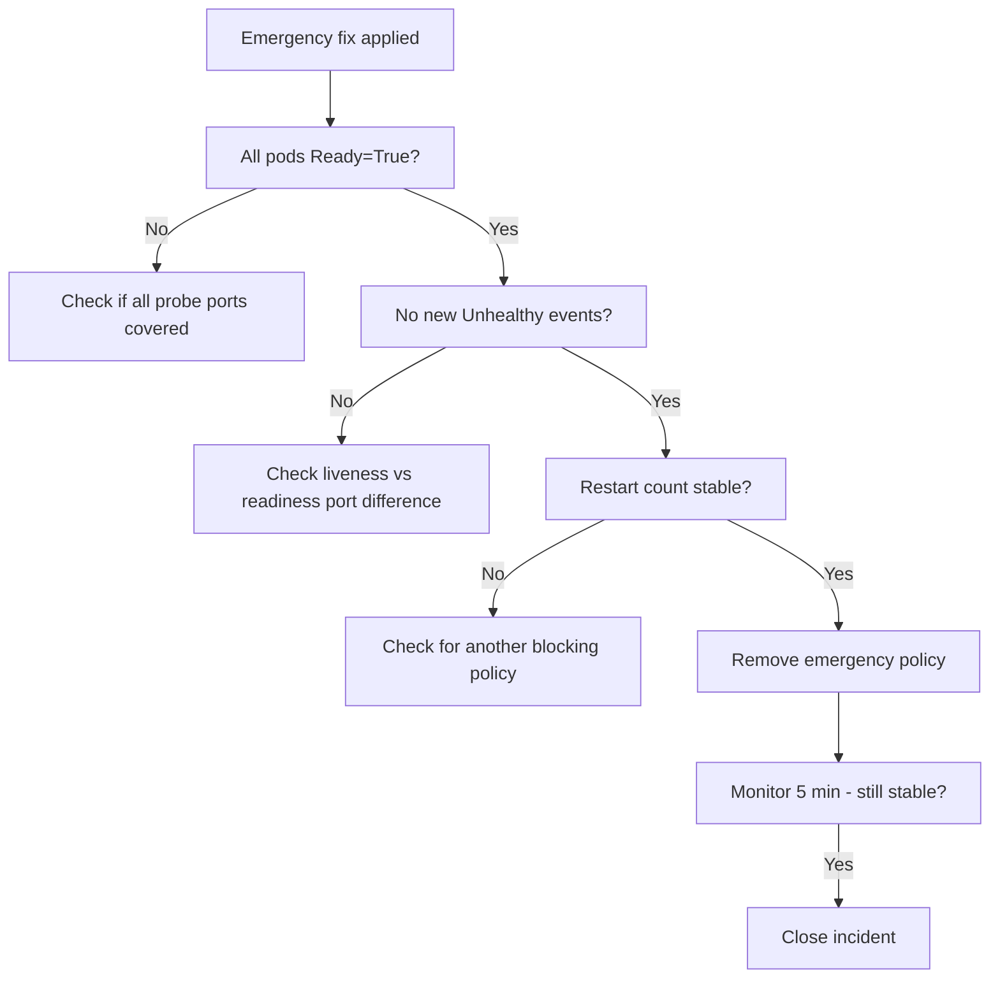

# How to Validate Resolution of Health Check Failures with Calico

Author: [nawazdhandala](https://github.com/nawazdhandala)

Tags: Calico, Kubernetes, Networking, Troubleshooting

Description: Validation steps to confirm health check probes are working correctly after fixing Calico NetworkPolicy ingress rules including pod readiness confirmation and probe event monitoring.

---

## Introduction

Validating that health check failures are resolved after a Calico NetworkPolicy fix requires confirming that all probe types (liveness, readiness, startup) are passing, that pod restart counts have stabilized, and that the emergency policy has been replaced with a permanent fix. A brief monitoring window after the fix is essential to catch probes that pass initially but fail under load.

## Symptoms

- Pods show Ready=True but restart count continues climbing
- Readiness probe passes but liveness probe still failing on a different port
- Emergency policy present but permanent fix not applied

## Root Causes

- Fix covered readiness probe port but not liveness probe port (different ports)
- Emergency policy applied but blocking policy not updated
- Multiple nodes with different CIDRs, fix only covered some nodes

## Diagnosis Steps

```bash
# Check all pod conditions
kubectl get pods -n <namespace> -o wide
```

## Solution

**Validation Step 1: Confirm all pods are Ready**

```bash
kubectl wait pods -n <namespace> --all --for=condition=Ready --timeout=180s
kubectl get pods -n <namespace> -o wide
# Expected: all pods show 1/1 or N/N Running
```

**Validation Step 2: Confirm no probe failure events in last 5 minutes**

```bash
kubectl get events -n <namespace> \
  --sort-by='.lastTimestamp' \
  --field-selector reason=Unhealthy | tail -10
# Expected: no events newer than the fix timestamp
```

**Validation Step 3: Confirm restart count is stable**

```bash
# Check restart counts twice, 2 minutes apart
kubectl get pods -n <namespace> \
  -o jsonpath='{range .items[*]}{.metadata.name}{"\t"}{.status.containerStatuses[0].restartCount}{"\n"}{end}'
sleep 120
kubectl get pods -n <namespace> \
  -o jsonpath='{range .items[*]}{.metadata.name}{"\t"}{.status.containerStatuses[0].restartCount}{"\n"}{end}'
# Expected: restart count did not increase
```

**Validation Step 4: Test all probe ports are accessible from node**

```bash
# From the node hosting the pod:
NODE=$(kubectl get pod <pod-name> -n <namespace> -o jsonpath='{.spec.nodeName}')
POD_IP=$(kubectl get pod <pod-name> -n <namespace> -o jsonpath='{.status.podIP}')

# Test each probe port (get from pod spec)
for PORT in 8080 8443 9090; do
  ssh $NODE "nc -zv $POD_IP $PORT 2>&1" && echo "Port $PORT: OPEN" || echo "Port $PORT: BLOCKED"
done
```

**Validation Step 5: Confirm permanent fix and remove emergency policy**

```bash
# Verify the blocking policy now has node CIDR allow
kubectl get networkpolicy -n <namespace> -o yaml | grep -B2 -A5 "ipBlock:"

# Remove emergency policy if permanent fix is confirmed
kubectl delete networkpolicy emergency-allow-kubelet-probes -n <namespace> --ignore-not-found

# Watch for 2 minutes to confirm probes still pass after emergency removal
watch -n10 kubectl get pods -n <namespace>
```



## Prevention

- List all probe ports when creating fix - cover all (liveness, readiness, startup)
- Document node CIDR change process that includes updating existing NetworkPolicies
- Add restart-count stability check to incident closure criteria

## Conclusion

Validating health check failure resolution requires confirming pod readiness, absence of new probe failure events, stable restart counts, and removal of the emergency policy after permanent fix is in place. Check all probe port types - liveness and readiness may use different ports and both need to be allowed.
