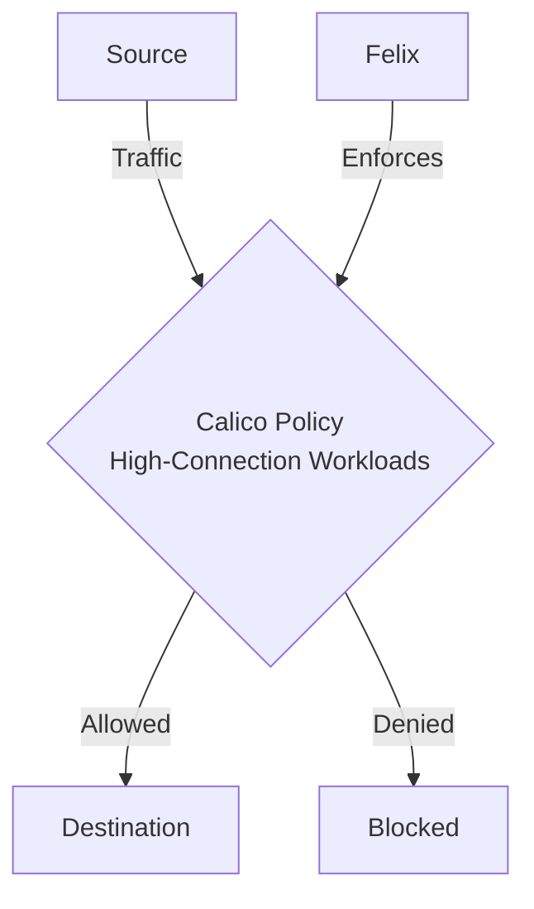

# How to Validate Calico Policies for High-Connection Workloads Before Production

Author: [nawazdhandala](https://github.com/nawazdhandala)

Tags: Calico, Kubernetes, Network Policy, Performance, Security

Description: Validate Calico network policies for high-connection workloads while maintaining performance and security.

---

## Introduction

Validate Calico Policies for High-Connection Workloads Before Production requires careful policy design in Calico to balance security with performance and availability. The `projectcalico.org/v3` API provides the flexibility needed to handle high-connection workloads while maintaining strict access controls.

This guide covers validate High-Connection Workloads in Calico with production-ready configurations.

## Prerequisites

- Kubernetes cluster with Calico v3.26+
- `calicoctl` and `kubectl` installed

## Core Configuration

```yaml
# Optimize for high-connection workloads

apiVersion: projectcalico.org/v3
kind: HostEndpoint
metadata:
  name: high-throughput-node-eth0
  labels:
    app: high-throughput-service
spec:
  interfaceName: eth0
  node: high-throughput-node
  expectedIPs:
    - 10.0.0.10
---
apiVersion: projectcalico.org/v3
kind: GlobalNetworkPolicy
metadata:
  name: allow-high-connection-workload
spec:
  selector: app == 'high-throughput-service'
  applyOnForward: true
  doNotTrack: true
  ingress:
    - action: Allow
      protocol: TCP
      source:
        selector: tier == 'client'
      destination:
        ports: [8080]
  egress:
    - action: Allow
      protocol: TCP
      source:
        ports: [8080]
      destination:
        selector: tier == 'client'
  types:
    - Ingress
    - Egress
```

## Performance Tuning

```bash
# Enable Felix metrics for high-connection workload validation
kubectl patch felixconfiguration default --type=merge -p '{
  "spec": {
    "prometheusMetricsEnabled": true
  }
}'

# Monitor connection tracking table
kubectl exec -n kube-system calico-node-xxx -- conntrack -S
```

## Architecture



## Conclusion

Validate High-Connection Workloads in Calico requires balancing security controls with operational requirements. Use the patterns in this guide as a starting point, test thoroughly in staging, and monitor policy impact after deployment. Regular review of your policies ensures they remain appropriate as your workload requirements evolve.
