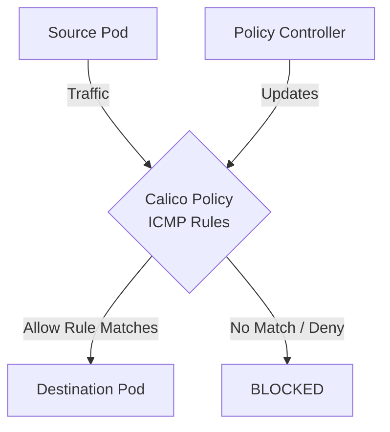

# How to Validate ICMP and Ping Rules Before Production in Calico

Author: [nawazdhandala](https://github.com/nawazdhandala)

Tags: Calico, Kubernetes, Network Policy, ICMP, Security, Network

Description: Build a validation framework for ICMP and Ping Rules in Calico before production deployment.

---

## Introduction

ICMP and Ping Rules in Calico provides fine-grained network security controls using the `projectcalico.org/v3` API. This guide covers how to validate ICMP Rules effectively.

Calico's extensible policy model supports ICMP Rules through its `GlobalNetworkPolicy` and `NetworkPolicy` resources, giving you cluster-wide and namespace-scoped control over traffic that matches your ICMP Rules criteria.

This guide provides practical techniques for validate ICMP Rules in your Kubernetes cluster, following security best practices and production-tested patterns.

## Prerequisites

- Kubernetes cluster with Calico v3.31+
- `calicoctl` and `kubectl` installed
- Basic understanding of Calico network policy concepts

## Step 1: Schema Validation

```bash
for f in policies/*.yaml; do
  calicoctl validate -f "$f" && echo "PASS: $f" || echo "FAIL: $f"
done
```

## Step 2: Selector Validation

```bash
python3 << 'EOF'
import re
import subprocess
import yaml

# Load policies

with open('policies/production-policies.yaml') as f:
    policies = list(yaml.safe_load_all(f))

errors = []
warnings = []
for p in policies:
    if p is None: continue
    kind = p.get('kind', '')
    namespace = p.get('metadata', {}).get('namespace', 'default')
    sel = p.get('spec', {}).get('selector', '')
    if sel and sel != 'all()':
        match = re.fullmatch(r"\s*([A-Za-z0-9./_-]+)\s*==\s*['\"]([^'\"]+)['\"]\s*", sel)
        if not match:
            warnings.append(f"Skipping selector that cannot be converted to a Kubernetes label selector: {sel}")
            continue

        kubernetes_selector = f"{match.group(1)}={match.group(2)}"
        command = ['kubectl', 'get', 'pods', '-l', kubernetes_selector, '-o', 'name']
        if kind == 'NetworkPolicy':
            command.extend(['-n', namespace])
        else:
            command.append('--all-namespaces')

        result = subprocess.run(
            command,
            capture_output=True, text=True
        )
        if result.returncode != 0:
            errors.append(f"Could not query selector {sel}: {result.stderr.strip()}")
        elif not result.stdout.strip():
            errors.append(f"No pods match selector: {sel}")
if warnings:
    for w in warnings: print(f"WARN: {w}")
if errors:
    for e in errors: print(f"WARN: {e}")
else:
    print("All checked selectors matched at least one pod")
EOF
```

## Step 3: Traffic Tests in Staging

```bash
./test-icmp-rules-policies.sh
echo "Exit code: $?"
```

## Step 4: CI/CD Integration

```yaml
# .github/workflows/validate-calico.yaml
name: Validate Calico Policies
on: [pull_request]
jobs:
  validate:
    runs-on: ubuntu-latest
    steps:
      - uses: actions/checkout@v6
      - name: Install validation tools
        run: |
          sudo apt-get update
          sudo apt-get install -y yamllint
          curl -L https://github.com/projectcalico/calico/releases/download/v3.31.5/calicoctl-linux-amd64 -o calicoctl
          chmod +x calicoctl
          sudo mv calicoctl /usr/local/bin/
      - name: Validate
        run: |
          for f in policies/*.yaml; do
            yamllint "$f"
            calicoctl validate -f "$f"
          done
```

## Architecture



## Conclusion

Validate ICMP Rules policies in Calico requires attention to policy ordering, selector accuracy, and bidirectional rule coverage. Follow the patterns in this guide to ensure your ICMP Rules policies are correctly configured, tested, and monitored. Always validate in staging before applying to production, and maintain comprehensive logging for visibility into policy decisions.
