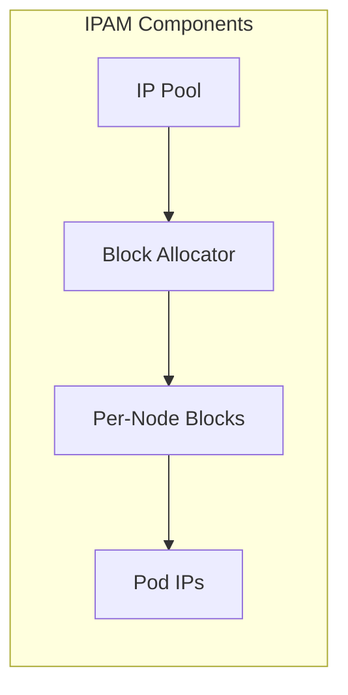

# How to Validate IP Address Allocation by Topology in Calico

Author: [nawazdhandala](https://github.com/nawazdhandala)

Tags: Calico, Kubernetes, IPAM, Topology, Networking

Description: Validate that Calico topology-aware IP allocation is assigning addresses correctly based on node topology labels.

---

## Introduction

IP Address Allocation by Topology is an important aspect of Calico IP address management in Kubernetes. Getting this right ensures efficient IP utilization, predictable pod addressing, and smooth cluster operations.

This guide provides practical steps to manage IP Address Allocation by Topology in your Calico deployment with focus on production-grade configurations and best practices.

## Prerequisites

- Calico v3.20+ with IPAM configured
- kubectl and calicoctl access
- IP pools configured in the cluster

## Configuration Steps

```bash
# Check current IPAM state

calicoctl ipam show --show-blocks

# View IP pool configuration
calicoctl get ippools -o yaml

# Check pool selectors
calicoctl get ippools -o wide
```

## Example Configuration

```yaml
apiVersion: projectcalico.org/v3
kind: IPPool
metadata:
  name: pool-rack-0
spec:
  cidr: 10.48.0.0/24
  blockSize: 26
  vxlanMode: Always
  natOutgoing: true
  nodeSelector: rack == "0"
---
apiVersion: projectcalico.org/v3
kind: IPPool
metadata:
  name: pool-rack-1
spec:
  cidr: 10.48.1.0/24
  blockSize: 26
  vxlanMode: Always
  natOutgoing: true
  nodeSelector: rack == "1"
```

## Verification

```bash
# Verify pod IPs and the nodes where pods are running
kubectl get pods -A -o wide

# Verify node labels match the pool selectors
kubectl get nodes --show-labels | grep 'rack='

# Check pool utilization
calicoctl ipam show

# Check IPAM configuration
calicoctl ipam show --show-configuration

# Validate allocated blocks by pool
calicoctl ipam show --show-blocks
```

## Architecture



## Conclusion

Properly managing IP Address Allocation by Topology in Calico ensures reliable pod networking and prevents IP exhaustion issues. Regular monitoring of pool utilization and IPAM state checks help maintain a healthy IP addressing infrastructure.
