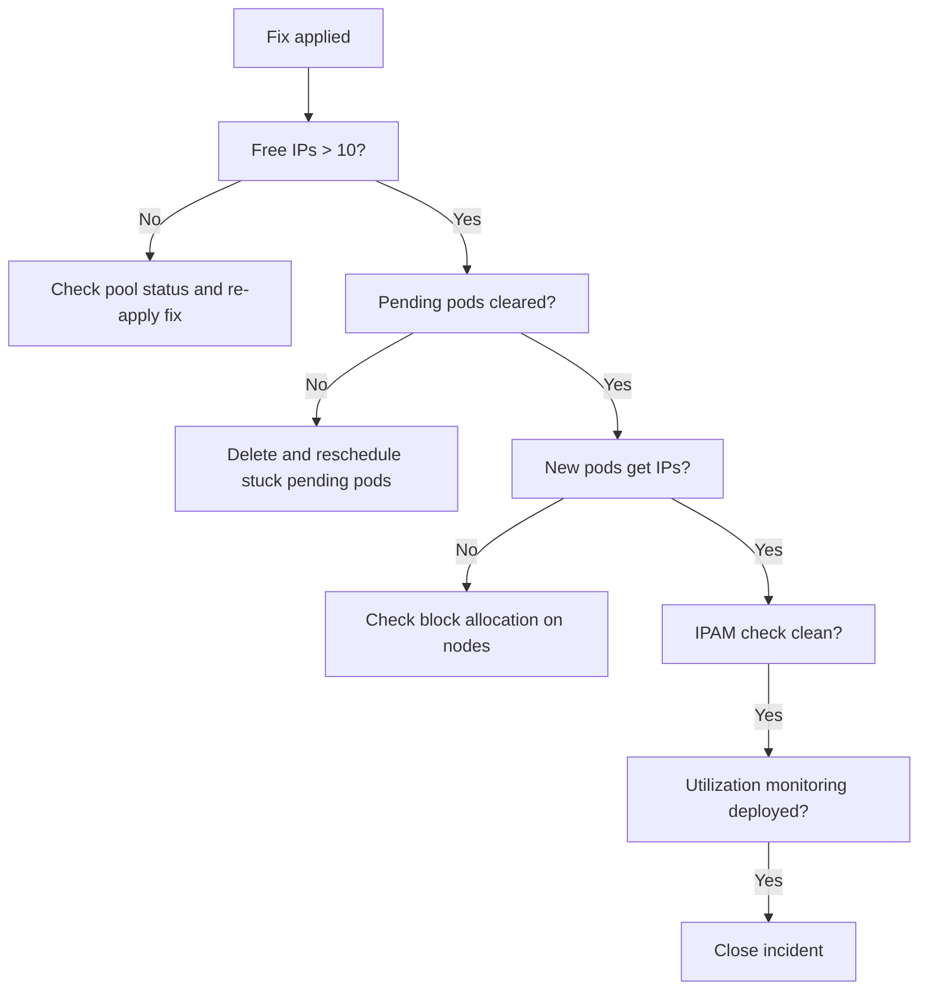

# How to Validate Resolution of IP Pool Exhaustion in Calico

Author: [nawazdhandala](https://github.com/nawazdhandala)

Tags: Calico, Kubernetes, Networking, Troubleshooting

Description: Validate that Calico IP pool exhaustion is resolved by confirming free IP availability, successful pod IP allocation, and IPAM check cleanliness.

---

## Introduction

Validating IP pool exhaustion resolution requires confirming that free IPs are available, new pods can receive IP addresses successfully, and the IPAM state is clean. After adding an emergency pool, also confirm that pending pods scheduled after the fix received IPs from the new pool.

## Symptoms

- Fix applied but new pods still failing IP allocation (new pool not recognized)
- Free IPs available but pods on specific nodes still failing (block allocation issue)

## Root Causes

- New pool disabled accidentally
- Block allocation stuck for specific nodes

## Diagnosis Steps

```bash
calicoctl ipam show
kubectl get pods --all-namespaces | grep -E "Pending|FailedScheduling"
```

## Solution

**Validation Step 1: Free IPs are available**

```bash
calicoctl ipam show | grep -i "free\|available"
FREE=$(calicoctl ipam show 2>/dev/null | grep -i "free" | grep -oP '\d+' | head -1)
[ "${FREE:-0}" -gt 10 ] && echo "PASS: $FREE free IPs" || echo "FAIL: Only $FREE free IPs"
```

**Validation Step 2: No pending pods due to IP allocation failure**

```bash
kubectl get pods --all-namespaces | grep Pending | head -10
kubectl get events --all-namespaces | grep "FailedScheduling\|failed to allocate" | tail -10
# Expected: no IP allocation events newer than the fix timestamp
```

**Validation Step 3: New pods get IPs successfully**

```bash
kubectl run ip-val-1 --image=busybox --restart=Never -- sleep 30
kubectl run ip-val-2 --image=busybox --restart=Never -- sleep 30
kubectl run ip-val-3 --image=busybox --restart=Never -- sleep 30

kubectl wait pod/ip-val-1 pod/ip-val-2 pod/ip-val-3 \
  --for=condition=Ready --timeout=60s

kubectl get pod ip-val-1 ip-val-2 ip-val-3 -o wide
kubectl delete pod ip-val-1 ip-val-2 ip-val-3
```

**Validation Step 4: IPAM check is clean**

```bash
calicoctl ipam check 2>/dev/null && echo "PASS: IPAM check clean" || echo "FAIL: IPAM check reports issues"
```

**Validation Step 5: Utilization monitoring active**

```bash
kubectl get cronjob ipam-utilization-check -n kube-system 2>/dev/null \
  && echo "PASS: Utilization monitoring active" \
  || echo "TODO: Deploy IPAM utilization monitoring"
```



## Prevention

- Add IP pool capacity validation to post-incident checklist
- Deploy utilization monitoring as a post-incident improvement
- Document the cluster's IP pool capacity and current utilization in the wiki

## Conclusion

Validating IP pool exhaustion resolution requires free IP count confirmation, no pending pods due to IP allocation errors, successful test pod IP assignments, and clean IPAM check output. Deploy utilization monitoring after the incident to prevent future exhaustion.
