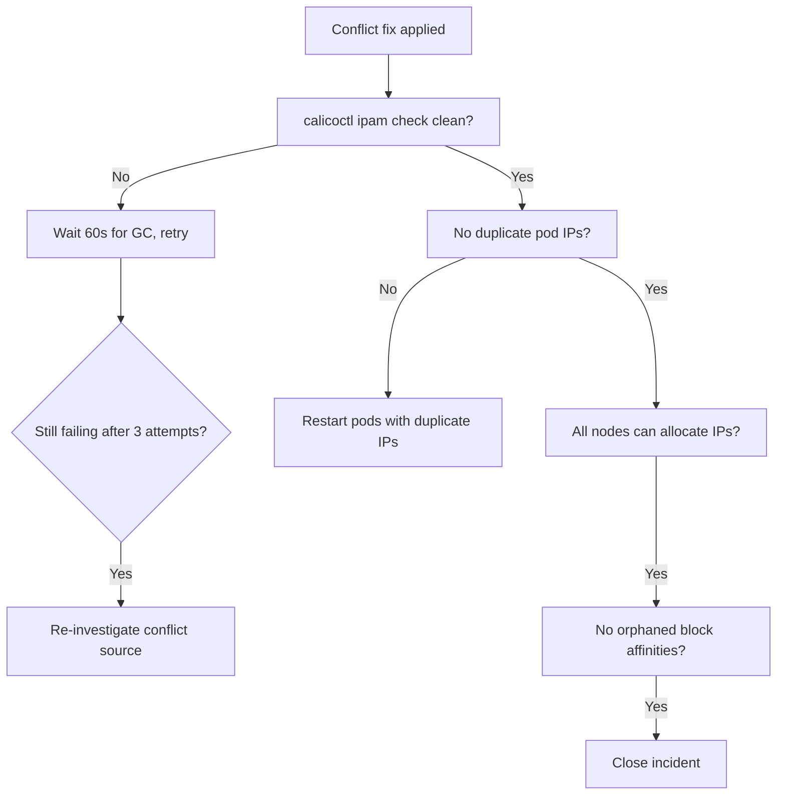

# How to Validate Resolution of IPAM Block Conflicts in Calico

Author: [nawazdhandala](https://github.com/nawazdhandala)

Tags: Calico, Kubernetes, Networking, Troubleshooting

Description: Validate that Calico IPAM block conflicts are resolved by confirming clean IPAM check output, no duplicate pod IPs, and successful IP allocation for new pods.

---

## Introduction

Validating IPAM block conflict resolution requires confirming that `calicoctl ipam check` returns clean, no duplicate pod IPs exist, and new pods can receive IP allocations from any node. IPAM state restoration after conflicts may take a few minutes while calico-kube-controllers completes garbage collection.

## Symptoms

- IPAM check still shows issues after fix
- GC still in progress when validation runs

## Root Causes

- calico-kube-controllers GC not complete
- Multiple conflict sources, only one addressed

## Diagnosis Steps

```bash
calicoctl ipam check
```

## Solution

**Validation Step 1: IPAM check returns clean**

```bash
# Run multiple times to confirm stable
for i in 1 2 3; do
  echo "IPAM check run $i:"
  calicoctl ipam check 2>/dev/null && echo "PASS" || echo "FAIL"
  sleep 30
done
```

**Validation Step 2: No duplicate pod IPs**

```bash
DUPES=$(kubectl get pods --all-namespaces -o wide \
  | awk '{print $7}' | grep -v "IP\|<none>" | sort | uniq -d)
[ -z "$DUPES" ] && echo "PASS: No duplicate pod IPs" || echo "FAIL: Duplicate IPs: $DUPES"
```

**Validation Step 3: New pods get unique IPs from all nodes**

```bash
for NODE in $(kubectl get nodes -o jsonpath='{.items[*].metadata.name}' | tr ' ' '\n' | head -3); do
  kubectl run ipam-test-$(echo $NODE | tr -d '-') --image=busybox --restart=Never \
    --overrides="{\"spec\":{\"nodeName\":\"$NODE\"}}" -- sleep 10
done

sleep 15

kubectl get pods -l run --selector='' -o wide 2>/dev/null | grep ipam-test
# Verify each pod has a unique IP
kubectl delete pods -l run 2>/dev/null || kubectl get pods | grep ipam-test | awk '{print $1}' | xargs kubectl delete pod
```

**Validation Step 4: Block affinity state is consistent**

```bash
# Verify no orphaned block affinities remain
CURRENT_NODES=$(kubectl get nodes -o jsonpath='{.items[*].metadata.name}')
ORPHANED=0
for BA in $(calicoctl get blockaffinity -o jsonpath='{.items[*].metadata.name}' 2>/dev/null); do
  NODE=$(calicoctl get blockaffinity $BA -o jsonpath='{.spec.node}' 2>/dev/null)
  if ! echo "$CURRENT_NODES" | grep -qw "$NODE"; then
    echo "ORPHANED AFFINITY: $BA"
    ORPHANED=1
  fi
done
[ $ORPHANED -eq 0 ] && echo "PASS: No orphaned block affinities"
```



## Prevention

- Add IPAM check to post-incident closure criteria
- Test IP allocation from all nodes after IPAM repairs
- Deploy IPAM audit CronJob as a post-incident improvement

## Conclusion

Validating IPAM block conflict resolution requires a clean `calicoctl ipam check`, absence of duplicate pod IPs, successful IP allocation from each node, and no orphaned block affinities. Run the IPAM check multiple times to confirm stability after garbage collection completes.
