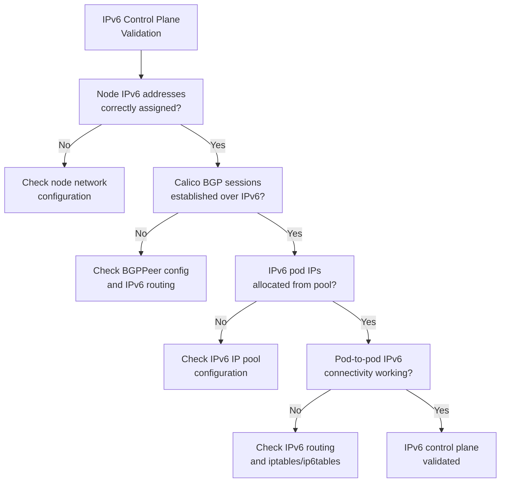

# Validate IPv6 Control Plane in Calico

Author: [nawazdhandala](https://github.com/nawazdhandala)

Tags: calico, ipv6, control-plane, kubernetes, networking, bgp

Description: A guide to validating Calico's IPv6 control plane, including BGP IPv6 peering, IPv6 node addressing, and ensuring Calico's control plane components communicate correctly over IPv6.

---

## Introduction

Running Kubernetes with an IPv6 control plane means that cluster components—including Calico's BGP daemon, Felix policy engine, and IPAM components—communicate over IPv6. Validating the IPv6 control plane in Calico requires checking more than just pod networking; you need to confirm that Calico's own internal communication, BGP sessions, and datastore connectivity are functioning correctly over IPv6.

IPv6 control plane validation is especially important in IPv6-only clusters (not dual-stack) where there is no IPv4 fallback. Misconfigurations in IPv6 addressing, routing, or DNS resolution for control plane components can cause Calico to fail in ways that are harder to diagnose than equivalent IPv4 issues.

## Prerequisites

- Kubernetes cluster with IPv6 enabled (IPv6-only or dual-stack)
- Calico configured with IPv6 IP pools
- `calicoctl` CLI configured with cluster access
- Understanding of IPv6 networking fundamentals

## Step 1: Verify Kubernetes Control Plane IPv6 Addressing

Confirm the Kubernetes API server and node components are using IPv6.

```bash
# Check the Kubernetes API server address
kubectl cluster-info

# Verify node internal addresses are IPv6 (for IPv6-only clusters)
kubectl get nodes -o jsonpath=\
'{range .items[*]}{.metadata.name}: {.status.addresses[?(@.type=="InternalIP")].address}{"\n"}{end}'

# Check pod CIDRs assigned to nodes are IPv6
kubectl get nodes -o jsonpath=\
'{range .items[*]}{.metadata.name}: {.spec.podCIDRs}{"\n"}{end}'
```

## Step 2: Validate Calico Node IPv6 Configuration

Check that each Calico node has IPv6 addresses configured.

```bash
# List Calico nodes with IPv6 addresses
calicoctl get nodes -o yaml | \
  grep -E "name:|ipv6Address:|bgp:"

# Check Felix configuration for IPv6 settings
calicoctl get felixconfiguration default -o yaml | \
  grep -E "ipv6|IPv6"

# Verify IPv6 IP pools exist
calicoctl get ippool -o yaml | grep "::" | grep cidr
```

## Step 3: Validate IPv6 BGP Peering

Check that BGP sessions are established over IPv6 when using IPv6 control plane.

```bash
# Check BGP peer status including IPv6 sessions
calicoctl node status

# Verify BGP peers are configured with IPv6 peer addresses
calicoctl get bgppeer -o yaml | grep "peerIP:" | grep ":"

# Check that IPv6 routes are being advertised
kubectl -n kube-system exec -it \
  $(kubectl -n kube-system get pods -l k8s-app=calico-node -o name | head -1) -- \
  birdcl6 show protocols
```

## Step 4: Test IPv6 Pod Networking

Validate that pods can communicate using IPv6 addresses.

```bash
# Deploy test pods and test IPv6 connectivity
kubectl run ipv6-server --image=nginx:alpine
kubectl run ipv6-client --image=nicolaka/netshoot -- sleep 3600

# Wait for pods to be ready
kubectl wait --for=condition=Ready pod/ipv6-server pod/ipv6-client

# Get the server's IPv6 address
SERVER_IPV6=$(kubectl get pod ipv6-server \
  -o jsonpath='{.status.podIPs[?(@.ip contains ":")].ip}')
echo "Server IPv6: $SERVER_IPV6"

# Test connectivity from client using IPv6
kubectl exec ipv6-client -- curl -6 -v http://[$SERVER_IPV6]/
```

## Step 5: Validate IPv6 DNS Resolution for Control Plane

```bash
# Verify that cluster DNS resolves to IPv6 addresses where applicable
kubectl run dns-test --image=busybox:1.36 --restart=Never -- \
  nslookup kubernetes.default.svc.cluster.local

# Check for AAAA records if dual-stack DNS is configured
kubectl run dns-aaaa-test --image=nicolaka/netshoot --restart=Never -- \
  dig AAAA kubernetes.default.svc.cluster.local

kubectl logs dns-aaaa-test
kubectl delete pod dns-test dns-aaaa-test
```

## IPv6 Control Plane Validation Checklist



## Best Practices

- Ensure ip6tables rules are configured alongside iptables rules — Calico manages both
- For IPv6-only clusters, verify all system components support IPv6 before deploying Calico
- Configure explicit IPv6 BGP peer IPs rather than relying on autodetection
- Test IPv6 DNS resolution separately as split-horizon DNS can cause issues
- Monitor IPv6-specific Calico metrics in Prometheus alongside IPv4 metrics

## Conclusion

Validating Calico's IPv6 control plane requires checking IPv6 addressing at every layer: Kubernetes nodes, Calico node configuration, BGP sessions, pod IP allocation, and connectivity. A fully validated IPv6 control plane confirms that Calico can operate correctly in IPv6-only or dual-stack environments without silent fallback to IPv4.
