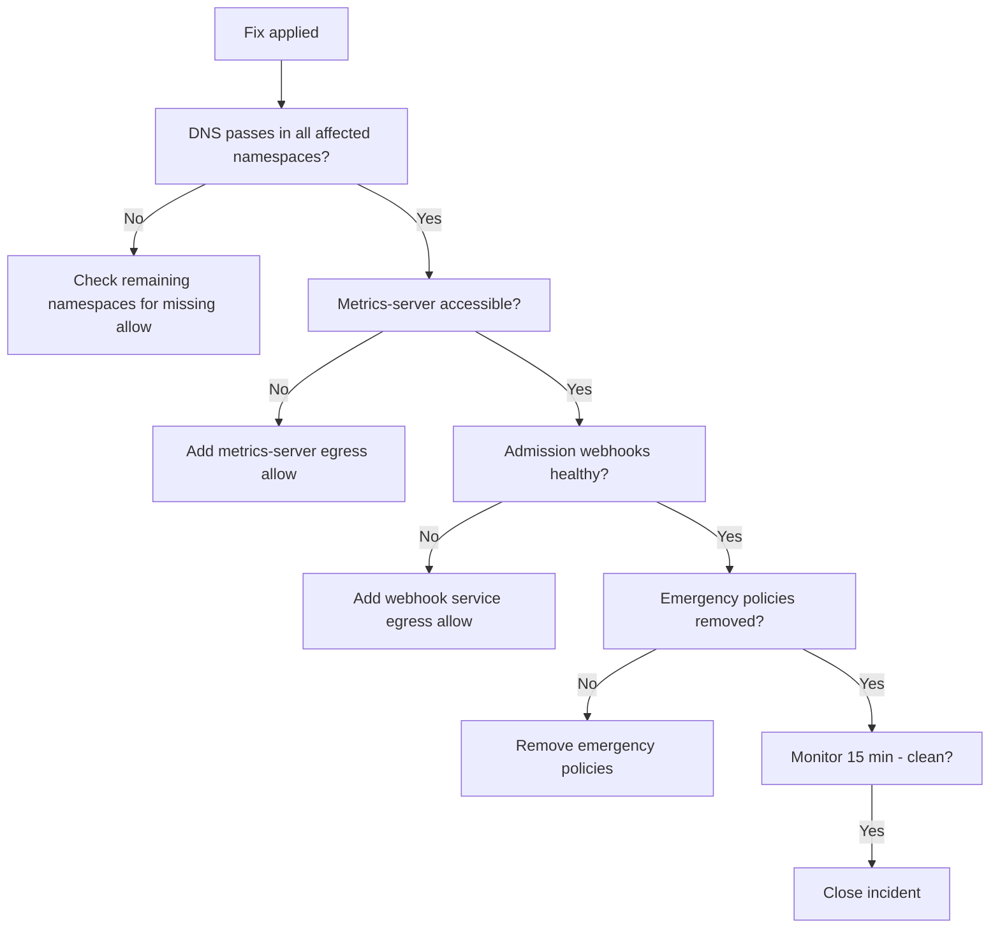

# How to Validate Resolution of kube-system Access Problems with Calico NetworkPolicy

Author: [nawazdhandala](https://github.com/nawazdhandala)

Tags: Calico, Kubernetes, Networking, Troubleshooting

Description: Validation steps to confirm kube-system services are accessible after fixing Calico NetworkPolicy issues including DNS, metrics-server, and admission webhook connectivity tests.

---

## Introduction

Validating kube-system access restoration after a Calico NetworkPolicy fix requires confirming that all kube-system services that were blocked are now reachable. DNS is typically the most critical, but admission webhooks and the metrics server may also have been affected and need separate verification.

A thorough validation also confirms that the permanent fix is in place and the emergency policy (if one was applied) has been removed. Leaving emergency policies in place creates policy sprawl that complicates future troubleshooting.

## Symptoms

- DNS works intermittently after the fix
- Metrics-server still returns errors after DNS is restored
- Emergency policy still present 24 hours after incident closure

## Root Causes

- Only DNS was fixed but metrics-server access is still blocked
- Emergency policy was applied but permanent fix was not completed
- Multiple namespaces affected but only one was fixed

## Diagnosis Steps

```bash
# Baseline check
kubectl get networkpolicy --all-namespaces | grep -v "No resources"
```

## Solution

**Validation Step 1: DNS resolution test**

```bash
for NS in $(kubectl get namespaces -o jsonpath='{.items[*].metadata.name}' \
  | tr ' ' '\n' | grep -v "kube-system\|kube-public\|kube-node-lease"); do
  RESULT=$(kubectl run dns-val --image=busybox -n $NS --restart=Never --rm -i \
    --timeout=15s -- nslookup kubernetes.default 2>&1)
  if echo "$RESULT" | grep -q "Address"; then
    echo "PASS: DNS in $NS"
  else
    echo "FAIL: DNS in $NS"
  fi
done 2>/dev/null
```

**Validation Step 2: Metrics-server access**

```bash
# Test from the affected namespace
kubectl run metrics-test --image=curlimages/curl -n <namespace> \
  --restart=Never --rm -i --timeout=30s \
  -- curl -sk https://metrics-server.kube-system.svc.cluster.local/apis/metrics.k8s.io/v1beta1 \
  -o /dev/null -w "HTTP: %{http_code}\n"
```

**Validation Step 3: Admission webhook connectivity (if applicable)**

```bash
# Check if admission webhooks are healthy
kubectl get validatingwebhookconfiguration
kubectl get mutatingwebhookconfiguration

# If any exist, deploy a test pod to trigger webhooks
kubectl run webhook-test --image=busybox -n <namespace> --restart=Never -- sleep 5
kubectl delete pod webhook-test -n <namespace> --ignore-not-found
```

**Validation Step 4: Confirm permanent fix is in place**

```bash
# Verify emergency policy was removed
kubectl get networkpolicy -n <namespace> | grep emergency
# Expected: No resources found

# Verify permanent DNS allow is present
kubectl get networkpolicy -n <namespace> -o yaml | grep -A 5 "port: 53"
```

**Validation Step 5: Monitor for 15 minutes post-fix**

```bash
# Watch for any DNS errors in CoreDNS
kubectl logs -n kube-system \
  $(kubectl get pods -n kube-system -l k8s-app=kube-dns -o name | head -1) \
  --since=15m | grep -i "SERVFAIL\|error" | tail -20
```



## Prevention

- Run DNS validation across all namespaces as a post-change health check
- Add metrics-server and webhook connectivity to the validation checklist
- Track emergency policy lifetime - auto-delete after 24 hours with a TTL annotation

## Conclusion

Validating kube-system access restoration requires checking DNS, metrics-server, and admission webhooks in all affected namespaces. Confirm the permanent fix is in place and remove any emergency policies. Monitor CoreDNS logs for SERVFAIL errors for 15 minutes before closing the incident.
