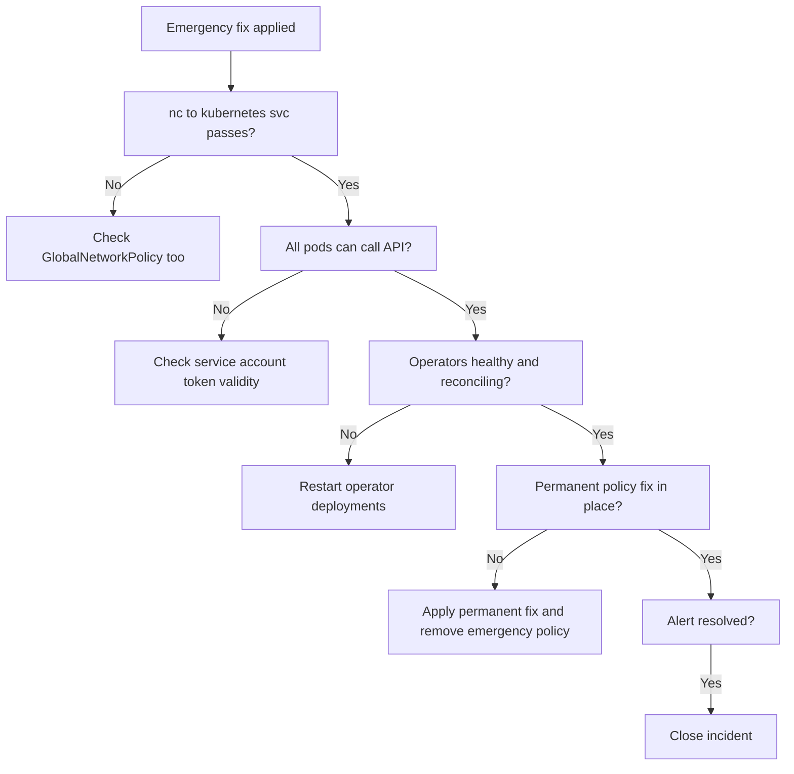

# How to Validate Resolution of Kubernetes API Access Problems with Calico Egress Policy

Author: [nawazdhandala](https://github.com/nawazdhandala)

Tags: Calico, Kubernetes, Networking, Troubleshooting

Description: Validation steps to confirm Kubernetes API access is fully restored after fixing Calico egress policy blocking including operator health checks and ServiceAccount permission tests.

---

## Introduction

Validating that Kubernetes API access is restored after a Calico egress policy fix requires confirming not only that the network path is open, but also that dependent workloads have recovered from the interruption. Operators, controllers, and service accounts may need to reconnect their watches and re-sync their state after a period of API unavailability.

A network-level fix (opening the egress path) does not automatically restart stuck operators. Some operators with exponential backoff may not retry for many minutes after the policy fix. Validation must include checking operator pod logs for successful API calls and confirming that their control loops are functioning correctly.

## Symptoms

- Emergency API allow policy was applied but operators are still failing
- Network path is confirmed open but service accounts still return 401
- Synthetic probe passes but operator error rate is still elevated

## Root Causes

- Operators are in exponential backoff and have not retried since the fix
- Emergency policy was applied but the permanent fix was not completed
- Service account token was rotated during the outage (rare)

## Diagnosis Steps

```bash
# Check current state
NAMESPACE=<affected-namespace>
KUBE_IP=$(kubectl get svc kubernetes -o jsonpath='{.spec.clusterIP}')
POD=$(kubectl get pods -n $NAMESPACE -o name | head -1)

# Confirm network path
kubectl exec $POD -n $NAMESPACE -- nc -zv $KUBE_IP 443 2>&1
```

## Solution

**Validation Step 1: Confirm API connectivity from multiple pods**

```bash
# Test from different pods in the namespace
for POD in $(kubectl get pods -n $NAMESPACE -o name | head -3); do
  echo "Testing from $POD:"
  kubectl exec $POD -n $NAMESPACE -- \
    curl -sk https://kubernetes.default.svc.cluster.local/api/v1 \
    --header "Authorization: Bearer $(cat /var/run/secrets/kubernetes.io/serviceaccount/token)" \
    -o /dev/null -w "HTTP: %{http_code}\n" --max-time 5 2>/dev/null
done
```

**Validation Step 2: Verify operator pods are healthy and running**

```bash
kubectl get pods -n $NAMESPACE
kubectl logs -n $NAMESPACE <operator-pod-name> --tail=20 | grep -v "level=debug"
```

**Validation Step 3: Force operator reconnect if still stuck in backoff**

```bash
# Restart the operator to clear backoff state
kubectl rollout restart deployment/<operator-deployment> -n $NAMESPACE
kubectl rollout status deployment/<operator-deployment> -n $NAMESPACE
```

**Validation Step 4: Confirm permanent policy fix is in place**

```bash
# Ensure emergency policy was removed after permanent fix
kubectl get networkpolicy -n $NAMESPACE | grep emergency
# If found, verify permanent fix is in place, then remove emergency policy
kubectl delete networkpolicy emergency-allow-api-access -n $NAMESPACE 2>/dev/null || echo "Already removed"
```

**Validation Step 5: Test synthetic probe manually**

```bash
kubectl create job --from=cronjob/api-access-probe manual-probe-$(date +%s) -n $NAMESPACE
kubectl wait job/manual-probe-* --for=condition=complete --timeout=60s -n $NAMESPACE
kubectl logs -n $NAMESPACE -l job-name=manual-probe-*
```

**Validation Step 6: Confirm alert is resolved**

```bash
# Check alertmanager for active KubernetesAPIAccessBlocked alerts
kubectl get --raw \
  /api/v1/namespaces/monitoring/services/alertmanager-operated:9093/proxy/api/v2/alerts \
  2>/dev/null | jq '.[] | select(.labels.alertname == "KubernetesAPIAccessBlocked")'
# Expected: empty result
```



## Prevention

- Include operator health checks in the validation checklist for all egress policy changes
- Set up synthetic API probes in each namespace at deployment time
- Document the emergency-allow-policy pattern in the team runbook

## Conclusion

Validating Kubernetes API access restoration requires confirming the network path, operator recovery, and removal of the emergency policy in favor of a permanent fix. Operators in backoff state need a restart to reconnect — this step is frequently overlooked when teams focus only on the network validation.
