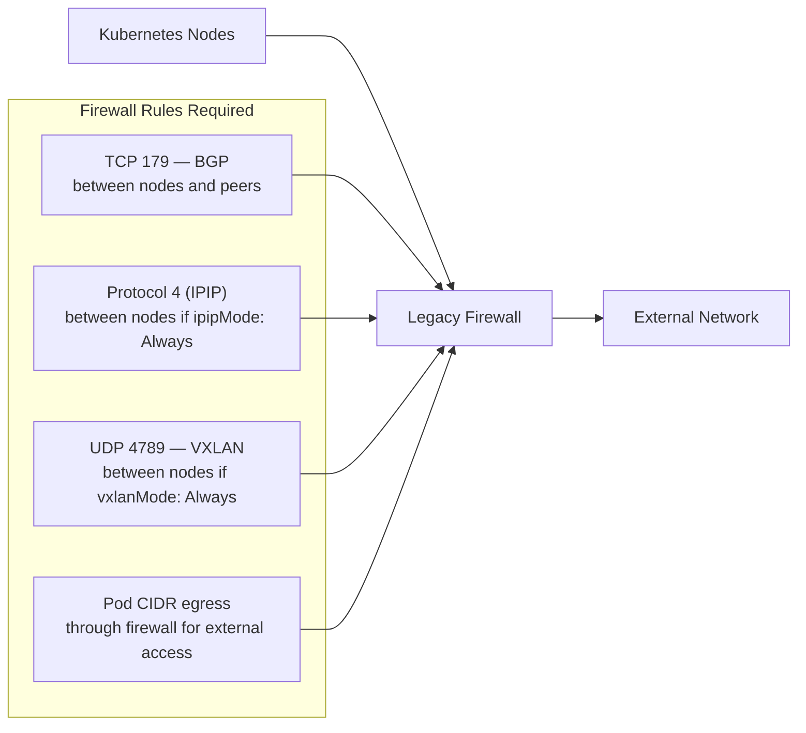

# Validate Legacy Firewalls with Calico IPAM

Author: [nawazdhandala](https://github.com/nawazdhandala)

Tags: calico, ipam, firewall, networking, kubernetes, on-premises, legacy

Description: A guide to validating that Calico IPAM and pod networking work correctly in environments with legacy firewalls, including firewall rule verification and confirming that pod traffic passes through without being blocked.

---

## Introduction

Many on-premises Kubernetes deployments coexist with legacy firewalls that were designed for traditional server networking. These firewalls often have rules based on static IP ranges and may not automatically accommodate dynamic pod IP allocations. When Calico allocates IP addresses for pods, those IPs must be able to traverse the legacy firewalls for pods to communicate with external systems.

Validating that Calico IPAM works correctly with legacy firewalls requires confirming that pod CIDR ranges are permitted through firewall rules, that the selected encapsulation mode (IP-in-IP, VXLAN, or native routing) is compatible with the firewall, and that egress traffic from pods reaches external destinations without being blocked.

This guide provides practical validation steps for Calico deployments operating behind legacy firewalls.

## Prerequisites

- Kubernetes cluster with Calico CNI in an on-premises environment
- Legacy firewall with access to review and modify rules
- `calicoctl` CLI with cluster access
- Network access to test external connectivity from pods

## Step 1: Document Pod CIDR and Firewall Requirements

Identify the IP ranges that need to be permitted through the legacy firewall.

```bash
# Get all configured IP pools
calicoctl get ippool -o wide

# Note the CIDRs that need firewall rules:
# 1. Pod CIDR (inter-cluster routing)
# 2. Node IP range (for tunnel endpoints if using IP-in-IP or VXLAN)
# 3. Service CIDR (if services need to be reachable externally)

# Get node IP range
kubectl get nodes -o jsonpath=\
'{.items[*].status.addresses[?(@.type=="InternalIP")].address}' | \
  tr ' ' '\n' | sort
```

## Step 2: Validate Encapsulation Mode Compatibility

Legacy firewalls may block encapsulated protocols. Verify the encapsulation mode.

```bash
# Check which encapsulation mode Calico is using
calicoctl get ippool default-ipv4-ippool \
  -o jsonpath='{.spec.ipipMode}:{.spec.vxlanMode}'

# Encapsulation modes and required firewall rules:
# IP-in-IP (ipipMode: Always): requires IP protocol 4 (IPIP) to be permitted
# VXLAN (vxlanMode: Always): requires UDP port 4789 to be permitted
# CrossSubnet: IPIP/VXLAN only crosses subnet boundaries — check subnet topology
# Never (pure BGP): requires BGP (TCP 179) to be permitted between nodes
```

## Step 3: Test Firewall Rules for Inter-Node Traffic

Validate that inter-node traffic (including pod traffic) passes through the firewall.

```bash
# Test IPIP traffic between two nodes (if using IP-in-IP mode)
# From node1, attempt to reach a pod on node2:
kubectl run net-test --image=nicolaka/netshoot -- sleep 3600
POD_IP=$(kubectl get pod net-test -o jsonpath='{.status.podIP}')
POD_NODE=$(kubectl get pod net-test -o jsonpath='{.spec.nodeName}')
echo "Pod on node: $POD_NODE, IP: $POD_IP"

# From another node or external host, test reachability
ping -c 4 $POD_IP

# Use traceroute to verify the path and confirm no firewall blocks
traceroute $POD_IP
```

## Step 4: Validate Pod Egress Through Firewall

Test that pods can reach external destinations through the legacy firewall.

```bash
# Test egress from a pod to an external IP (should use NAT via node IP)
kubectl exec net-test -- curl -m 10 http://example.com

# Verify the source IP that the external host sees (should be a node IP, not pod IP)
kubectl exec net-test -- curl -m 10 https://ifconfig.me

# Check that natOutgoing is enabled on the pod IP pool (required for internet access)
calicoctl get ippool default-ipv4-ippool \
  -o jsonpath='{.spec.natOutgoing}'
# Expected: true (pods NAT to node IP for egress)
```

## Step 5: Validate BGP Traffic Through Firewall (If Using BGP)

```bash
# Check if BGP sessions are established (TCP port 179 must be open)
calicoctl node status

# If BGP sessions are not established, check firewall rules for TCP 179
# between nodes and between nodes and external BGP peers

# Test BGP port accessibility from one node to another
kubectl -n kube-system exec -it \
  $(kubectl -n kube-system get pods -l k8s-app=calico-node -o name | head -1) -- \
  nc -zv <peer-node-ip> 179
```

## Required Firewall Rules Summary



## Best Practices

- Document all required firewall rules before deploying Calico in a legacy environment
- Use `CrossSubnet` encapsulation mode to avoid encapsulation overhead within the same L2 segment
- Consider native routing mode (BGP, no encapsulation) for the simplest firewall rule set
- Work with your network team to create firewall rules before deploying pods — retrofitting rules is risky
- Test connectivity from the pod CIDR range through the firewall during a maintenance window

## Conclusion

Validating Calico IPAM with legacy firewalls requires systematic testing at each network boundary: inter-node traffic, pod egress, and BGP control plane. By documenting required firewall rules before deployment and testing each traffic type, you ensure that dynamic pod IP allocations from Calico IPAM can flow through your existing network infrastructure without being silently blocked.
