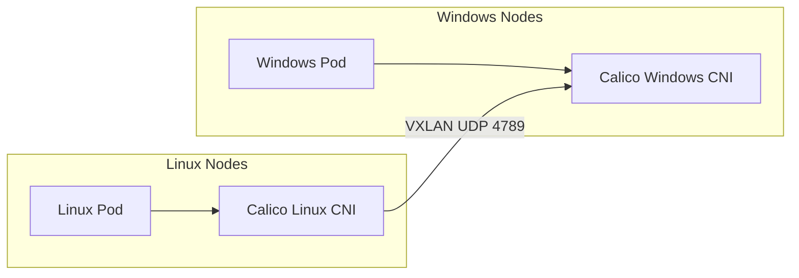

# How to Validate Mixed Linux and Windows Networking with Calico

Author: [nawazdhandala](https://github.com/nawazdhandala)

Tags: Calico, Kubernetes, Window, Linux, Networking

Description: Validate connectivity between Linux and Windows pods in a Calico-managed mixed-OS Kubernetes cluster.

---

## Introduction

Running Calico in mixed Linux/Windows Kubernetes clusters enables organizations to containerize Windows-specific workloads alongside Linux containers while using a unified networking and policy model. Calico for Windows supports VXLAN encapsulation (IP-in-IP is not supported on Windows) and non-overlay BGP peering, with some Windows-specific feature limitations for policy and networking.

Mixed OS networking requires careful attention to differences in how Windows handles network interfaces, IPAM, and policy enforcement. Windows Calico uses a different CNI binary and network driver compared to Linux, but both integrate with the same Kubernetes API and Calico datastore.

## Prerequisites

- Kubernetes cluster with Linux control plane nodes
- Windows worker nodes (Windows Server 2019+)
- Calico v3.27+ with Windows support for operator-based installs
- VXLAN mode configured for this guide
- Calico IPAM strict affinity enabled if you use Calico IPAM

## Configure VXLAN for Windows Compatibility

```yaml
apiVersion: projectcalico.org/v3
kind: IPPool
metadata:
  name: default-ipv4-ippool
spec:
  cidr: 10.244.0.0/16
  vxlanMode: Always  # Used for this VXLAN example
  ipipMode: Never    # IP-in-IP not supported on Windows
  natOutgoing: true
```

```bash
kubectl patch ipamconfigurations default --type merge --patch='{"spec": {"strictAffinity": true}}'
```

## Install Calico on Windows Nodes

```powershell
# On Windows node

Invoke-WebRequest https://github.com/projectcalico/calico/releases/download/v3.30.3/install-calico-windows.ps1 -OutFile c:\install-calico-windows.ps1
c:\install-calico-windows.ps1 -DownloadOnly yes -KubeVersion <your Kubernetes version>

# Configure C:\CalicoWindows\config.ps1, then start Calico
C:\CalicoWindows\install-calico.ps1
```

## Test Cross-OS Connectivity

```bash
# Deploy Linux pod
kubectl run linux-pod --image=busybox -- sleep 3600

# Deploy Windows pod (ensure windows-pod.yaml schedules to a Windows node)
kubectl apply -f windows-pod.yaml

LINUX_IP=$(kubectl get pod linux-pod -o jsonpath='{.status.podIP}')
WIN_IP=$(kubectl get pod windows-pod -o jsonpath='{.status.podIP}')

# Test Linux to Windows
kubectl exec linux-pod -- ping -c 3 ${WIN_IP}

# Test Windows to Linux (from Windows pod)
kubectl exec windows-pod -- ping -n 3 ${LINUX_IP}
```

## Mixed OS Architecture



## Conclusion

Mixed Linux/Windows networking with Calico can use VXLAN mode for overlay networking (IP-in-IP is not supported on Windows), careful MTU configuration, and thorough testing of cross-OS pod connectivity. Kubernetes network policies can be enforced across both OS types, with Windows-specific Calico limitations to account for in mixed workload clusters.
