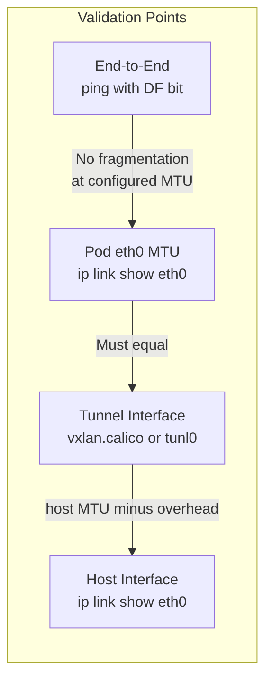

# How to Validate MTU Sizing for Calico

Author: [nawazdhandala](https://github.com/nawazdhandala)

Tags: Calico, Kubernetes, MTU, Networking, Validation

Description: Validate Calico MTU configuration by testing packet sizes through the network path, verifying pod interface MTU, and detecting fragmentation with active probing.

---

## Introduction

Validating MTU configuration in Calico ensures that the values set in Felix configuration are actually applied to pod interfaces and that packets of the expected size traverse the network without fragmentation. MTU validation is particularly important after cluster upgrades, network changes, or when onboarding new node types with different physical MTU values.

The most reliable MTU validation method is sending packets at the configured MTU size with the "Don't Fragment" (DF) bit set. If the packet passes without fragmentation, the MTU is correctly configured throughout the path. If it fails, you have a mismatch somewhere in the path.

## Prerequisites

- Test pods deployed on different nodes
- Tools: ping, iperf3 available in pods

## Validate Pod Interface MTU

```bash
# Check MTU on all running pods
kubectl get pods -o wide | awk '{print $1, $7}' | while read pod node; do
  mtu=$(kubectl exec ${pod} -- ip link show eth0 2>/dev/null | grep mtu | awk '{print $5}')
  echo "${pod} on ${node}: MTU=${mtu}"
done
```

## Test MTU with Ping (Don't Fragment)

Send a ping packet at the exact MTU size to test for fragmentation:

```bash
# From pod, ping another pod with DF bit set
# MTU=1450 for VXLAN: payload = MTU - 28 (IP+ICMP headers) = 1422
kubectl exec pod-on-node1 -- ping -M do -s 1422 -c 3 <pod-on-node2-ip>
```

If this fails but smaller sizes succeed, there is an MTU mismatch in the path.

## Test with iperf3 for Throughput at MTU Boundary

```bash
# Server
kubectl exec -it iperf3-server -- iperf3 -s

# Client - test at different MTU-relevant sizes
SERVER_IP=$(kubectl get pod iperf3-server -o jsonpath='{.status.podIP}')
kubectl exec -it iperf3-client -- iperf3 -c ${SERVER_IP} -M 1400 -t 10
kubectl exec -it iperf3-client -- iperf3 -c ${SERVER_IP} -M 1450 -t 10
kubectl exec -it iperf3-client -- iperf3 -c ${SERVER_IP} -M 1500 -t 10
```

Compare throughput across sizes - a significant drop indicates MTU misconfiguration.

## Check for Fragmentation in Node Counters

```bash
# Check IP fragmentation counters on node
cat /proc/net/snmp | grep -i frag
netstat -s | grep -i fragment
```

## Validate MTU Across Encapsulation Types



## Automated MTU Validation Script

```bash
#!/bin/bash
EXPECTED_MTU=1450  # Adjust for your setup
ERRORS=0

kubectl get pods -o wide | tail -n +2 | while read line; do
  POD=$(echo $line | awk '{print $1}')
  MTU=$(kubectl exec ${POD} -- ip link show eth0 2>/dev/null | grep -oP 'mtu \K\d+')
  if [ "${MTU}" != "${EXPECTED_MTU}" ]; then
    echo "ERROR: ${POD} has MTU=${MTU}, expected ${EXPECTED_MTU}"
    ERRORS=$((ERRORS+1))
  fi
done

echo "MTU validation complete. Errors: ${ERRORS}"
```

## Conclusion

Validating Calico MTU configuration requires checking pod interface MTU values, testing with DF-bit ping at the expected MTU boundary, and monitoring fragmentation counters. Run this validation after any network or Calico configuration changes, and automate it as a cluster health check to catch MTU regressions early.
