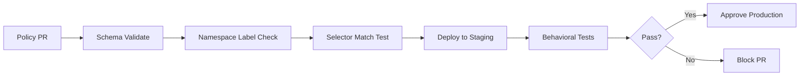

# How to Validate Calico Namespace-Based Policies Before Production

Author: [nawazdhandala](https://github.com/nawazdhandala)

Tags: Calico, Kubernetes, Network Policy, Namespace, Validation

Description: Build a validation framework for Calico namespace-based network policies that verifies namespace labels and policy selectors before production deployment.

---

## Introduction

Validating namespace-based Calico policies requires checking both the policy definitions and the namespace label state. A syntactically valid policy that references a namespace label that doesn't exist will silently fail to apply. Validation should catch these mismatches before they reach production.

Unlike pod label validation, namespace label validation is often overlooked because namespaces are less frequently modified. But a missing or incorrect namespace label can leave an entire application tier unprotected or blocked.

## Prerequisites

- Kubernetes cluster with Calico v3.26+ (staging)
- `calicoctl`, `kubectl`, and Python 3 installed
- CI/CD pipeline integration

## Step 1: Validate Namespace Labels Exist

```bash
#!/bin/bash
# validate-namespace-labels.sh
REQUIRED_NS_LABELS=("environment" "team")
POLICY_DIR="policies/"
EXIT_CODE=0

# Extract all namespace selectors from policies
NS_SELECTORS=$(grep -r "namespaceSelector" $POLICY_DIR | grep -oP "(?<=namespaceSelector: ).*" | sort | uniq)

echo "Validating namespace selectors in policies..."
echo "$NS_SELECTORS" | while read selector; do
  echo "Checking: $selector"
  # Check if any namespace matches
  KEY=$(echo "$selector" | cut -d= -f1 | tr -d "' ")
  VALUE=$(echo "$selector" | cut -d= -f3 | tr -d "' ")
  MATCHES=$(kubectl get namespaces -l "$KEY=$VALUE" --no-headers 2>/dev/null | wc -l)
  if [ "$MATCHES" -eq 0 ]; then
    echo "WARNING: Selector '$selector' matches 0 namespaces"
    EXIT_CODE=1
  else
    echo "OK: Selector '$selector' matches $MATCHES namespaces"
  fi
done
exit $EXIT_CODE
```

## Step 2: Verify All Namespaces Have Required Labels

```python
#!/usr/bin/env python3
import subprocess, json, sys

result = subprocess.run(
    ["kubectl", "get", "namespaces", "-o", "json"],
    capture_output=True, text=True
)
data = json.loads(result.stdout)

required_labels = ["environment", "team"]
errors = []

for ns in data["items"]:
    name = ns["metadata"]["name"]
    labels = ns["metadata"].get("labels", {})
    
    # Skip system namespaces
    if name in ["kube-system", "kube-public", "kube-node-lease"]:
        continue
    
    for label in required_labels:
        if label not in labels:
            errors.append(f"Namespace '{name}' missing label: {label}")

if errors:
    for e in errors:
        print(f"FAIL: {e}")
    sys.exit(1)
print("All namespaces have required labels")
```

## Step 3: Schema Validation

```bash
# Validate all namespace-based policies
for f in policies/namespace-*.yaml; do
  echo "Validating: $f"
  calicoctl apply -f "$f" --dry-run && echo "PASS" || echo "FAIL: $f"
done
```

## Step 4: Behavioral Test Suite

```bash
#!/bin/bash
# test-namespace-isolation.sh
FAIL=0

run_test() {
  local desc="$1" src_ns="$2" dest_svc="$3" expected="$4"
  kubectl exec -n "$src_ns" test-pod -- curl -s --max-time 5 "http://$dest_svc" > /dev/null 2>&1
  local exit=$?
  if { [ $exit -eq 0 ] && [ "$expected" == "allow" ]; } || { [ $exit -ne 0 ] && [ "$expected" == "deny" ]; }; then
    echo "PASS: $desc"
  else
    echo "FAIL: $desc (expected $expected)"
    ((FAIL++))
  fi
}

run_test "prod->prod intra" production "prod-service.production.svc.cluster.local" allow
run_test "staging->prod cross" staging "prod-service.production.svc.cluster.local" deny
run_test "monitoring->prod metrics" monitoring "prod-service.production.svc.cluster.local:9090" allow

[ "$FAIL" -eq 0 ] && echo "All tests passed" || exit 1
```

## Validation Pipeline



## Conclusion

Namespace-based policy validation requires a two-pronged approach: validating the policy definitions (schema and selector syntax) and validating the runtime state (namespace labels exist and match). Automate both in your CI/CD pipeline, and add behavioral tests in staging to verify the combined effect of all your namespace policies. This multi-layer validation approach catches the majority of namespace isolation misconfigurations before they affect production.
