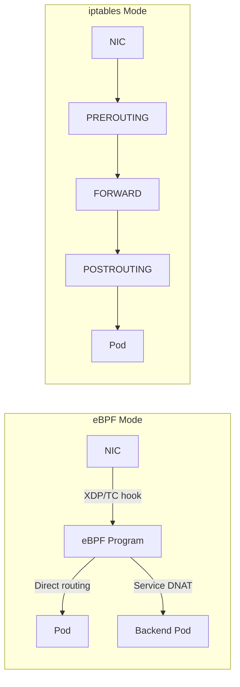

# How to Validate Native Routing with Calico eBPF

Author: [nawazdhandala](https://github.com/nawazdhandala)

Tags: Calico, Kubernetes, EBPF, Networking, Performance

Description: Validate that Calico eBPF native routing is correctly configured and delivering the expected performance improvements over iptables mode.

---

## Introduction

Calico's eBPF dataplane provides native routing that bypasses much of the Linux kernel's traditional networking stack, resulting in significantly lower latency and higher throughput compared to the iptables-based dataplane. eBPF programs are loaded into the kernel and intercept network packets at the earliest possible point, performing routing decisions and policy enforcement without the overhead of traversing multiple kernel layers.

Native routing in eBPF mode eliminates the need for VXLAN or IP-in-IP encapsulation in many scenarios, as eBPF can directly program routes and perform NAT at packet arrival time. This makes it particularly valuable for latency-sensitive workloads and high-throughput microservices.

## Prerequisites

- Linux kernel 5.3+ (5.8+ recommended for full feature support)
- Calico v3.13+ with eBPF support
- kube-proxy disabled or replaced by Calico eBPF
- kubectl and calicoctl access

## Enable eBPF Dataplane

```bash
# Disable kube-proxy before enabling eBPF
kubectl patch ds -n kube-system kube-proxy -p   '{"spec":{"template":{"spec":{"nodeSelector":{"non-calico":"true"}}}}}'

# Enable eBPF mode
calicoctl patch felixconfiguration default --type merge   --patch '{"spec":{"bpfEnabled":true,"bpfDisableUnprivileged":true}}'
```

## Verify eBPF Mode

```bash
# Check eBPF programs loaded on a node
kubectl exec -n calico-system ds/calico-node -- bpftool prog list | grep calico

# Verify kube-proxy replacement
kubectl exec -n calico-system ds/calico-node -- calico-node -bpf-log-level Debug

# Test connectivity
kubectl run test1 --image=busybox -- sleep 3600
kubectl exec test1 -- wget -O- http://kubernetes.default.svc
```

## Benchmark eBPF vs iptables

```bash
# Run throughput test
kubectl run iperf-server --image=networkstatic/iperf3 -- iperf3 -s
SRV=$(kubectl get pod iperf-server -o jsonpath='{.status.podIP}')
kubectl run iperf-client --image=networkstatic/iperf3 -- iperf3 -c ${SRV} -t 30

# Compare against previous iptables results
```

## eBPF Architecture



## Conclusion

Calico eBPF native routing delivers measurable performance improvements by bypassing traditional kernel networking overhead. Enable eBPF mode after verifying kernel compatibility, disable kube-proxy, and benchmark throughput and latency to validate the improvement. The migration is reversible - eBPF mode can be disabled and kube-proxy re-enabled if issues are encountered.
