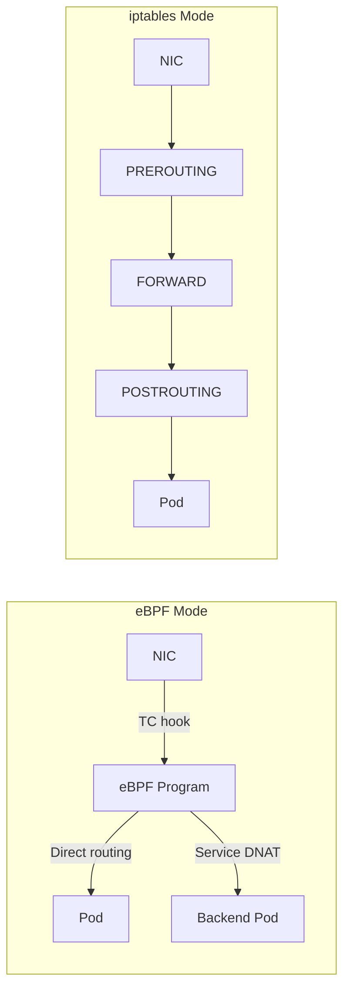

# How to Validate Native Routing with Calico eBPF

Author: [nawazdhandala](https://github.com/nawazdhandala)

Tags: Calico, Kubernetes, eBPF, Networking, Performance

Description: Validate that Calico eBPF native routing is correctly configured and delivering the expected performance improvements over iptables mode.

---

## Introduction

Calico's eBPF dataplane provides native routing that bypasses much of the Linux kernel's traditional networking stack, resulting in significantly lower latency and higher throughput compared to the iptables-based dataplane. eBPF programs are loaded into the kernel and attached to tc hooks on Calico, data, and tunnel interfaces, performing routing decisions and policy enforcement without the overhead of traversing multiple kernel layers.

Native routing in eBPF mode eliminates the need for an overlay for pod-to-pod traffic in many scenarios, as Calico can use direct routes on an underlying network that supports them. VXLAN is still used for some service paths, such as forwarding NodePort traffic between nodes. This makes it particularly valuable for latency-sensitive workloads and high-throughput microservices.

## Prerequisites

- A supported Linux distribution with kernel 5.10+ (or RHEL 8.4 with kernel 4.18.0-305+); kernel 6.6+ is recommended for all eBPF features
- A current Calico release with eBPF support
- kube-proxy disabled or replaced by Calico eBPF
- kubectl and calicoctl access

## Enable eBPF Dataplane

```bash
# Disable kube-proxy before enabling eBPF on clusters where kube-proxy runs as a DaemonSet
kubectl patch ds -n kube-system kube-proxy -p '{"spec":{"template":{"spec":{"nodeSelector":{"non-calico":"true"}}}}}'

# Enable eBPF mode
calicoctl patch felixconfiguration default --patch '{"spec":{"bpfEnabled":true}}'
```

## Verify eBPF Mode

```bash
# Check eBPF programs loaded on a node
CALICO_NODE=$(kubectl get pod -n calico-system -l k8s-app=calico-node -o jsonpath='{.items[0].metadata.name}')
kubectl exec -n calico-system "$CALICO_NODE" -- bpftool prog list | grep calico

# Verify kube-proxy replacement
kubectl logs -n calico-system "$CALICO_NODE" -c calico-node | grep "BPF enabled, starting BPF endpoint manager and map manager"
kubectl exec -n calico-system "$CALICO_NODE" -- calico-node -bpf nat dump

# Test connectivity
kubectl run test1 --image=busybox -- sleep 3600
kubectl exec test1 -- wget -O- http://kubernetes.default.svc
```

## Benchmark eBPF vs iptables

```bash
# Run throughput test
kubectl run iperf-server --image=networkstatic/iperf3 -- iperf3 -s
kubectl wait --for=condition=Ready pod/iperf-server --timeout=60s
SRV=$(kubectl get pod iperf-server -o jsonpath='{.status.podIP}')
kubectl run iperf-client --rm -i --restart=Never --image=networkstatic/iperf3 -- iperf3 -c ${SRV} -t 30

# Compare against previous iptables results
```

## eBPF Architecture


```mermaid
graph LR
    subgraph eBPF Mode
        NIC[NIC] -->|TC hook| EBPF[eBPF Program]
        EBPF -->|Direct routing| POD[Pod]
        EBPF -->|Service DNAT| BACKEND[Backend Pod]
    end
    subgraph iptables Mode
        NIC2[NIC] --> PREROUTING[PREROUTING] --> FORWARD[FORWARD] --> POSTROUTING[POSTROUTING] --> POD2[Pod]
    end
```

## Conclusion

Calico eBPF native routing delivers measurable performance improvements by bypassing traditional kernel networking overhead. Enable eBPF mode after verifying kernel compatibility, disable kube-proxy, and benchmark throughput and latency to validate the improvement. The migration is reversible - eBPF mode can be disabled and kube-proxy re-enabled if issues are encountered.
