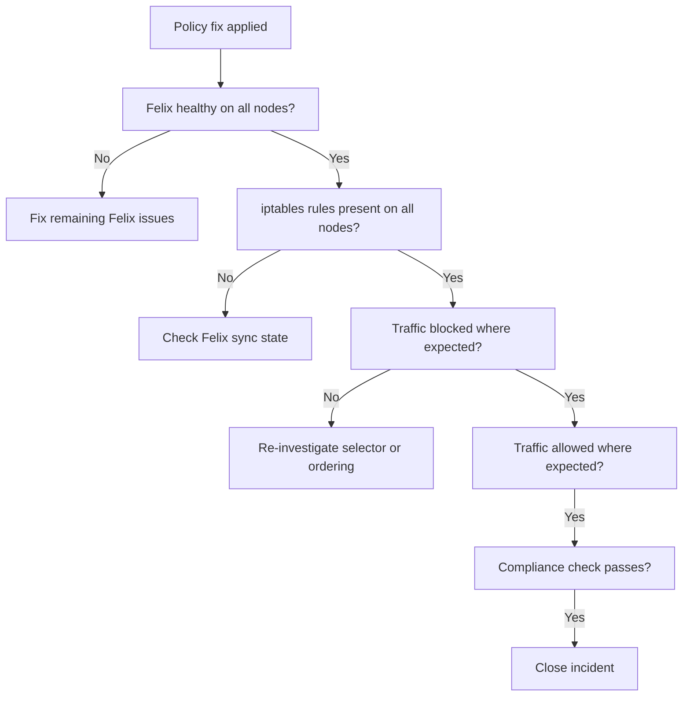

# How to Validate Resolution of Network Policy Not Taking Effect in Calico

Author: [nawazdhandala](https://github.com/nawazdhandala)

Tags: Calico, Kubernetes, Networking, Troubleshooting

Description: Validate that Calico NetworkPolicy is now properly enforced after fixing selector or Felix issues using traffic tests and iptables rule verification.

---

## Introduction

Validating NetworkPolicy enforcement resolution requires confirming the policy is producing the expected traffic behavior. This means running traffic tests that verify both the blocking behavior (traffic that should be blocked is now blocked) and the allowing behavior (traffic that should flow still flows).

## Symptoms

- Policy appears to work for some traffic but not all
- Intermittent enforcement after Felix restart

## Root Causes

- Policy is enforced on some nodes but not others
- Felix sync not complete

## Diagnosis Steps

```bash
kubectl exec $NODE_POD -n kube-system -- wget -qO- http://localhost:9099/readiness
```

## Solution

**Validation Step 1: Felix is healthy and in-sync on all nodes**

```bash
for POD in $(kubectl get pods -n kube-system -l k8s-app=calico-node -o name); do
  NODE=$(kubectl get $POD -n kube-system -o jsonpath='{.spec.nodeName}')
  READY=$(kubectl exec $POD -n kube-system -- wget -qO- http://localhost:9099/readiness 2>/dev/null && echo "OK" || echo "FAIL")
  echo "$NODE: $READY"
done
```

**Validation Step 2: iptables rules present on all nodes**

```bash
for NODE in $(kubectl get nodes -o jsonpath='{.items[*].metadata.name}'); do
  RULES=$(ssh $NODE "sudo iptables -L | grep -c cali-pi" 2>/dev/null)
  echo "$NODE: $RULES Calico policy rules"
done
```

**Validation Step 3: Traffic test confirms blocking behavior**

```bash
# Test that traffic is now blocked (if policy is deny)
kubectl run block-test --image=busybox --restart=Never -- sleep 60
TARGET_IP=$(kubectl get pod <policy-target-pod> -o jsonpath='{.status.podIP}')

kubectl exec block-test -- ping -c 2 -W 2 $TARGET_IP 2>&1
# Expected: ping times out or fails (blocked by policy)

kubectl delete pod block-test
```

**Validation Step 4: Traffic test confirms allowing behavior (for allow policies)**

```bash
kubectl run allow-test --image=busybox --restart=Never -- sleep 60
kubectl exec allow-test -- ping -c 3 <expected-allowed-ip> 2>&1
# Expected: ping succeeds (allowed by policy)
kubectl delete pod allow-test
```

**Validation Step 5: Policy compliance check passes**

```bash
kubectl create job policy-check --from=cronjob/policy-compliance-check -n kube-system 2>/dev/null || true
# Or manually run the compliance check
```



## Prevention

- Run both blocking and allowing traffic tests after policy fixes
- Validate policy enforcement on all nodes, not just the affected one
- Add compliance checks to monitoring for ongoing policy enforcement validation

## Conclusion

Validating NetworkPolicy enforcement requires confirming Felix health on all nodes, iptables rules present cluster-wide, and both blocking and allowing traffic tests passing as expected. Running tests on multiple nodes catches partial enforcement issues that single-node validation would miss.
