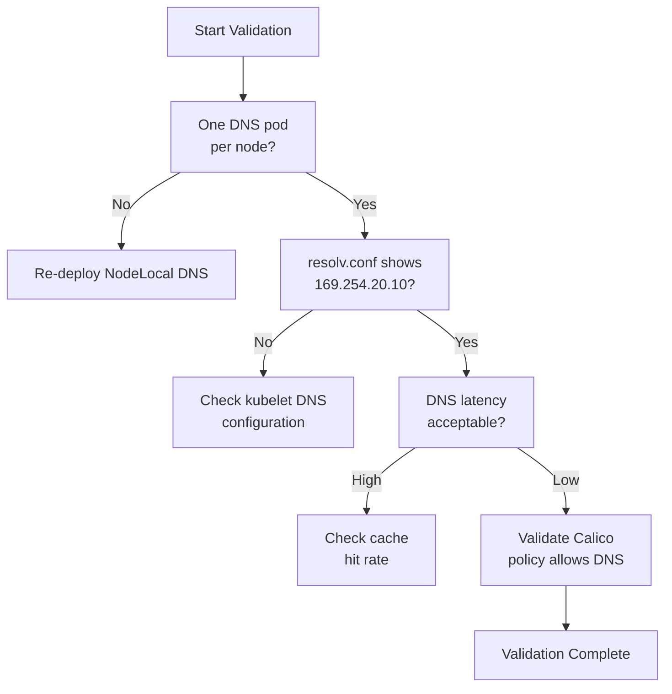

# How to Validate Node Local DNS Cache with Calico

Author: [nawazdhandala](https://github.com/nawazdhandala)

Tags: Calico, Kubernetes, DNS, node-cache, Networking

Description: Validate that NodeLocal DNSCache is working correctly with Calico by testing cache hit rates, DNS resolution latency, and network policy enforcement.

---

## Introduction

Validating NodeLocal DNSCache with Calico confirms that DNS queries from pods are being served by the local cache rather than crossing the network to CoreDNS. Effective validation requires measuring DNS resolution latency (cache hits should be sub-millisecond), confirming that Calico network policies correctly allow traffic to the link-local cache IP, and verifying that cache pods are healthy on all nodes.

A misconfigured NodeLocal DNS cache can silently fall back to CoreDNS for all queries, negating the performance benefit while consuming resources running the cache daemon. Validation catches this scenario and ensures the cache is actually being used.

## Prerequisites

- NodeLocal DNSCache deployed with Calico
- kubectl access and ability to exec into pods
- curl or wget for accessing metrics

## Verify Cache Pod Health

```bash
# All nodes should have a node-local-dns pod
kubectl get pods -n kube-system -l k8s-app=node-local-dns -o wide

# Check there is one pod per node
NODE_COUNT=$(kubectl get nodes --no-headers | wc -l)
POD_COUNT=$(kubectl get pods -n kube-system -l k8s-app=node-local-dns --no-headers | wc -l)
echo "Nodes: ${NODE_COUNT}, DNS cache pods: ${POD_COUNT}"
```

## Test DNS via NodeLocal Cache

```bash
# Deploy test pod and verify it uses node-local cache
kubectl run dns-test --image=busybox -- sleep 3600

# Check /etc/resolv.conf - should show 169.254.20.10
kubectl exec dns-test -- cat /etc/resolv.conf

# Time DNS lookups
kubectl exec dns-test -- time nslookup kubernetes.default.svc.cluster.local
```

## Measure Cache Hit Rate

```bash
NODE_DNS=$(kubectl get pod -n kube-system -l k8s-app=node-local-dns \
  --field-selector spec.nodeName=<node> -o name | head -1)

# Get cache metrics
kubectl exec -n kube-system ${NODE_DNS} -- \
  wget -qO- http://localhost:9253/metrics | grep -E "cache_hits|cache_misses"
```

## Validate Calico Policies Allow DNS Traffic

```bash
# Test connectivity to node-local DNS IP
kubectl exec dns-test -- nc -zvw 3 169.254.20.10 53

# Verify no dropped packets in Calico logs
kubectl logs -n calico-system ds/calico-node | grep -i "169.254.20.10" | grep -i deny
```

## Validation Summary



## Conclusion

Validating NodeLocal DNSCache with Calico confirms the full DNS acceleration path is working: pods are configured to use 169.254.20.10, Calico policies allow traffic to that address, and the cache is serving requests with high hit rates. Monitor cache metrics regularly to ensure the caching layer continues to function after cluster changes.
