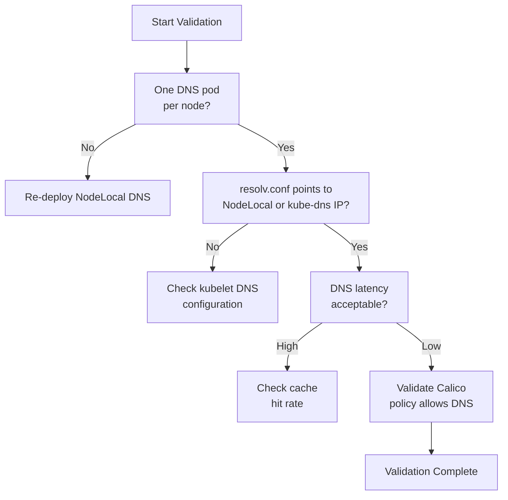

# How to Validate Node Local DNS Cache with Calico

Author: [nawazdhandala](https://github.com/nawazdhandala)

Tags: Calico, Kubernetes, DNS, Node-cache, Networking

Description: Validate that NodeLocal DNSCache is working correctly with Calico by testing cache hit rates, DNS resolution latency, and network policy enforcement.

---

## Introduction

Validating NodeLocal DNSCache with Calico confirms that DNS queries from pods use the node-local caching path, with cache misses forwarded to kube-dns/CoreDNS. Effective validation requires measuring DNS resolution latency, confirming that Calico network policies correctly allow DNS traffic, and verifying that cache pods are healthy on all nodes.

A misconfigured NodeLocal DNS cache can silently send queries directly to kube-dns/CoreDNS, negating the performance benefit while consuming resources running the cache daemon. Validation catches this scenario and ensures the cache is actually being used.

## Prerequisites

- NodeLocal DNSCache deployed with Calico
- kubectl access and ability to exec into pods
- curl for accessing metrics

## Verify Cache Pod Health

```bash
# All nodes should have a node-local-dns pod

kubectl get pods -n kube-system -l k8s-app=node-local-dns -o wide

# Check there is one pod per node
NODE_COUNT=$(kubectl get nodes --no-headers | wc -l)
POD_COUNT=$(kubectl get pods -n kube-system -l k8s-app=node-local-dns --no-headers | wc -l)
echo "Nodes: ${NODE_COUNT}, DNS cache pods: ${POD_COUNT}"
```

## Test DNS via NodeLocal Cache

```bash
# Deploy test pod and verify it uses node-local cache
kubectl run dns-test --image=busybox -- sleep 3600

# Check /etc/resolv.conf. In IPVS mode it should show the NodeLocal DNS IP
# such as 169.254.20.10; in iptables mode it may still show the kube-dns
# service IP because node-local-dns can listen on both addresses.
kubectl exec dns-test -- cat /etc/resolv.conf

# Time DNS lookups through the pod resolver
kubectl exec dns-test -- sh -c 'time nslookup kubernetes.default.svc.cluster.local'

# Query the NodeLocal DNS IP directly
kubectl exec dns-test -- nslookup kubernetes.default.svc.cluster.local 169.254.20.10
```

## Measure Cache Hit Rate

```bash
NODE_DNS=$(kubectl get pod -n kube-system -l k8s-app=node-local-dns \
  --field-selector spec.nodeName=<node> -o name | head -1)

# Get cache metrics
kubectl port-forward -n kube-system ${NODE_DNS} 9253:9253 >/tmp/node-dns-port-forward.log 2>&1 &
PF_PID=$!
sleep 2
curl -s http://127.0.0.1:9253/metrics | grep -E "coredns_cache_hits_total|coredns_cache_requests_total"
kill ${PF_PID}
```

## Validate Calico Policies Allow DNS Traffic

```bash
# Test DNS resolution through the node-local DNS IP
kubectl exec dns-test -- nslookup kubernetes.default.svc.cluster.local 169.254.20.10

# Verify no dropped packets in Calico logs. The namespace is calico-system
# for operator installs and may be kube-system for manifest installs.
kubectl logs -n calico-system ds/calico-node --all-pods=true | grep -i "169.254.20.10" | grep -i deny
```

## Validation Summary


```mermaid
flowchart TD
    A[Start Validation] --> B[One DNS pod\nper node?]
    B -- No --> C[Re-deploy NodeLocal DNS]
    B -- Yes --> D[resolv.conf points to\nNodeLocal or kube-dns IP?]
    D -- No --> E[Check kubelet DNS\nconfiguration]
    D -- Yes --> F[DNS latency\nacceptable?]
    F -- High --> G[Check cache\nhit rate]
    F -- Low --> H[Validate Calico\npolicy allows DNS]
    H --> I[Validation Complete]
```

## Conclusion

Validating NodeLocal DNSCache with Calico confirms the full DNS acceleration path is working: pods are configured to use the NodeLocal DNS path, Calico policies allow the required DNS traffic, and the cache is serving requests with high hit rates. Monitor cache metrics regularly to ensure the caching layer continues to function after cluster changes.
