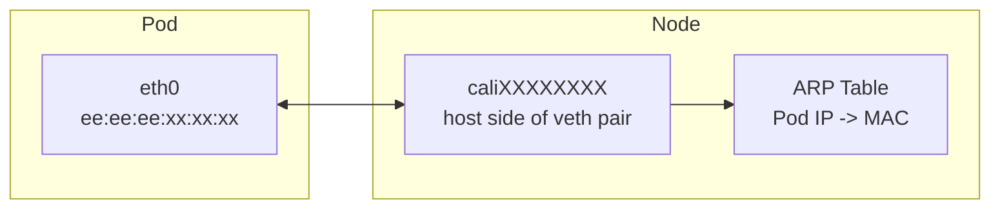

# How to Validate Pod MAC Addresses with Calico

Author: [nawazdhandala](https://github.com/nawazdhandala)

Tags: Calico, Kubernetes, MAC Address, Networking, CNI

Description: Validate that Calico is correctly assigning MAC addresses to pod interfaces and that MAC addresses do not conflict across nodes.

---

## Introduction

Calico assigns MAC addresses to pod virtual ethernet (veth) interfaces using a configurable scheme. By default, Calico uses a fixed MAC address prefix (ee:ee:ee:ee:ee:ee modified with interface-specific bytes) for all pod interfaces. This design works well for most environments but requires attention in networks where MAC addresses have security implications or in environments with physical switches that track ARP/MAC bindings.

Understanding Calico's MAC address assignment is important for debugging layer-2 networking issues, configuring certain network security controls, and ensuring compatibility with network monitoring tools that track device identity by MAC address.

## Prerequisites

- Calico v3.20+ installed
- kubectl access to the cluster
- Access to node networking stack

## Check Pod MAC Addresses

```bash
# View MAC address of a pod interface
kubectl exec test-pod -- ip link show eth0

# View the corresponding veth on the host
ip link | grep -A1 cali

# Verify MAC address uniqueness across pods
kubectl get pods -A -o wide | while read ns pod rest; do
  mac=$(kubectl exec -n ${ns} ${pod} -- ip link show eth0 2>/dev/null |     grep -oP '([0-9a-f]{2}:){5}[0-9a-f]{2}' | head -1)
  echo "${ns}/${pod}: ${mac}"
done | sort -t: -k2
```

## Configure MAC Prefix

Calico allows configuring the MAC prefix used for pod interfaces:

```bash
calicoctl patch felixconfiguration default --type merge \
  --patch '{"spec":{"deviceRouteProtocol":80}}'
```

## Check for MAC Conflicts

```bash
# Look for duplicate MACs in arp table
arp -n | awk '{print $3}' | sort | uniq -d
```

## MAC Address Architecture



## Conclusion

Calico's MAC address management for pods uses deterministic assignment based on interface identifiers, ensuring unique MACs within a node. Monitoring for MAC conflicts and understanding the MAC assignment scheme helps diagnose layer-2 networking issues and configure security controls appropriately in your Kubernetes environment.
