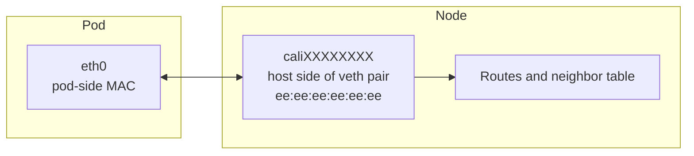

# How to Validate Pod MAC Addresses with Calico

Author: [nawazdhandala](https://github.com/nawazdhandala)

Tags: Calico, Kubernetes, MAC Address, Networking, CNI

Description: Validate that Calico is correctly assigning MAC addresses to pod interfaces and that MAC addresses do not conflict across nodes.

---

## Introduction

Calico creates a virtual ethernet (veth) pair for each pod. The pod sees one end as `eth0`, while the host sees the other end as a `cali*` interface. In many Calico deployments, host-side `cali*` interfaces use the fixed MAC address `ee:ee:ee:ee:ee:ee`. This is expected: Calico uses point-to-point routed interfaces, so the host-side MAC address is not used for normal layer-2 forwarding.

Understanding which MAC address belongs to the pod-side interface and which belongs to the host-side Calico interface is useful when debugging networking issues, configuring workloads that require a stable pod MAC address, and interpreting monitoring tools that track device identity by MAC address.

## Prerequisites

- Calico v3.24+ installed
- kubectl access to the cluster
- Access to node networking stack

## Check Pod MAC Addresses

```bash
# View MAC address of a pod interface

kubectl exec test-pod -- ip link show eth0

# View Calico veth interfaces on the host
ip -o link show | awk -F': ' '/cali/{print $2}'

# Look for duplicate pod eth0 MAC addresses across running pods
kubectl get pods -A --field-selector=status.phase=Running \
  -o custom-columns=NS:.metadata.namespace,POD:.metadata.name --no-headers |
while read -r ns pod; do
  mac=$(kubectl exec -n "$ns" "$pod" -- ip -o link show eth0 2>/dev/null |
    awk '{for (i=1; i<=NF; i++) if ($i=="link/ether") print $(i+1)}')
  [ -n "$mac" ] && echo "$mac $ns/$pod"
done | sort | awk '
  { count[$1]++; pods[$1]=pods[$1] " " $2 }
  END { for (mac in count) if (count[mac] > 1) print mac pods[mac] }
'
```

## Configure a Pod MAC Address

Calico allows requesting a specific pod interface MAC address with a pod annotation. The annotation must be present when the pod is created:

```yaml
apiVersion: v1
kind: Pod
metadata:
  name: test-pod
  annotations:
    cni.projectcalico.org/hwAddr: "1c:0c:0a:c0:ff:ee"
spec:
  containers:
    - name: test
      image: busybox:1.36
      command: ["sleep", "3600"]
```

## Check for MAC Conflicts

```bash
# Look for duplicate learned neighbor MACs on the node
ip neigh show | awk '$5 ~ /^([0-9a-f]{2}:){5}[0-9a-f]{2}$/ {print $5}' | sort | uniq -d
```

## MAC Address Architecture


```mermaid
graph LR
    subgraph Pod
        ETH0[eth0\npod-side MAC]
    end
    subgraph Node
        VETH[caliXXXXXXXX\nhost side of veth pair\nee:ee:ee:ee:ee:ee]
        ROUTE[Routes and neighbor table]
    end
    ETH0 <--> VETH
    VETH --> ROUTE
```

## Conclusion

Calico's host-side `cali*` interfaces may all show the same `ee:ee:ee:ee:ee:ee` MAC address, and that is expected for Calico's point-to-point routed model. When a workload needs a specific pod-side MAC address, use the `cni.projectcalico.org/hwAddr` annotation at pod creation time. Checking both pod `eth0` and host-side Calico interfaces helps avoid confusing normal Calico behavior with a real MAC conflict.
