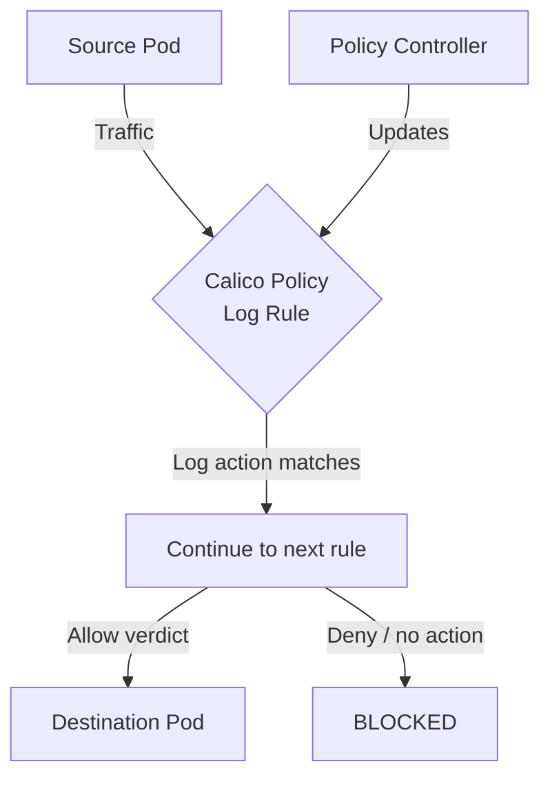

# How to Validate Calico Policy Log Rules Before Production in Calico

Author: [nawazdhandala](https://github.com/nawazdhandala)

Tags: Calico, Kubernetes, Network Policy, Logging, Audit, Security

Description: Build a validation framework for Calico Policy Log Rules in Calico before production deployment.

---

## Introduction

Calico log rules provide fine-grained network security visibility using the `projectcalico.org/v3` API. This guide covers how to validate policy logging effectively.

Calico's extensible policy model supports log rules through its `GlobalNetworkPolicy` and `NetworkPolicy` resources, giving you cluster-wide and namespace-scoped control over traffic that matches your policy logging criteria.

This guide provides practical techniques for validating policy logging in your Kubernetes cluster, following security best practices and production-tested patterns.

## Prerequisites

- Kubernetes cluster with Calico v3.26+
- `calicoctl` and `kubectl` installed
- Basic understanding of Calico network policy concepts

## Step 1: Schema Validation

```bash
for f in policies/*.yaml; do
  calicoctl validate -f "$f" && echo "PASS: $f" || echo "FAIL: $f"
done
```

## Step 2: Selector Validation

```bash
python3 << 'EOF'
import re
import subprocess
import yaml

# Load policies

with open('policies/production-policies.yaml') as f:
    policies = list(yaml.safe_load_all(f))

errors = []
for p in policies:
    if p is None: continue
    sel = p.get('spec', {}).get('selector', '')
    if sel and sel != 'all()':
        if re.fullmatch(r"[A-Za-z0-9./_-]+\s*==\s*['\"][^'\"]+['\"]", sel):
            label_key, label_value = re.split(r"\s*==\s*", sel, maxsplit=1)
            label_value = label_value.strip().strip("'\"")
            kube_selector = f"{label_key.strip()}={label_value}"
        elif re.fullmatch(r"has\([A-Za-z0-9./_-]+\)", sel):
            kube_selector = sel[4:-1]
        else:
            print(f"SKIP: selector requires Calico validation, not kubectl label matching: {sel}")
            continue
        result = subprocess.run(
            ['kubectl', 'get', 'pods', '--all-namespaces', '-l', kube_selector, '--no-headers'],
            capture_output=True, text=True
        )
        if result.returncode != 0:
            errors.append(f"kubectl failed for selector {sel}: {result.stderr.strip()}")
            continue
        if not result.stdout.strip():
            errors.append(f"No pods match selector: {sel}")
if errors:
    for e in errors: print(f"WARN: {e}")
else:
    print("All selectors validated")
EOF
```

## Step 3: Traffic Tests in Staging

```bash
./test-policy-logging-policies.sh
echo "Exit code: $?"
```

## Step 4: CI/CD Integration

```yaml
# .github/workflows/validate-calico.yaml
name: Validate Calico Policies
on: [pull_request]
jobs:
  validate:
    runs-on: ubuntu-latest
    steps:
      - uses: actions/checkout@v4
      - name: Install validation tools
        run: |
          pipx install yamllint
          curl -L https://github.com/projectcalico/calico/releases/download/v3.32.0/calicoctl-linux-amd64 -o calicoctl
          chmod +x calicoctl
          sudo mv calicoctl /usr/local/bin/calicoctl
      - name: Validate
        run: |
          yamllint policies/
          for f in policies/*.yaml; do
            calicoctl validate -f "$f"
          done
```

## Architecture



## Conclusion

Validating policy logging in Calico requires attention to policy ordering, selector accuracy, and bidirectional rule coverage. Follow the patterns in this guide to ensure your log rules are correctly configured, tested, and monitored. Always validate in staging before applying to production, and remove temporary log rules when testing is complete to avoid unnecessary overhead.
