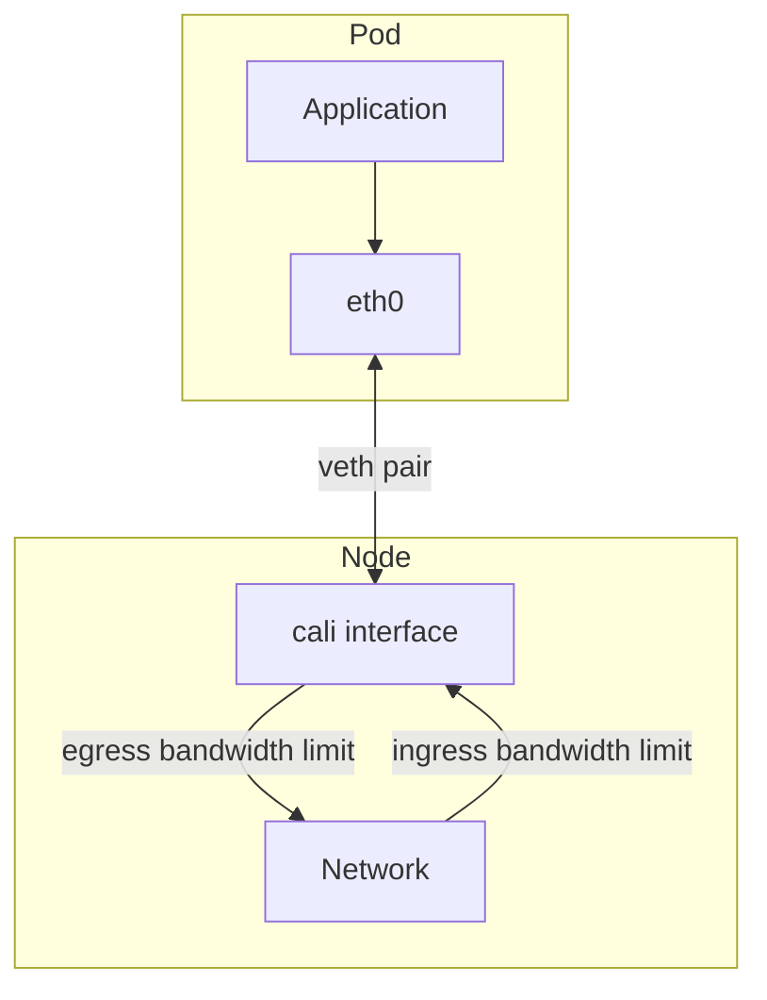

# How to Validate QoS Controls with Calico

Author: [nawazdhandala](https://github.com/nawazdhandala)

Tags: Calico, Kubernetes, QoS, Networking, Bandwidth

Description: Validate that Calico QoS bandwidth limits are correctly applied to pod interfaces and are enforcing the expected traffic shaping policies.

---

## Introduction

Quality of Service (QoS) controls in Calico allow you to limit pod network bandwidth to prevent noisy neighbors from consuming all available bandwidth. Calico applies QoS controls to pod workload interfaces.

Pod bandwidth annotations provide a straightforward way to specify limits: annotate pods with the desired ingress and egress bandwidth limits, and Calico applies the corresponding controls. Calico-specific QoS annotations are preferred, and Calico also honors the standard Kubernetes bandwidth annotations when Calico-specific annotations are not present.

## Prerequisites

- Calico with QoS controls enabled, or the CNI bandwidth plugin configured when using Kubernetes bandwidth annotations
- kubectl access
- iperf3 for testing (optional)

## Configure Pod Bandwidth Limits

Apply bandwidth limits using pod annotations on pods or deployment templates:

```yaml
apiVersion: v1
kind: Pod
metadata:
  name: bandwidth-limited-pod
  annotations:
    qos.projectcalico.org/ingressBandwidth: "10M"
    qos.projectcalico.org/egressBandwidth: "10M"
spec:
  containers:
  - name: app
    image: networkstatic/iperf3
    command: ["sleep", "3600"]
```

## Verify QoS Rules are Applied

```bash
# Find the pod's veth interface on the node

NODE=
POD_UID=
CALI_IFACE=

# List tc qdiscs on the calico interface
tc qdisc show dev "$CALI_IFACE"
tc class show dev "$CALI_IFACE"
```

## Test Bandwidth Limiting with iperf3

```bash
# Run iperf3 server
kubectl run iperf3-server --image=networkstatic/iperf3 --command -- iperf3 -s

# Run client with bandwidth-limited pod
SERVER_IP=$(kubectl get pod iperf3-server -o jsonpath='{.status.podIP}')
kubectl exec bandwidth-limited-pod -- iperf3 -c ${SERVER_IP} -t 10
# Expected: throughput limited to ~10 Mbps
```

## QoS Architecture



## Conclusion

Calico QoS controls using pod bandwidth annotations provide a simple, declarative way to limit network bandwidth per pod. Test QoS limits with iperf3 to verify enforcement, and monitor tc statistics to track bandwidth utilization and drops caused by the limiting.
