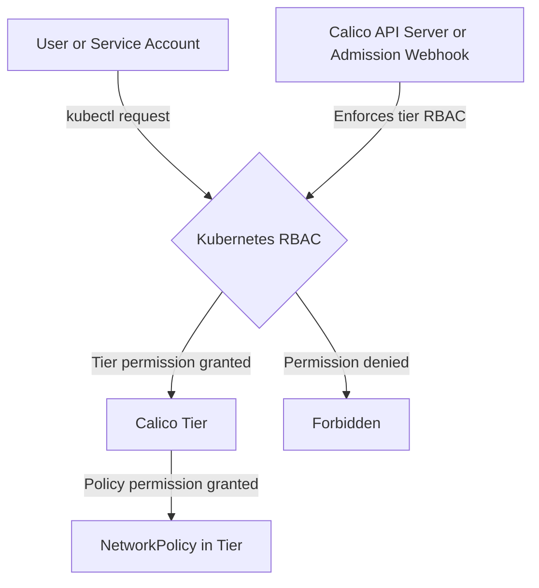

# How to Validate RBAC for Calico Tiered Policies Before Production

Author: [nawazdhandala](https://github.com/nawazdhandala)

Tags: Calico, Kubernetes, Network Policy, RBAC, Policy Tiers, Security

Description: Build a validation framework for RBAC for Tiered Policies in Calico before production deployment.

---

## Introduction

RBAC for Tiered Policies is an advanced Calico feature that provides fine-grained access control for Calico policy and tier resources using Kubernetes RBAC. This guide covers how to validate RBAC Tiered Policies effectively in your Kubernetes cluster.

Calico's `projectcalico.org/v3` API provides rich support for tiered policies through its `GlobalNetworkPolicy`, `NetworkPolicy`, `Tier`, and related resources. Proper configuration of RBAC for Tiered Policies is essential for controlling who can view or modify policies in each tier.

This guide provides production-tested patterns for validating RBAC Tiered Policies, including YAML examples, CLI commands, and troubleshooting techniques.

## Prerequisites

- Kubernetes cluster with Calico tiered policy RBAC support enabled
- `kubectl` installed
- Basic understanding of Calico network policy concepts
- Cluster-admin access to create RBAC resources

## Core Configuration

The following YAML demonstrates the key pattern for RBAC Tiered Policies:

```yaml
kind: ClusterRole
apiVersion: rbac.authorization.k8s.io/v1
metadata:
  name: validate-net-sec-tier-get
rules:
  - apiGroups: ["projectcalico.org"]
    resources: ["tiers"]
    resourceNames: ["net-sec"]
    verbs: ["get"]
---
kind: ClusterRole
apiVersion: rbac.authorization.k8s.io/v1
metadata:
  name: validate-net-sec-tier-policy-reader
rules:
  - apiGroups: ["projectcalico.org"]
    resources: ["tier.networkpolicies"]
    resourceNames: ["net-sec.*"]
    verbs: ["get", "list"]
---
kind: ClusterRoleBinding
apiVersion: rbac.authorization.k8s.io/v1
metadata:
  name: alice-can-get-net-sec-tier
subjects:
  - kind: User
    name: alice
    apiGroup: rbac.authorization.k8s.io
roleRef:
  kind: ClusterRole
  name: validate-net-sec-tier-get
  apiGroup: rbac.authorization.k8s.io
---
kind: RoleBinding
apiVersion: rbac.authorization.k8s.io/v1
metadata:
  name: alice-can-read-net-sec-tier-policies
  namespace: production
subjects:
  - kind: User
    name: alice
    apiGroup: rbac.authorization.k8s.io
roleRef:
  kind: ClusterRole
  name: validate-net-sec-tier-policy-reader
  apiGroup: rbac.authorization.k8s.io
```

## Implementation Steps

```bash
# 1. Validate the RBAC manifest

kubectl apply --dry-run=server -f validate-rbac-tiered-policies-rbac.yaml

# 2. Apply the RBAC rules
kubectl apply -f validate-rbac-tiered-policies-rbac.yaml

# 3. Verify the target user can read policies in the allowed tier and namespace
kubectl --as=alice get networkpolicies.p -n production -l projectcalico.org/tier==net-sec

# 4. Verify the target user is blocked from another tier
kubectl --as=alice get networkpolicies.p -n production -l projectcalico.org/tier==default
```

## Operational Commands

```bash
# List all relevant policies
kubectl get networkpolicies.p --all-namespaces
kubectl get globalnetworkpolicies.p

# View policy details
kubectl get networkpolicy.p net-sec.validate-policy -n production -o yaml

# Delete the RBAC bindings if needed
kubectl delete clusterrolebinding alice-can-get-net-sec-tier
kubectl delete rolebinding alice-can-read-net-sec-tier-policies -n production
```

## Architecture



## Common Issues

1. **RBAC manifest not applying**: Verify API version is `rbac.authorization.k8s.io/v1` and run `kubectl apply --dry-run=server` first
2. **Tier not visible**: Ensure the subject has `get` access to the `tiers` resource for the target tier
3. **Policy access denied**: Use the `tier.networkpolicies` or `tier.globalnetworkpolicies` pseudo resources with `resourceNames` such as `net-sec.*`
4. **Unexpected read behavior**: When using native `projectcalico.org/v3` CRDs, create, update, and delete operations are enforced by the admission webhook, but read operations are not enforced because admission webhooks cannot intercept read requests

## Conclusion

Validating RBAC Tiered Policies in Calico requires careful attention to tier names, pseudo resource names, and namespace-scoped bindings. Use the patterns in this guide as a starting point, adapt them to your specific requirements, and always validate changes in a staging environment before applying to production. Consistent logging and monitoring will help you detect and resolve issues quickly when they occur.
