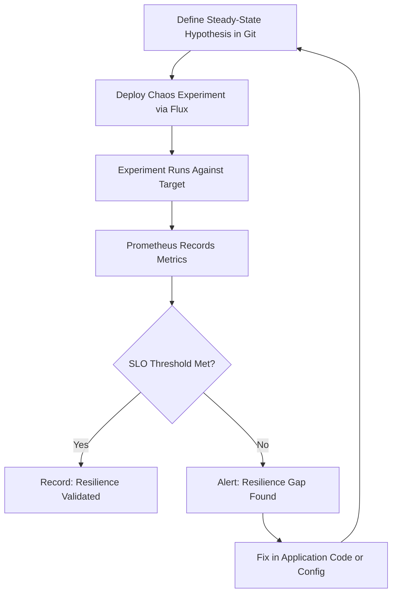

# How to Validate Resilience with Chaos Engineering and Flux CD

Author: [nawazdhandala](https://github.com/nawazdhandala)

Tags: Flux CD, Kubernetes, GitOps, Chaos Engineering, Resilience, SRE

Description: Use chaos engineering to validate the resilience of Flux CD managed workloads by defining steady-state hypotheses and measuring their preservation under fault conditions.

---

## Introduction

Resilience validation is the process of proving, with data, that your system meets its reliability goals under adverse conditions. Chaos engineering without a defined steady-state hypothesis and measurement methodology is just random destruction. True resilience validation requires defining what "working correctly" looks like, injecting faults, and measuring whether those conditions still hold.

Flux CD provides the ideal foundation for resilience validation because every workload definition — including chaos experiments, SLO monitors, and alerting rules — lives in Git. This means your resilience tests are as auditable and reproducible as your application deployments. When a chaos experiment fails a SLO threshold, the failure is recorded in your Git history and can be traced back to the specific change that caused the regression.

This guide walks through the complete resilience validation workflow: defining steady-state hypotheses, running chaos experiments, measuring SLO impact, and recording results — all managed by Flux CD.

## Prerequisites

- Flux CD bootstrapped on the cluster
- Chaos Mesh deployed via Flux HelmRelease
- Prometheus and Grafana deployed for metrics
- A production-like staging environment with realistic workloads

## Step 1: Define Steady-State Hypotheses

Before running chaos, document what "healthy" looks like for each service. Store these as ConfigMaps in Git.

```yaml
# clusters/my-cluster/resilience/hypotheses/api-server-slo.yaml
apiVersion: v1
kind: ConfigMap
metadata:
  name: api-server-slo
  namespace: chaos-mesh
  labels:
    resilience.validation/component: api-server
data:
  hypothesis: |
    Title: API server remains available during pod failures
    Conditions:
      - HTTP success rate > 99.5% (measured over 5 minutes)
      - P99 latency < 500ms
      - At least 1 pod in Ready state at all times
    Measurement: Prometheus metrics via kube-state-metrics and nginx-ingress
```

## Step 2: Create PrometheusRules for SLO Measurement

```yaml
# clusters/my-cluster/resilience/monitoring/slo-rules.yaml
apiVersion: monitoring.coreos.com/v1
kind: PrometheusRule
metadata:
  name: api-server-slo
  namespace: monitoring
spec:
  groups:
    - name: slo.api-server
      interval: 30s
      rules:
        - record: slo:api_success_rate:5m
          expr: |
            sum(rate(nginx_ingress_controller_requests{
              service="api-server", status!~"5.*"
            }[5m])) /
            sum(rate(nginx_ingress_controller_requests{
              service="api-server"
            }[5m]))

        - alert: SLOViolationDuringChaos
          expr: slo:api_success_rate:5m < 0.995
          for: 1m
          labels:
            severity: warning
          annotations:
            summary: "SLO violated during chaos experiment"
```

## Step 3: Structure Resilience Experiments by Category

```yaml
# clusters/my-cluster/resilience/experiments/pod-failure-validation.yaml
apiVersion: chaos-mesh.org/v1alpha1
kind: PodChaos
metadata:
  name: api-server-pod-failure
  namespace: chaos-mesh
  annotations:
    # Link this experiment to the SLO it validates
    resilience.validation/hypothesis: api-server-slo
    resilience.validation/expected-outcome: "Success rate stays above 99.5%"
spec:
  action: pod-kill
  mode: one
  selector:
    namespaces:
      - default
    labelSelectors:
      app: api-server
  duration: "60s"
```

```yaml
# clusters/my-cluster/resilience/experiments/network-partition-validation.yaml
apiVersion: chaos-mesh.org/v1alpha1
kind: NetworkChaos
metadata:
  name: api-server-network-partition
  namespace: chaos-mesh
  annotations:
    resilience.validation/hypothesis: api-server-slo
    resilience.validation/expected-outcome: "Circuit breaker activates within 30s"
spec:
  action: partition
  mode: one
  selector:
    namespaces:
      - default
    labelSelectors:
      app: api-server
  target:
    selector:
      namespaces:
        - default
      labelSelectors:
        app: database
    mode: all
  duration: "2m"
```

## Step 4: Create a Validation Report Job

```yaml
# clusters/my-cluster/resilience/validation-job.yaml
apiVersion: batch/v1
kind: Job
metadata:
  name: resilience-validation-report
  namespace: chaos-mesh
spec:
  ttlSecondsAfterFinished: 86400
  template:
    spec:
      restartPolicy: Never
      containers:
        - name: validator
          image: prom/prometheus:latest
          command:
            - sh
            - -c
            - |
              # Query Prometheus for SLO metrics during the experiment window
              RESULT=$(curl -s "http://prometheus.monitoring:9090/api/v1/query" \
                --data-urlencode 'query=min_over_time(slo:api_success_rate:5m[10m])' \
                | jq '.data.result[0].value[1]')

              echo "Minimum success rate during chaos window: $RESULT"

              if (( $(echo "$RESULT >= 0.995" | bc -l) )); then
                echo "RESILIENCE VALIDATED: SLO maintained during chaos"
                exit 0
              else
                echo "RESILIENCE FAILURE: SLO violated during chaos"
                exit 1
              fi
```

## Step 5: Manage the Full Resilience Suite with Flux

```yaml
# clusters/my-cluster/resilience/kustomization.yaml
apiVersion: kustomize.toolkit.fluxcd.io/v1
kind: Kustomization
metadata:
  name: resilience-validation
  namespace: flux-system
spec:
  interval: 10m
  path: ./clusters/my-cluster/resilience
  prune: true
  sourceRef:
    kind: GitRepository
    name: flux-system
  dependsOn:
    - name: chaos-mesh
    - name: monitoring
```

## Step 6: Track Results Over Time



## Best Practices

- Always define a steady-state hypothesis before running chaos; experiments without a success criterion are not validation.
- Store experiment results as annotations or labels on the chaos resources in Git for historical tracking.
- Run the same experiment suite against every new environment (staging, pre-prod) before promoting to production.
- Treat a resilience validation failure as a bug — open an issue, fix the root cause, and re-run the experiment.
- Use Grafana dashboards pinned to chaos experiment time windows to visually confirm SLO preservation.

## Conclusion

Resilience validation with chaos engineering and Flux CD creates a closed-loop system where reliability goals are defined in code, tested automatically, and measured against real metrics. By managing hypotheses, experiments, and validation logic in Git, your team builds institutional knowledge about system behavior under fault conditions — transforming chaos from a source of fear into a source of confidence.
