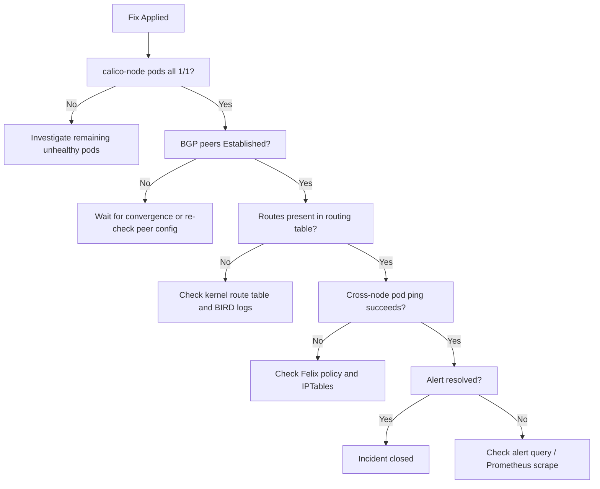

# Validate Resolution for BIRD Not Ready in Calico

Author: [nawazdhandala](https://github.com/nawazdhandala)

Tags: Calico, Kubernetes, BGP, BIRD, Troubleshooting

Description: Learn how to diagnose and resolve the BIRD not ready status in Calico, which indicates a BGP routing daemon failure that can disrupt pod-to-pod communication across nodes.

---

## Introduction

After applying a fix for a BIRD not-ready error in Calico, validating that the issue is truly resolved is as important as the fix itself. Incomplete resolution leaves the cluster in a degraded state where BGP routes may be partially restored but cross-node connectivity remains unreliable. A thorough validation process catches these partial recoveries before the incident is closed.

Validation must cover three dimensions: BIRD process health (is the BGP daemon running and healthy?), BGP peer state (are all expected peers in Established state?), and data-plane connectivity (can pods on different nodes actually reach each other?). Checking only one dimension can give a false sense of resolution.

This guide provides a validation checklist that maps directly to the diagnosis and fix steps, ensuring that every aspect of the BIRD not-ready incident is confirmed resolved before the on-call engineer closes the incident ticket.

## Symptoms

- Fix has been applied but calico-node pod still shows not-ready intermittently
- BGP peers show `Established` but cross-node pod ping fails
- Prometheus alert keeps re-firing after the initial fix

## Root Causes

- Fix addressed the symptom but not the underlying root cause
- Only one of multiple affected nodes was remediated
- Route convergence is still in progress after BGP session recovery

## Diagnosis Steps

```bash
# Full cluster readiness overview
kubectl get pods -n kube-system -l k8s-app=calico-node -o wide
```

## Solution

**Validation Step 1: Confirm all calico-node pods are ready**

```bash
kubectl get pods -n kube-system -l k8s-app=calico-node
# Expected: all pods show 1/1 Running
```

**Validation Step 2: Verify BGP peer state on all nodes**

```bash
# Check from one node - repeat for others if needed
calicoctl node status
# Expected: all peers show "Established" under BGP summary
```

**Validation Step 3: Verify routes are present in node routing table**

```bash
# SSH to the previously-affected node
ip route show | grep bird
# Expected: routes for all other node pod CIDRs are present
```

**Validation Step 4: End-to-end pod connectivity test**

```bash
# Deploy test pods on different nodes
kubectl run test-pod-a --image=busybox --restart=Never \
  --overrides='{"spec":{"nodeName":"<node-a>"}}' -- sleep 3600
kubectl run test-pod-b --image=busybox --restart=Never \
  --overrides='{"spec":{"nodeName":"<node-b>"}}' -- sleep 3600

# Wait for pods to be running
kubectl wait pod/test-pod-a pod/test-pod-b --for=condition=Ready --timeout=60s

# Get IP of test-pod-b
POD_B_IP=$(kubectl get pod test-pod-b -o jsonpath='{.status.podIP}')

# Ping from test-pod-a to test-pod-b
kubectl exec test-pod-a -- ping -c 4 $POD_B_IP

# Cleanup
kubectl delete pod test-pod-a test-pod-b
```

**Validation Step 5: Confirm no recent restarts**

```bash
kubectl get pods -n kube-system -l k8s-app=calico-node \
  -o jsonpath='{range .items[*]}{.metadata.name}{"\t"}{.status.containerStatuses[0].restartCount}{"\n"}{end}'
# Expected: restart count has not increased since the fix was applied
```

**Validation Step 6: Confirm Prometheus alert is resolved**

```bash
# Check alert state via kubectl or Alertmanager UI
kubectl get --raw /api/v1/namespaces/monitoring/services/alertmanager-operated:9093/proxy/api/v2/alerts \
  | jq '.[] | select(.labels.alertname == "CalicoNodeBIRDNotReady")'
# Expected: no active alerts for CalicoNodeBIRDNotReady
```



## Prevention

- Add validation steps to the post-incident review checklist
- Automate end-to-end connectivity tests as part of your CI/CD pipeline
- Set a 30-minute post-fix observation period before closing incidents

## Conclusion

Validating BIRD not-ready resolution requires confirming pod readiness, BGP peer state, routing table correctness, and actual data-plane connectivity. Following this checklist prevents premature incident closure and ensures the cluster is fully healthy before engineers stand down from on-call response.
