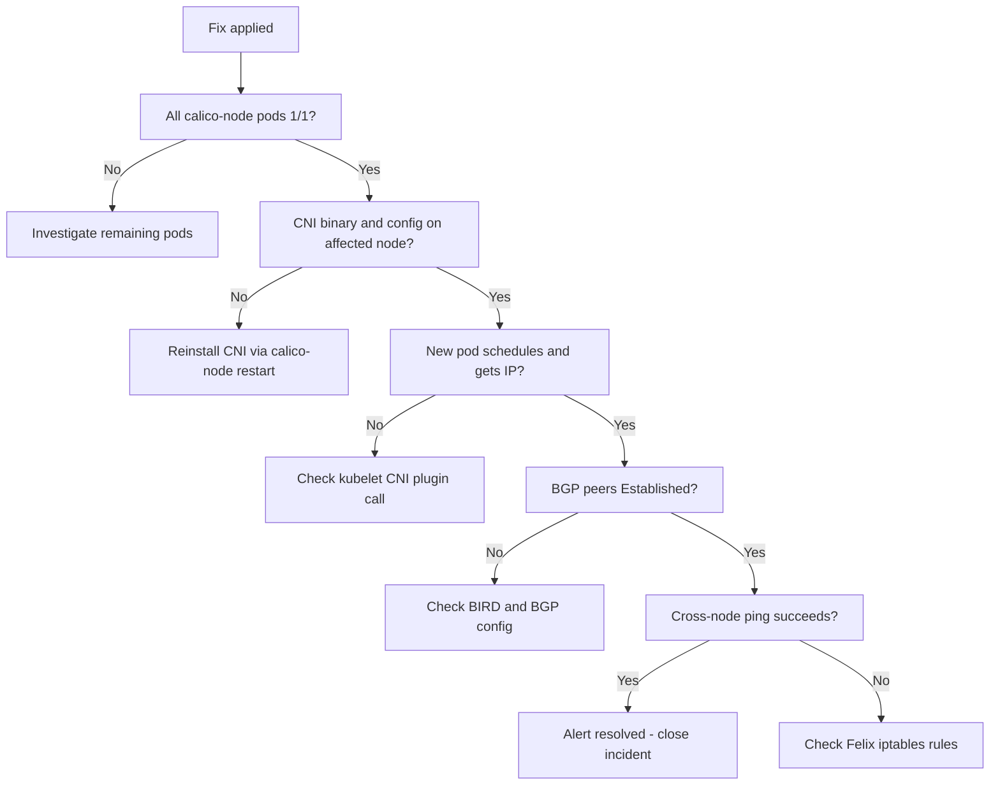

# How to Validate Resolution of Calico Node CrashLoopBackOff

Author: [nawazdhandala](https://github.com/nawazdhandala)

Tags: Calico, Kubernetes, Networking, Troubleshooting

Description: Post-fix validation steps to confirm calico-node CrashLoopBackOff is fully resolved including pod health checks, CNI functionality tests, and BGP state verification.

---

## Introduction

After applying a fix for calico-node CrashLoopBackOff, a structured validation sequence confirms that the cluster has returned to a fully healthy state. Without this validation, teams risk closing incidents prematurely, only to see CrashLoopBackOff recur within hours when the underlying condition re-triggers.

Validation for CrashLoopBackOff covers more ground than most fixes because the calico-node crash affects multiple subsystems: CNI configuration, BGP routing, and pod scheduling. Each of these must be independently verified. An end-to-end pod scheduling test is particularly valuable because it exercises the entire path from scheduler through CNI to BGP advertisement.

This guide provides a verification checklist that should be completed in order before the incident is marked resolved.

## Symptoms

- CrashLoopBackOff appears to stop but restart count continues climbing
- Pod scheduling works but cross-node communication is still broken
- BIRD appears healthy but CNI config was not actually fixed

## Root Causes

- Fix was applied to one node but multiple nodes were affected
- calico-node restarted successfully but hit a different failure path
- Route convergence is still in progress

## Diagnosis Steps

```bash
# Baseline: check all calico-node pods
kubectl get pods -n kube-system -l k8s-app=calico-node -o wide
```

## Solution

**Validation Step 1: Confirm calico-node pods are running with stable restart counts**

```bash
# Wait for all pods to be ready
kubectl wait pods -n kube-system -l k8s-app=calico-node \
  --for=condition=Ready --timeout=180s

# Verify restart counts are stable (run twice, 60s apart)
kubectl get pods -n kube-system -l k8s-app=calico-node \
  -o jsonpath='{range .items[*]}{.metadata.name}{"\t"}{.status.containerStatuses[0].restartCount}{"\n"}{end}'
```

**Validation Step 2: Verify CNI binary and config are present on affected node**

```bash
# SSH to the previously-affected node
ssh <node-name>
ls -la /opt/cni/bin/calico*
ls -la /etc/cni/net.d/10-calico.conflist
cat /etc/cni/net.d/10-calico.conflist | python3 -m json.tool
exit
```

**Validation Step 3: Schedule a new pod on the previously-affected node**

```bash
# Test that new pods can be scheduled and receive IPs
kubectl run post-fix-test --image=busybox \
  --restart=Never \
  --overrides="{\"spec\":{\"nodeName\":\"<affected-node>\"}}" \
  -- sleep 30

kubectl wait pod/post-fix-test --for=condition=Ready --timeout=60s
kubectl get pod post-fix-test -o jsonpath='{.status.podIP}'

kubectl delete pod post-fix-test
```

**Validation Step 4: Verify BGP routes are being advertised**

```bash
calicoctl node status
# Expected: all BGP peers showing Established
```

**Validation Step 5: Cross-node connectivity test**

```bash
kubectl run node-a-pod --image=busybox --restart=Never \
  --overrides="{\"spec\":{\"nodeName\":\"<affected-node>\"}}" -- sleep 300

kubectl run node-b-pod --image=busybox --restart=Never \
  --overrides="{\"spec\":{\"nodeName\":\"<different-node>\"}}" -- sleep 300

kubectl wait pod/node-a-pod pod/node-b-pod --for=condition=Ready --timeout=60s

NODE_B_IP=$(kubectl get pod node-b-pod -o jsonpath='{.status.podIP}')
kubectl exec node-a-pod -- ping -c 3 $NODE_B_IP

kubectl delete pod node-a-pod node-b-pod
```

**Validation Step 6: Confirm alert is resolved**

```bash
# Check that no CalicoNodeCrashLoopBackOff alert is active
kubectl get --raw /api/v1/namespaces/monitoring/services/alertmanager-operated:9093/proxy/api/v2/alerts \
  2>/dev/null | jq '.[] | select(.labels.alertname | test("Calico"))'
```



## Prevention

- Add validation steps to post-incident review template
- Run the cross-node ping test as a synthetic monitor every 5 minutes
- Set a "resolved" SLO of 15 minutes from alert to validation complete

## Conclusion

Validating CrashLoopBackOff resolution requires checking pod health, CNI binary presence, pod scheduling on the affected node, BGP peer state, and cross-node connectivity. This checklist ensures the fix is complete and the cluster is fully operational before the incident is closed.
