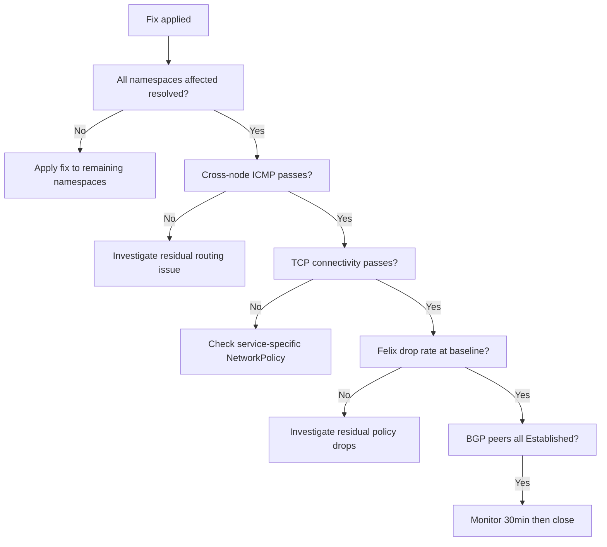

# How to Validate Resolution of Pod Connectivity Failures with Calico

Author: [nawazdhandala](https://github.com/nawazdhandala)

Tags: Calico, Kubernetes, Networking, Troubleshooting

Description: Validation checklist to confirm pod-to-pod connectivity is fully restored after fixing Calico networking issues including ICMP tests, TCP tests, and policy verification.

---

## Introduction

Validating that pod-to-pod connectivity is fully restored after a Calico networking incident requires more than a single ping test. The validation must confirm that the specific failure scenario is resolved, that the fix did not introduce new connectivity problems in adjacent paths, and that the cluster is stable and not about to fail again.

A single successful ping proves that the ICMP path is working but does not guarantee TCP connectivity or that the fix is permanent. A comprehensive validation includes ICMP tests, TCP application traffic tests, policy consistency checks, and a stability window during which the cluster is monitored for recurrence.

This guide provides a step-by-step validation checklist organized to catch both incomplete fixes and regressions introduced by the fix itself.

## Symptoms

- Fix was applied but ping tests are still inconsistent
- TCP traffic works but ICMP remains blocked (valid if ICMP was intentionally blocked)
- Connectivity restored but Felix drop rate is still elevated

## Root Causes

- Fix applied to one namespace but issue affects multiple namespaces
- Policy was deleted as a workaround but needs to be recreated correctly
- BGP reconvergence still in progress

## Diagnosis Steps

```bash
# Check current state before starting validation
kubectl get pods --all-namespaces | grep -v Running | grep -v Completed
calicoctl node status
```

## Solution

**Validation Step 1: Confirm fix scope covers all affected namespaces**

```bash
# Test in each namespace that was affected
for NS in default production staging; do
  echo "Testing namespace: $NS"
  kubectl run val-test-$NS --image=busybox -n $NS --restart=Never -- sleep 60
done

kubectl wait pods --all --for=condition=Ready --timeout=60s \
  -l run  # or appropriate label
```

**Validation Step 2: ICMP test across all node pairs**

```bash
# Get all nodes
NODES=$(kubectl get nodes -o jsonpath='{.items[*].metadata.name}')
echo "Nodes: $NODES"

# For each pair, deploy pods and test
kubectl run val-a --image=busybox --restart=Never \
  --overrides='{"spec":{"nodeName":"<node-1>"}}' -- sleep 120
kubectl run val-b --image=busybox --restart=Never \
  --overrides='{"spec":{"nodeName":"<node-2>"}}' -- sleep 120

kubectl wait pod/val-a pod/val-b --for=condition=Ready --timeout=60s

B_IP=$(kubectl get pod val-b -o jsonpath='{.status.podIP}')
kubectl exec val-a -- ping -c 5 $B_IP && echo "PASS: Cross-node ping" || echo "FAIL: Cross-node ping"

kubectl delete pod val-a val-b
```

**Validation Step 3: TCP connectivity test**

```bash
# Deploy a simple TCP listener and client
kubectl run tcp-server --image=busybox --restart=Never \
  -- sh -c "nc -l -p 8080 -e echo PONG"
kubectl run tcp-client --image=busybox --restart=Never \
  -- sleep 120

kubectl wait pod/tcp-server pod/tcp-client --for=condition=Ready --timeout=60s

SERVER_IP=$(kubectl get pod tcp-server -o jsonpath='{.status.podIP}')
kubectl exec tcp-client -- nc -zv $SERVER_IP 8080 && echo "PASS: TCP" || echo "FAIL: TCP"

kubectl delete pod tcp-server tcp-client
```

**Validation Step 4: Verify Felix drop counters are back to baseline**

```bash
NODE_POD=$(kubectl get pods -n kube-system -l k8s-app=calico-node -o name | head -1)
kubectl exec $NODE_POD -n kube-system -- \
  wget -qO- http://localhost:9091/metrics | grep "felix_iptables_dropped"
# Compare to baseline - should be near zero for new drops
```

**Validation Step 5: Confirm BGP peers stable**

```bash
calicoctl node status
# All peers should show Established
```

**Validation Step 6: Monitor for 30 minutes post-fix**

```bash
# Watch for any new events
kubectl get events --all-namespaces --watch \
  --field-selector type=Warning 2>/dev/null | grep -i "calico\|network\|cni"
```



## Prevention

- Add this validation checklist to incident closure requirements
- Automate cross-node ping as a synthetic monitor
- Keep baseline Felix drop rate metric for comparison during incidents

## Conclusion

Validating pod connectivity restoration requires testing ICMP and TCP across node boundaries, verifying Felix drop counters return to baseline, and confirming BGP peer state. A 30-minute monitoring window after fix application catches delayed failures before the incident is closed.
