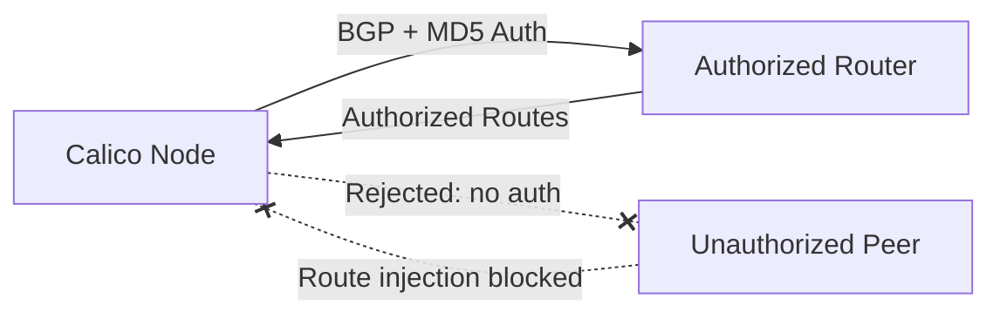

# How to Validate BGP Session Security in Calico Before Production

Author: [nawazdhandala](https://github.com/nawazdhandala)

Tags: Calico, Kubernetes, BGP, Security, Network Policy

Description: Validate secure BGP sessions in Calico to prevent route injection and unauthorized BGP peering.

---

## Introduction

BGP (Border Gateway Protocol) sessions in Calico are used to distribute pod routes between nodes and to upstream routers. Unsecured BGP sessions are vulnerable to route injection attacks, where a malicious peer could inject false routes and redirect cluster traffic. Securing BGP sessions is an essential part of hardening a production Calico deployment.

Calico supports BGP session authentication using MD5 passwords and can be configured to only peer with authorized BGP peers. The `projectcalico.org/v3` BGPPeer resource lets you configure per-peer authentication and encryption settings.

This guide covers validate BGP sessions in Calico to prevent unauthorized route injection and BGP hijacking.

## Prerequisites

- Kubernetes cluster with Calico v3.26+ in BGP mode
- `calicoctl` and `kubectl` installed
- Access to BGP peer configuration on both sides

## Secure BGP Configuration

```yaml
apiVersion: projectcalico.org/v3
kind: BGPPeer
metadata:
  name: secure-bgp-peer-router01
spec:
  peerIP: 192.168.1.1
  asNumber: 65001
  password:
    secretKeyRef:
      name: bgp-peer-secrets
      key: router01-password
  node: "node01"
---
apiVersion: v1
kind: Secret
metadata:
  name: bgp-peer-secrets
  namespace: kube-system
type: Opaque
data:
  router01-password: <base64-encoded-password>
```

```bash
# Create BGP password secret
kubectl create secret generic bgp-peer-secrets \
  --from-literal=router01-password="$(openssl rand -base64 32)" \
  -n kube-system

# Apply BGP peer with authentication
calicoctl apply -f secure-bgp-peer.yaml

# Verify BGP session
calicoctl node status
```

## Verify BGP Security

```bash
# Check BGP peer status
calicoctl node status | grep Established

# Verify MD5 authentication is active
bird cli <<< "show protocols all bgp_peer_router01" | grep auth

# Check for unauthorized BGP connections
calicoctl get bgppeers -o wide
```

## Architecture



## Conclusion

Securing BGP sessions in Calico with MD5 authentication prevents route injection attacks and unauthorized BGP peering. Configure BGP passwords using Kubernetes Secrets, apply them to each BGPPeer resource, and monitor your BGP session status regularly to detect unauthorized connection attempts. In high-security environments, combine BGP authentication with strict host endpoint policies to restrict which hosts can establish BGP connections with your nodes.
