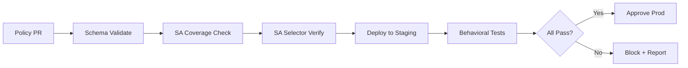

# How to Validate Calico Service Account-Based Policies Before Production

Author: [nawazdhandala](https://github.com/nawazdhandala)

Tags: Calico, Kubernetes, Network Policy, Service Accounts, Validation

Description: Build a validation framework for Calico service account-based network policies that verifies SA coverage and policy correctness before production deployment.

---

## Introduction

Validating service account-based Calico policies requires checking that every workload is running with the correct service account, that policy SA selectors match existing service accounts, and that the traffic behavior matches the intended security model.

A common validation gap is checking the policy but not the underlying SA assignments. A correctly written SA policy is useless if the target pods are running as the default service account.

## Prerequisites

- Kubernetes cluster with Calico v3.26+ (staging)
- `calicoctl`, `kubectl`, and Python 3

## Step 1: Validate SA Coverage

```python
#!/usr/bin/env python3
import subprocess, json, sys

result = subprocess.run(
    ["kubectl", "get", "pods", "--all-namespaces", "-o", "json"],
    capture_output=True, text=True
)
pods = json.loads(result.stdout)

errors = []
for pod in pods["items"]:
    ns = pod["metadata"]["namespace"]
    name = pod["metadata"]["name"]
    sa = pod["spec"].get("serviceAccountName", "default")
    
    if ns in ["kube-system", "calico-system", "kube-public"]:
        continue
    
    if sa == "default":
        errors.append(f"Pod {ns}/{name} uses default SA - may bypass SA policies")

if errors:
    for e in errors:
        print(f"WARNING: {e}")
    sys.exit(1 if len(errors) > 3 else 0)  # Allow up to 3 default SA pods
print(f"SA validation passed. Default SA pods: {len(errors)}")
```

## Step 2: Validate Policy SA Selector Syntax

```bash
# Test all SA-based policies with dry-run
for f in policies/sa-*.yaml; do
  echo "Validating: $f"
  calicoctl apply -f "$f" --dry-run
  
  # Extract SA selectors and verify SA exists
  SA_NAME=$(grep "serviceAccountSelector" "$f" | grep -oP "name == '\K[^']+")
  if [ -n "$SA_NAME" ]; then
    NS=$(grep "namespace:" "$f" | head -1 | awk '{print $2}')
    kubectl get serviceaccount "$SA_NAME" -n "$NS" &>/dev/null || \
      echo "WARNING: SA '$SA_NAME' not found in namespace '$NS'"
  fi
done
```

## Step 3: Behavioral Tests in Staging

```bash
#!/bin/bash
# sa-policy-tests.sh
TESTS_PASSED=0
TESTS_FAILED=0

test_sa_access() {
  local desc="$1" src_pod="$2" src_ns="$3" dest_ip="$4" port="$5" expected="$6"
  # Verify SA first
  SA=$(kubectl get pod "$src_pod" -n "$src_ns" -o jsonpath='{.spec.serviceAccountName}')
  echo "  Source SA: $SA"
  
  kubectl exec -n "$src_ns" "$src_pod" -- nc -zv "$dest_ip" "$port" --wait 3 2>/dev/null
  local exit=$?
  
  if { [ $exit -eq 0 ] && [ "$expected" == "allow" ]; } || { [ $exit -ne 0 ] && [ "$expected" == "deny" ]; }; then
    echo "PASS: $desc"
    ((TESTS_PASSED++))
  else
    echo "FAIL: $desc (SA: $SA, expected: $expected)"
    ((TESTS_FAILED++))
  fi
}

echo "Running SA policy validation tests..."
# Add test cases here
echo "Results: $TESTS_PASSED passed, $TESTS_FAILED failed"
[ "$TESTS_FAILED" -eq 0 ]
```

## Validation Pipeline



## Conclusion

Service account policy validation must check both the policies and the underlying SA assignments. A policy that is syntactically correct but references a SA that no pods are using provides no security value. Automate SA coverage checks alongside policy schema validation in your CI/CD pipeline, and run behavioral tests in staging after every policy change. This comprehensive validation approach ensures your SA-based security controls actually work as intended.
