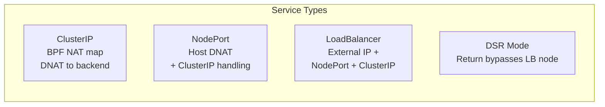

# How to Validate Service Handling in Calico eBPF Mode

Author: [nawazdhandala](https://github.com/nawazdhandala)

Tags: Calico, Kubernetes, EBPF, Service Handling, Networking

Description: Validate that all Kubernetes service types work correctly in Calico eBPF mode with direct connectivity tests.

---

## Introduction

Calico eBPF mode handles all Kubernetes service types - ClusterIP, NodePort, LoadBalancer, and ExternalName - using BPF programs and maps that are loaded directly into the kernel. This provides lower latency service routing compared to iptables-based approaches and scales better with the number of services and endpoints.

Understanding how eBPF handles each service type is important for troubleshooting and optimization. ClusterIP services are handled via BPF NAT maps, NodePort services add host networking DNAT, and LoadBalancer services optionally use DSR to eliminate the load balancer hop from return traffic.

## Prerequisites

- Calico eBPF mode enabled
- kube-proxy disabled
- Multiple service types deployed for testing

## Verify Service Type Handling

```bash
# Check BPF NAT map contents
kubectl exec -n calico-system ds/calico-node -- \
  calico-node -bpf-nat-dump | head -50

# Test ClusterIP service
SVC_IP=$(kubectl get svc my-service -o jsonpath='{.spec.clusterIP}')
kubectl exec test-pod -- wget -O- http://${SVC_IP}/

# Test NodePort service
NODE_IP=$(kubectl get nodes -o jsonpath='{.items[0].status.addresses[0].address}')
NODE_PORT=$(kubectl get svc my-nodeport -o jsonpath='{.spec.ports[0].nodePort}')
curl http://${NODE_IP}:${NODE_PORT}/
```

## Configure Service Affinity

```bash
# Enable session affinity for a service
kubectl patch svc my-service -p '{"spec":{"sessionAffinity":"ClientIP"}}'

# Verify eBPF affinity map is populated
kubectl exec -n calico-system ds/calico-node -- \
  calico-node -bpf-affinity-dump
```

## eBPF Service Types Architecture



## Conclusion

Calico eBPF service handling provides efficient O(1) routing for all Kubernetes service types. Verify each service type works after enabling eBPF mode, check BPF map contents to diagnose routing issues, and configure session affinity where needed for stateful applications. Monitor BPF map capacity as it must accommodate all service endpoints.
